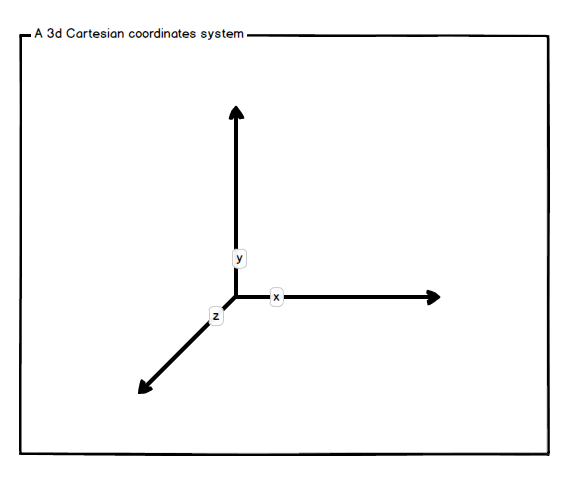
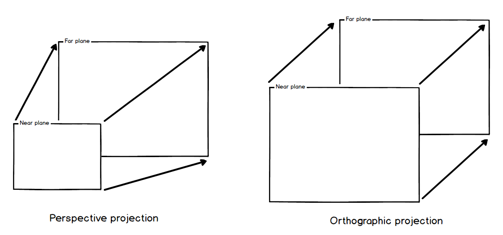
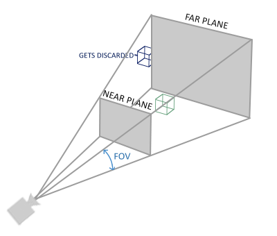
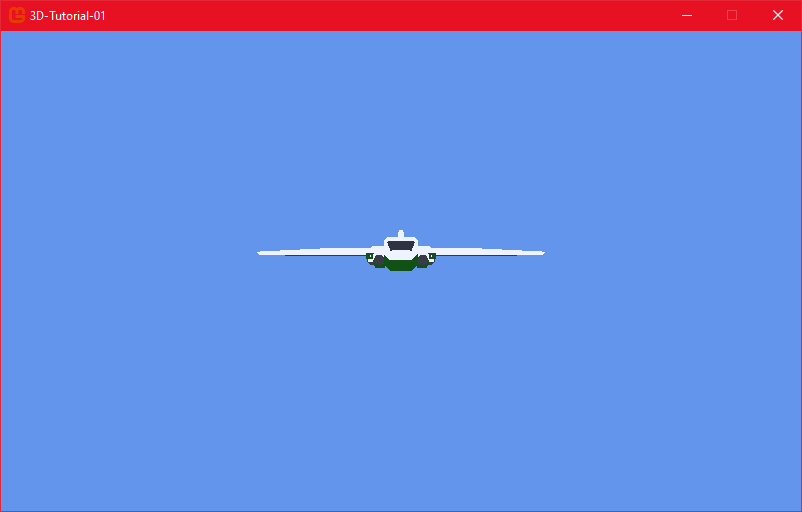

# Step 1: Display a 3D ship

## Objective

In this first tutorial, we will see how to load and display the space ship that will serve to represent the player in our game. We will position it in the game, setup a camera to watch it and integrate that in the `Game1` class. This will allow us to review 3D mathematics concept and their API in MonoGame.

> [!NOTE] Requierements
>
> You are supposed to have read lessons 1, 2, 3, 5 and 6 of the MonoGame's 2D basic tutorial. You should know about the `Game1` class, its `LoadContent`, `Update` and `Draw` functions, the use of the `GameTime` parameter in `Update` and `Draw`, and the way to use the MonoGame Content Builder.

|   Sum up                |     Content                                                           |       Link                      |
| ----------------------- | --------------------------------------------------------------------- | ------------------------------- |
| What is MonoGame?       | An high level view and a summary of MonoGame's history and features   | [2D games chapter 01](https://docs.monogame.net/articles/tutorials/building_2d_games/01_what_is_monogame/index.html)          |
| How to install MonoGame | Setting up and getting started with MonoGame, whichever your platform | [2D games chapter 02](https://docs.monogame.net/articles/tutorials/building_2d_games/02_getting_started/index.html?tabs=windows)  |
| The Game1 file         | Understanding the game loop in the Game1 class                         | [2D games chapter 03](https://docs.monogame.net/articles/tutorials/building_2d_games/03_the_game1_file/index.html)  |
| The Content pipeline    | How to load assets using the MGCB editor and the ContentManager class | [2D games chapter 05](https://docs.monogame.net/articles/tutorials/building_2d_games/05_content_pipeline/index.html?tabs=vscode)  |
| Working with textures   | We will need to display textures in our game, for UI.                 | [2D games chapter 06](https://docs.monogame.net/articles/tutorials/building_2d_games/06_working_with_textures/index.html)  |

## The Player class

Create a `Player.cs` class. We will review 3D mathematical concepts while creating our Player. We will for now create the different member variables of this class, and its `Load` and `Update` function.

Create the class squeletton in such a way:

```csharp
class Player
{
    private Model model;
    private Vector3 position;
    private Quaternion orientation;
    private Vector3 scale;
    private Matrix world;

    public void Load(ContentManager content)
    {

    }

    public void Update(double dt)
    {

    }
}
```

### Loading the Model

The `Model` class can contain a 3D model, also called mesh. A mesh file usually contains geometrical data related to the 3d model, plus additional information for textures placement, animations etc. We will use this class to store our player's model.

[Link to MonoGame's Model documentation](https://docs.monogame.net/api/Microsoft.Xna.Framework.Graphics.Model.html)

#### Add the model in MGCB

Double click on the `Content/Content.mgcb` file. If MonoGame is correctly installed, the MGCB window should open. Right click on the Content icon, Add, Existing Item, and select the `Ship.fbx` file from the resource folder you have unzipped. Accept to copy those files in the Content folder.

The MGCB should have automatically selected the right Importer and Processor for the files you have chosen. Click on the Build icon, shut down MGCB.


#### Load the model in Player class

The model will be stored in the model variable.

```csharp
    private Model model;
```

We will fill this variable by loading the file from the content manager:

```csharp
    public void Load(ContentManager content)
    {
        model = content.Load<Model>("Ship");
    }
```

### Positionning the player's ship

We will position the player ship thanks to two `Vector3`, to manage its position and scale (its size), and a Quaternion, to manage rotations. Those three variables will allow us to compute a *world transform matrix*, which will hold the final space coordinates of our ship. We will explain this just below.

```csharp
    class Player
    {
        private Model model;
        private Vector3 position;
        private Quaternion orientation;
        private Vector3 scale;
        private Matrix world;
        ...
```

#### The position vector

The Vector3 position contains the 3D world position of our ship. Before diving deeper, let's understand how 3D space works in games:

Vector3 contains 3 coordinates, x, y, z, along 3 axis:

- X-axis: Runs horizontally (left to right)
- Y-axis: Runs vertically (up and down)
- Z-axis: Runs depth-wise (forward and backward, z towards us)



We decide a special point is the origin: the point where x, y and z coordinates are zero.

In our game, the initial of our ship will be Vector3(0f, 0f, -250.0f):

- 0 in x coordinate
- 0 in y coordinate
- -250 in z coordinate (negative, so toward the "inside" of the screen)

```csharp
    public void Load(ContentManager content)
    {
        model = content.Load<Model>("Ship");
        position = new Vector3(0, 0.0f, -250.0f);
    }
```

This places the ship:

- At the center horizontally (x = 0)
- At the middle vertically (y = 0)
- 250 units into the screen/away from the camera (z = -250)

#### About Vector3 in MonoGame

Here is [MonoGame's Vector3 Documentation](https://docs.monogame.net/api/Microsoft.Xna.Framework.Vector3.html)

#### Basic Definition

A Vector3 represents either:

- A point in 3D space (x, y, z coordinates)
- A direction with magnitude (like velocity or force)

#### Mathematical Properties

**1. Addition/Subtraction:** When you add two vectors *a* and *b*, you add their components.

$$
(x_a, y_a, z_a) + (x_b, y_b, z_b) = (x_a+x_b, y_a+y_b, z_a+z_b)
$$

The result of a vector addition is the vector between the start of the first vector and the end of the second vector:


In MonoGame, Vector3 can be added:

```csharp
var a = new Vector3(0, 1, 2);
var b = new Vector3(3, 4, 5);
Vector3 result = a + b;
```

If you can add them, you can substract them.

```csharp
var a = new Vector3(0, 1, 2);
var b = new Vector3(3, 4, 5);
Vector3 result = b - a;
```

Vector substraction is very interesting for two reasons :

- First, because you can take the opposite of a vector to go in the same orientation but in inverse direction:


- Second, because you can use it with points. If you substract two *A* and *B* points' coordinates, you obtain the vector going from the second point to the first:


This operation is ultra useful. We will use it a lot in this tutorial.

There is no equivalent for the usual multiplication between two Vector3. Instead, there is the *Dot product* and the *Cross product*.

**2. Magnitude (Length):** The "length" of a vector

It can also be tought as the distance from origin to the point that has the vector's coordinates.

$$
|a| = \sqrt(x² + y² + z²)
$$

MonoGame provides you with a way to directly get the magnitude from a vector. Because square root is a complex numerical operation, you might also want the squared magnitude (magnitude multiplied by itself).

```csharp
Vector3 distanceFromOrigin = position.Length();
Vector3 distanceFromOriginSquared = position.LengthSquared();
```

For instance, when you want to compare two lengths between two set of 2 points, you would get the vectors between each point of the set by subtracting them, then compare the squared magnitude of the vectors. In term of computing, this is more optimal than comparing the magnitudes themselves.

**3. Normalization:** Creating a unit vector (length of 1) in the same direction.

$$
v̂ = v/|v| = (x/|v|, y/|v|, z/|v|)
$$

Usually, we want a normalized vector when we want a direction with no length information. Normalizing will set the length of the vector to 1. MonoGame provides us with a way to easily do this operation:

```csharp
Vector3 directionFromOrigin = position - Vector3.Zero;
directionFromOrigin.Normalize();
```

In this specific case, we do not need to substract the zero vector to our position vector, but it allow me to insist on the fact that a direction between two points in the normalized difference between end point's and starting point's positions ;)


**4. Dot Product:** Measures how parallel two normalized vectors are.

$$
a·b = x_a*x_b + y_a*y_b + z_a*z_b
$$

If vectors are normalized, the result of the dot product will be a number between -1 and 1, and gives us:

- If *a·b* = 0, vectors are perpendicular
- If *a·b* > 0, angles between vectors is less than 90°
- If *a·b* < 0, angle is greater than 90°
- If *a·b* = 1, vectors are parallel and in the same direction
- If *a·b* = -1, vectors are parallel but in opposite directions


This operation is super useful in videogames. The MonoGame's Vector3 class gives us a way to easily compute dot products:

```csharp
var a = new Vector3(0, 1, 2);
var b = new Vector3(3, 4, 5);
a.Normalize();
b.Normalize();
float dotProduct = Vector3.Dot(a, b);
```

When you want to measure *colinearity* (if vectors are "more or less" parallel), do not forget to normalize *a* and *b*!

When vectors are NOT normalized, an other dot product definition gives us the projection of the second vector on the first. If $\theta$ is the angle between *a* and *b*, the dot product is:

$$
a·b = cos(\theta) * |a| * |b|
$$

That is to say that we can now "how much" the second vector *projects* onto the first vector.


It is still a useful operation, but it is used in more complex contexts than what we will tackle in this tutorial, like lighting calculations.

**5. Cross Product:** Creates a new vector perpendicular to both inputs.

$$
a×b = (y_a*z_b - z_a*y_b, z_a*x_b - x_a*z_b, x_a*y_b - y_a*x_b)
$$

The cross product between two vectors give a vector that is perpendicular to the plane defined by the two input vectors. This is super useful to compute normal vectors, which are used in lighting computations. MonoGame provides us with a way to easily compute cross products:

```csharp
var a = new Vector3(0, 1, 0);   // Up
var b = new Vector3(1, 0, 0);   // Right
Vector3 crossProduct = Vector3.Cross(a, b); 
```

In this case, the cross product will give us the forward vector, which is perpendicular to the up and right vectors. The two vectors we have chosen do not have to be normalized, except if you want the cross product result to be normalized.

Here is a diagram showing the cross product with non-normalized vectors:


In this case, *a*x*b* is perpendicular to the grey plane.

**Application of Vector3 in Game Development:** Vectors are used for a lot of 3D calculations in games:

- Object positions (like the ship's position in the code)
- Movement directions and velocity
- Forces (gravity, thrust)
- Surface normals (for lighting calculations)

This is just a small list of examples, but you will see that vectors are used everywhere in 3D games.

### Orientation with Quaternions

#### How to represent rotations in 3D games?

While in 2D games, we can use just one angle to represent rotations, in 3D games, it is not that simple. While 2D objects were just rotated around a single axis, 3D objects can be rotated around three axes: x, y and z. This means that we need to represent rotations in a more complex way than just using angles.


After some searches, game programmers of old have come to represent 3D rotations all at once with two main mathematical objects: *rotation matrices* and *quaternions*.

*3D matrices* are a table of 4 by 4 numbers that can contain at the same time translation, rotation and scale information. If we use them for rotations, they have a marvelous feature: they can be multiplied together to apply several rotations at once. This is a very powerful property, but it has a big drawback: they are quite heavy to compute, and they can suffer from *gimbal lock*. Gimbal lock is a problem that occurs when two of the three axes align, causing a loss of one degree of freedom in rotation. This can lead to unexpected behavior in 3D games.

*Quaternions* is a quite abstract mathematical object which is only represented with 4 numbers, and present the same property of being able to be multiplied together (we say *concatenated*) to apply several rotations at once. Additionally, the do not suffer from gimbal lock, and they are more efficient to compute than matrices. Nevertheless, they can just represent rotations, and not translations or scales like matrices do.

The following consensus was finally found. Because they can represent translations, rotations and scales, matrices would be used to contain the final transformation of a 3D object and sent to the GPU to draw objects. Meanwhile, quaternions being more efficient to rotate the 3d objects around, we would use them to execute any rotation during a frame, and then convert them to matrices to apply the final transformation to the 3D object.

We will implement this consensus in our game. We will use a quaternion to represent the orientation of our ship, rotate it with other quaternions, and we will convert it to a matrix to apply the final transformation to the ship's model.

> [!NOTE]
>
> Transform matrices will be presented in the next section. For now, let's just focus on quaternions.

#### Quaternions for our game

The orientation variable will hold the rotation of the ship. As stated before, we will use Quaternions to represent rotations.

```csharp
    public void Load(ContentManager content)
    {
        model = content.Load<Model>("Ship");
        position = new Vector3(0, 0.0f, -250.0f);
        orientation = Quaternion.Identity;
    }
```

The *identity quaternion* is the quaternion that does not rotate the object. It is the equivalent of the zero vector for the `Vector3` class.

#### Quaternions in MonoGame

Usually, in this tutotial's code, in most cases we will create quaternions just before multiplying them to handle rotations.

In this cas we will use the `Quaternion.CreateFromAxisAngle` function. With this function the quaternion will represent a rotation around the axis, by the angle given in radians.

Let's review a case where we create two rotations, one around the x axis and one around the y axis, then multiply (*concatenate*) them together to get a final orientation:

```csharp
var xRotation = Quaternion.CreateFromAxisAngle(Vector3.Right, -MathF.PI / 2);
var yRotation = Quaternion.CreateFromAxisAngle(Vector3.Up, MathF.PI / 4);
orientation = xRotation * yRotation;
// We could have used: Quaternion.Concatenate(xRotation, yRotation);
```


Sometimes, for a specific reason, we will have a matrix containing the rotation that interests us. In this case, we will be able to create a quaternion from a rotation matrix, using the `Quaternion.CreateFromRotationMatrix` function:

```csharp
return Quaternion.CreateFromRotationMatrix(aim);
```

As stated in this section's introduction, when we have multiplied quaternions together to get a final orientation, we convert this result back to a rotation matrix using the `Matrix.CreateFromQuaternion` function, so we can apply it to our 3D model.

```csharp
var rotationMatrix = Matrix.CreateFromQuaternion(orientation);
```

To learn more about quaternions in MonoGame, here is [MonoGame's Quaternion Documentation](https://docs.monogame.net/api/Microsoft.Xna.Framework.Quaternion.html).

#### Why Not Just Use Angles?

Before discussing quaternions, it's important to understand why we don't just use Euler angles (pitch, yaw, roll) with rotation matrices. While angles are intuitive, they have significant limitations in 3D graphics:

- Gimbal Lock: When rotations on one axis cause another axis to align, losing a degree of freedom, rotation becomes unpredictable.
- Interpolation Problems: Smoothly transitioning between rotations is difficult with angles
- Numerical Stability: Accumulated errors can cause issues over time

#### What is a Quaternion?

Now that we know how to use them, let's understand further what a quaternion is.

Mathematically, a quaternion is a four-dimensional number represented as:

$$
q = w + xi + yj + zk
$$

Where:

- *w* is the real component
- *x*, *y*, *z* are imaginary components
- *i*, *j*, *k* are special operators with properties like $i² = j² = k² = ijk = -1$

Yes, this last property feels a bit weird. You may have learned that real numbers (numbers from $\mathbb{R}$), when squared, cannot be negative - so their squared values cannot be equal to -1. Actually, there are other sets of numbers than real numbers. You might have heard about complex numbers (in $\mathbb{C}$), which are numbers that can be represented as a + bi, where a and b are real numbers and i is the imaginary unit, with the property that i² = -1. Quaternions are an extension of complex numbers, living in a 4 dimensions space called the Hamiltonian space ($\mathbb{H}$).

In code, a quaternion is stored as a vector with 4 dimensions (x, y, z, w).

> [!NOTE]
>
> You cannot represent yourself a number in 4 dimensions? That is normal: it is a quite abstract mathematical object. Actually, you do not need to understand the underlying mathematics to use quaternions. You can consider it as a tool to ease rotation computations.

#### Mathematical properties

**1. Quaternion.Identity:** Represents "no rotation" (like in your code)

```csharp
Quaternion.Identity = Quaternion(0, 0, 0, 1)
// Here, w = 1, x = 0, y = 0, z = 0. 
// w is at the end of the constructor.
```

**2. Normalization:** Like vectors, quaternions must be normalized for rotation. Using a non-normalized quaternion can cause unexpected rotations.

$$
|q| = \sqrt{w² + x² + y² + z²}
$$

$$
\hat{q} = \frac{q}{|q|}
$$

```csharp
orientation.Normalize();
```

**3. Quaternion Multiplication:** Combines rotations.

This is the key to quaternions' efficiency, because it is way quicker to multiply quaternions than to multiply rotation matrices.

$$
q_1 * q_2 = (w_1w_2 - x_1x_2 - y_1y_2 - z_1z_2) + (w_1x_2 + x_1w_2 + y_1z_2 - z_1y_2)i + (w_1y_2 - x_1z_2 + y_1w_2 + z_1x_2)j + (w_1z_2 + x_1y_2 - y_1x_2 + z_1w_2)k
$$

MonoGame allows us to multiply quaternions:

```csharp
orientation = orientation * Quaternion.CreateFromAxisAngle(Vector3.Up, MathHelper.Pi);
```

**4. Converting to a Rotation Matrix:** When we have computed the final orientation of our object with quaternions, we can convert it to a rotation matrix to apply it to our object.

We will discuss matrices just below.

```text
Matrix rotationMatrix = Matrix.CreateFromQuaternion(orientation);
```

**Application of Quaternions in Game Development:** Quaternions are used for:

- Representing object orientation (like your ship)
- Smooth rotation interpolation (SLERP - Spherical Linear Interpolation)
- Camera control
- Character animation

Again, this list is far from exhaustive! We will come back to rotations when talking about the transform matrix, but for now, let's change subject and talk about the scale of our ship.

### Scale with Vector3

Lastly, the scale is extension of a 3D element in the three x, y, and z directions. With the scale, you can expand or shrink a 3D element in those directiions.

By defaut, the scale is `Vector3(1f, 1f, 1f)`, which mean 1 for x, y and z scales. If, for instance, you change the y scale to make it equal to 2 (`Vector3(1f, 2f, 1f)`), your 3d element will be stretched in the vertical direction, doubling its vertical size, while the other sizes will remain the same.

In our case, we will make our ship's scale equal to `Vector3(2f, 2f, 2f)`, which will double its size, while conserving the proportions.


```csharp
    public void Load(ContentManager content)
    {
        model = content.Load<Model>("Ship");
        position = new Vector3(0, 0.0f, -250.0f);
        orientation = Quaternion.Identity;
        scale = new Vector3(2f, 2f, 2f);
    }
```

That's it for scale. Now let's combine position, orientation and scale to create a world matrix that will allow us to insert our ship in the game world.

### Inserting the player in the world with the world matrix

#### What is the World Matrix?

A `Matrix` in an algebraic structure (a mathematical tool) that is used to represent linear applications, that is to say, the transformation of a vector in an other vector. In 3D graphics, matrices are used to represent specific applications, named transformations, like rotations, scalings, and translations.

Why do we want to transform a vector in an other vector?

A 3D Model is composed multiple vertices - each "point" of the mesh. You have to understand that each vertex of a 3D object is represented by a `Vector3`, with coordinates set from its origin (the point (0, 0, 0) in blender for instance). To insert this 3d object in the game world, where the object is probably set at a specific position, rotation and scale, we need to convert each vertex coordinate from the object space the world space. To achieve that, we multiply each vertex by a matrix, called the world matrix, that combine translation, rotation and scale operations. The result is a new Vector3, which is the transformed vertex, with its coordinates expressed relatively to the world origin.


#### Computing the World Matrix

In our code, our player stores a World matrix:

```csharp
    class Player
    {
        private Model model;
        private Vector3 position;
        private Quaternion orientation;
        private Vector3 scale;
        private Matrix world;
        ...
```

Because position and rotation will constantly change, we need to update the world matrix every frame. We also have to take into account the effect of the scale. We will compute the world matrix in the `Update` function:

```csharp
    public void Update(double dt)
    {
        world = Matrix.CreateScale(scale) 
                * Matrix.CreateFromQuaternion(orientation) 
                * Matrix.CreateTranslation(position);
    }
```

As you can see, we can create a scale matrix from the scale vector, a rotation matrix from the orientation quaternion, and a translation matrix from a position vector. We can multiply those three matrices to get the final world matrix.

#### Matrices in MonoGame

A matrix in 3D graphics is typically a 4×4 grid of numbers that can represent a transformation. In the MonoGame framework, `Matrix` is this structure.

[Link to MonoGame's Matrix documentation](https://docs.monogame.net/api/Microsoft.Xna.Framework.Matrix.html)

#### Translation, rotation, and scale matrices

**1. Translation Matrix:** Moves objects in 3D space

```text
[1 0 0 X]
[0 1 0 Y]
[0 0 1 Z]
[0 0 0 1]
```

Where X, Y, Z are the distances to move along each axis.

MonoGame provides a way to create a translation matrix:

```csharp
Matrix translationMatrix = Matrix.CreateTranslation(10, 20, 30);
```

**2. Rotation Matrix:** Rotates objects. The matrix varies by axis.
Rotation around X-axis:

```text
[1  0       0       0]
[0  cosθ    -sinθ   0]
[0  sinθ    cosθ    0]
[0  0       0       1]
```

Where $θ$ is the angle of rotation.

Rotation around Y-axis:

```text
[cosθ   0   sinθ    0]
[0      1   0       0]
[-sinθ  0   cosθ    0]
[0      0   0       1]
```

Rotation around Z-axis:

```text
[cosθ   -sinθ   0   0]
[sinθ   cosθ    0   0]
[0      0       1   0]
[0      0       0   1]
```

MonoGame provides a way to create a rotation matrix around a specific axis:

```csharp
Matrix rotationMatrix = Matrix.CreateFromAxisAngle(Vector3.Up, MathHelper.Pi);
```

The angle is given in radians.

Rotation matrices can be combined to create a rotation matrix that rotates around multiple axes. Nevertheless, quaternions are more efficient for this kind of operation and avoid the gimbal lock problem. As stated above, it is better to use quaternions to create complex rotations, then go back to matrices when needed.

**3. Scale Matrix:** Changes the size of objects

```text
[X 0 0 0]
[0 Y 0 0]
[0 0 Z 0]
[0 0 0 1]
```

Where X, Y, Z are the scaling factors.

MonoGame provides a way to create a scale matrix:

```csharp
Matrix scaleMatrix = Matrix.CreateScale(2, 3, 4);
```

#### Transform vectors with matrices

To transform a vector with a matrix, you multiply the vector by the matrix. The result is a new vector that has been transformed by the matrix. In MonoGame, you cannot use the `*` operator to multiply a vector by a matrix, but you can use the `Vector3.Transform` function.

For instance, to transform a vector by a translation matrix, you multiply the vector by the translation matrix:

```csharp
Vector3 position = new Vector3(1, 2, 3);
Matrix translationMatrix = Matrix.CreateTranslation(10, 20, 30);
var transformedPosition =  Vector3.Transform(position, translationMatrix);
```

The result is a new vector that has been moved by the translation matrix.


You can perform the same operation with rotation and scale matrices.

#### Matrix multiplication and the World matrix

Multiplying two matrices is a way to combine their transformations. The result is a new matrix that applies both transformations at the same time.

There is a mathematical rules that are important to know: order is important!

```text
A * B != B * A
```

The standard order is: Scale → Rotate → Translate. Not respecting this order can lead to unexpected results. For instance, if you translate before rotating, the object will rotate around the world's origin, not around its center.

In the case of the world matrix, we combine the translation, rotation, and scale matrices to transform a vertex from object space to world space.

The *world matrix* is the matrix that combines translation, rotation and scale matrices to transform a vertex from the object space to the world space. It is the matrix that is used to insert the object in the game world.

In our code, we compute the world matrix in the `Update` function:

```csharp
    private Matrix world;

    public void Update(double dt)
    {
        world = Matrix.CreateScale(scale) 
                * Matrix.CreateFromQuaternion(orientation) 
                * Matrix.CreateTranslation(position);
    }
```

That's it for the `Player` class. The only missing part is drawing, but we will get back to it later. We will now integrate our player in the `Game1` class.

### Additional 3D geometry resources

If you want to learn more about 3D geometry, here are some resources that can help you:

- [MonoGame's 3D basic geometry documentation](https://docs.monogame.net/articles/getting_to_know/whatis/vector_matrix_quat/)
- [Geeks for Geeks's transformation matrix Overview](https://www.geeksforgeeks.org/transformation-matrix/)
- [Jorge Rodriguez's math for game developers playlist](https://www.youtube.com/watch?v=sKCF8A3XGxQ&list=PLW3Zl3wyJwWOpdhYedlD-yCB7WQoHf-My)
- [Eric Lengyel's 3D math book](https://www.amazon.com/dp/0985811749/?tag=terathon-20)

## Using the Player in the Game1 class

We will now integrate the player in the `Game1` class. We will load the player in the `LoadContent` function, update it in the `Update` function, and draw it in the `Draw` function. We will also need to create a view matrix and a projection matrix to draw the player correctly.

### Load the player

First we need to add a member variable to the `Game1` class to store the player:

```csharp
    class Game1 : Game
    {
        private GraphicsDeviceManager _graphics;
        private SpriteBatch _spriteBatch;
        private Player player;
        ...
```

Now we can create the player in the `LoadContent` function:

```csharp
    protected override void LoadContent()
    {
        _spriteBatch = new SpriteBatch(GraphicsDevice);

        player = new Player();
        player.Load(Content);
    }
```

Note that we pass the `ContentManager` (the `Content` variable) to the `Load` function of the player. This is because the player needs to load the model from the content manager. The `Content` variable comes from the `Game` class, from which `Game1` inherit, and is automatically initialized by the `Game` class.

### Update the player

We will now update the player in the `Update` function. As you may have remarked in the `Player` class, the `Update` function takes a double parameter, `dt`, which is the time elapsed since the last frame. We need to create this parameter in the `Update` function of the `Game1` class, and pass it to the `Update` function of the `Player`.

```csharp
    protected override void Update(GameTime gameTime)
    {
        if (GamePad.GetState(PlayerIndex.One).Buttons.Back == ButtonState.Pressed || Keyboard.GetState().IsKeyDown(Keys.Escape))
            Exit();

        double dt = gameTime.ElapsedGameTime.TotalSeconds;
        player.Update(dt);

        base.Update(gameTime);
    }
```

Ok, we have a player in our game, that is updated every frame. We will now see how to draw it.

## Basic 3D drawing with MonoGame

### The view and projection matrices

We have seen that the world matrix is used to transform a vertex from the object space to the world space. But we cannot stop here. First, we need to see the world from the point of view of a camera. Then we need to project the 3D world "filmed" by this camera to your 2D screen. To achieve that, we need two other matrices: the *view matrix* and the *projection matrix*.

Basically, we are saying that in addition to multiplying the vertex by the world matrix, we will also multiply it by the view matrix and the projection matrix to get the final position of the vertex on the screen.

> [!NOTE]
>
> After all this matrix multiplication party, we actually have coordinates in *normalized screen space* coordinates. That is, a float number between -1 and 1 that corresponds to where the pixel should be displayed *in proportion* of your screen size. We need to convert those coordinates to the screen's real pixel coordinates, which depends the resolution of the screen. The *viewport* will contain the needed information.


*Image is curtesy from [learnopengl.com](https://learnopengl.com/Getting-started/Coordinate-Systems)*

#### View matrix

The *view matrix* is used to transform a vertex from the world space to the camera space. MonoGame provides us with a way to create a view matrix from a position, a target and an up vector. The position is the position of the camera, the target is the point the camera is looking at, and the up vector is the direction that is considered as up.

```csharp
private Matrix view = Matrix.CreateLookAt(new Vector3(0, 0, 100), new Vector3(0, 0, 0), Vector3.UnitY);
```

Here, we create a view matrix that places the camera at the position (0, 0, 100), looking at the point (0, 0, 0), with the up vector pointing in the positive Y direction. This means that the camera is positioned 100 units away from the world's origin, looking towards it.

#### Projection matrix

The *projection matrix* is used to transform a vertex from the camera space to the screen space. There are usually two ways to create a projection matrix: create a *perspective* projection matrix or an *orthographic* projection matrix. The perspective projection matrix is used to create a perspective effect, where objects that are far away are smaller than objects that are close. The orthographic projection matrix is used to create an isometric effect, where objects that are far away are the same size as objects that are close.



In our case, we will use a perspective projection matrix. MonoGame provides us with a way to create a perspective projection matrix from a field of view, an aspect ratio, a near plane and a far plane. The *field of view* (*FOV*) is the angle of the camera's field of view, the *aspect ratio* is the ratio of the screen's width to the screen's height, the *near plane* is the distance from the camera to the near clipping plane, and the *far plane* is the distance from the camera to the far clipping plane.

The *near and far clipping planes* are used to clip objects that are too close or too far from the camera. Objects that are too close or too far are not drawn. This is useful to improve performance, because objects that are not drawn are not processed by the GPU. The shape of the clipping volume is known as a *frustum*, which is a pyramid with the top cut off.



*Image is curtesy from [learnopengl.com](https://learnopengl.com/Getting-started/Coordinate-Systems)*

MonoGame provides us with a way to create a perspective projection matrix (and also an orthographic projection matrix, but we won't use it in this tutorial):

```csharp
private Matrix projection = Matrix.CreatePerspectiveFieldOfView(MathHelper.ToRadians(45), 800f / 480f, 1f, 10000f);
```

#### Creating view and projection matrices

We update the `Game1` class to store those two matrices:

```csharp
class Game1 : Game
{
    private GraphicsDeviceManager _graphics;
    private SpriteBatch _spriteBatch;

    private Player player;
    private Matrix view = Matrix.CreateLookAt(new Vector3(0, 0, 100), new Vector3(0, 0, 0), Vector3.UnitY);
    private Matrix projection = Matrix.CreatePerspectiveFieldOfView(MathHelper.ToRadians(45), 800f / 480f, 1f, 10000f);
    ...
```

In our game, the camera won't move, so we can create it once and for all.

### Drawing the player with the world, view, projection matrices, and the BasicEffect

We will now draw the player by defining its `Draw` function. We need to use the world, view, and projection matrices to transform the player's model from the object space to the screen space.

The combination of the world, view and projection matrices is called the world-view-projection matrix, or model-view-projection matrix (*MVP matrix*). In 3D engines, this matrix is computed in a program that run on the GPU and is called a shader. More specifically, it is needed to have at least a vertex shader to compute this matrix, and a fragment shader to compute the color of the pixel on the screen once we know the coordinates of each vertex on the screen.

In MonoGame, the `BasicEffect` class can play the role of both the vertex and fragment shader. It is a class that is used to draw 3D models in a quick and effective way. We will use the `BasicEffect` class to draw the player's model.

Here is the code for the `Player`'s class `Draw` function:

```csharp
    public void Draw(Matrix view, Matrix projection)
    {
        foreach (ModelMesh mesh in model.Meshes)
        {
            foreach (BasicEffect effect in mesh.Effects)
            {
                effect.World = world;
                effect.View = view;
                effect.Projection = projection;
            }

            mesh.Draw();
        }
    }
```

As you can see, we loop through the model's meshes, and for each mesh, we loop through the basic effects. We set the world, view, and projection matrices of the effect to the world, view, and projection matrices of the player. We then draw the mesh.

We will make a further use of the `BasicEffect` later in the tutorial. For now, let's integrate the player's `Draw` function in the `Game1` class.

### The GraphicsDevice

In the `Game1` class, you may have remarked the `GraphicsDeviceManager` member variable. The `GraphicsDeviceManager` is used to create the `GraphicsDevice`, which represents the GPU an can draw the game. The `GraphicsDevice` is created when the `Game` class is initialized, and is accessible through the `GraphicsDevice` property of the Game class.

We create the `GraphicsDeviceManager` in the `Game1` constructor:

```csharp
    public Game1()
    {
        _graphics = new GraphicsDeviceManager(this);
        Content.RootDirectory = "Content";
        IsMouseVisible = true;
    }
```

You have noticed the `GraphicsDevice` is used to initialize the `SpriteBatch` in the `LoadContent` function:

```csharp
    protected override void LoadContent()
    {
        _spriteBatch = new SpriteBatch(GraphicsDevice);

        player = new Player();
        player.Load(Content);
    }
```

We won't use the `SpriteBatch` to draw until the UI part of the tutorial, but it worth mentioning.

### Drawing the player and using the GraphicsDevice

Now we have everything ready, we will now integrate the player's `Draw` function in the `Game1` class. We will also use the GraphicsDevice to clear the screen and draw the player.

```csharp
    protected override void Draw(GameTime gameTime)
    {
        GraphicsDevice.Clear(Color.CornflowerBlue);

        player.Draw(view, projection);

        base.Draw(gameTime);
    }
```

If you launch the game, you should see the player's model displayed on the screen. The player's model should be at the center of the screen, and should be facing the camera. We will orientate it to the far plane of the camera and make it move in the next lesson!



## Conclusion

In this chapter, we have learned how to create a 3D player in MonoGame. We have seen how to use vectors to represent positions, orientations, and scales, and how to use quaternions to represent rotations. We have also learned how to create a world matrix to transform the player's model from the object space to the world space, and how to use view and projection matrices to draw the player on the screen.

This chapter has been quite mathematical, but no worries: you have learned the most difficult part. In the next chapters, we will rely on the fundations we have laid here to create all the 3D game features. More fun to come!
