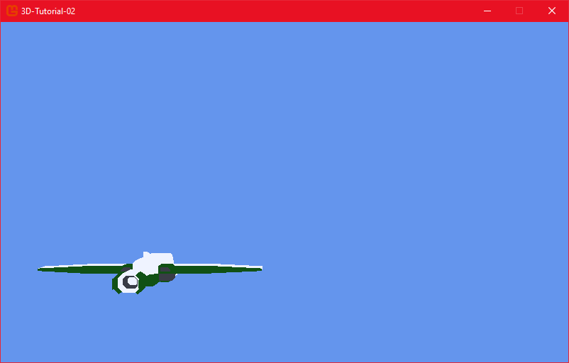

# Step 2: Move the player

## Objective

In this chapter, we will learn how to move the player using inputs.

The player will be able to move in left/right and up/down directions, along a plane that will be set up at 250 units from the camera. Such move will allow the player to position itself to shoot and to avoid incoming bullets.

Rather than just moving the ship around, we will make the movement smooth and graceful. We will also add a bit of inertia to the movement, so that the player will not stop immediately when the input is released. This will be accomplished by creating a concept of velocity and acceleration.

We will also restrict the player movement to the screen boundaries, so that the player will not be able to move outside the screen.

> [!WARNING]
>
> For this lesson, you are supposed to know how keyboard inputs work in MonoGame. You would find a wonderful reference in the Building 2D Games tutorial's chapter 10:

|   Sum up                |     Content                                                           |       Link                      |
| ----------------------- | --------------------------------------------------------------------- | ------------------------------- |
| Handling input          | They way to use keyboard, mouse and controller in MonoGame            | [2D games chapter 10](https://docs.monogame.net/articles/tutorials/building_2d_games/10_handling_input/index.html)  |

## Moving the player

All input related code will be placed in a `HandleInput` function. Let's define it and call it from Update.

```csharp
    private void HandlingInput(double dt)
    {

    }

    public void Update(double dt)
    {
        HandlingInput(dt);
        world = Matrix.CreateScale(scale) 
                * Matrix.CreateFromQuaternion(orientation) 
                * Matrix.CreateTranslation(position);
    }
```

### Speed and position

Speed is the variation of position over time. We will use two variables `speedX` and `speedY` to store the speed of the player. We will also create a constant for maximum speed.

At first, we will change the speed of the player for maximum speed when the input is pressed. We will then use the speed to change the position of the player.

```csharp
class Player
{
  private Model model;
  private Vector3 position;
  private Quaternion orientation;
  private Matrix world;

  const float MAX_SPEED = 350.0f;

  private float speedX = 0.0f;
  private float speedY = 0.0f;

  private void HandlingInput(double dt)
  {
    KeyboardState state = Keyboard.GetState();
    if (state.IsKeyDown(Keys.W))
    {
        speedY = MAX_SPEED;
    }
    if (state.IsKeyDown(Keys.S))
    {
        speedY = -MAX_SPEED;;
    }

    if (state.IsKeyDown(Keys.A))
    {
        speedX = -MAX_SPEED;
    }
    if (state.IsKeyDown(Keys.D))
    {
        speedX = MAX_SPEED;
    }

    position += new Vector3((float)(speedX * dt), (float)(speedY * dt), 0);
  }
```

This will move the player in the x and y directions when the keys are pressed. The player will stop when the keys are released.

> [!TIP]
>
> As you can see, the speed variation is multiplied by the `dt` parameter. This is because the speed is a variation over time, and we want to make sure that the movement frame rate independent.
>
> As a general rule, any variation over time should be multiplied by delta time to ensure consistent behavior across different frame rates.

### Using input for acceleration

We will now add acceleration to the movement, to make the movement smoother.

Acceleration is the variation of speed over time. We must make the player accelerate when the input is pressed, and decelerate when the input is released. The speed is variating, so we need to multiply it with the delta time.

```csharp
class Player
{
  ...
  const float ACCELERATION_RATE = 4000.0f;
  const float DECELERATION_RATE = 0.85f;

  private void HandlingInput(double dt)
  {
    KeyboardState state = Keyboard.GetState();
    if (state.IsKeyDown(Keys.W))
    {
        speedY += ACCELERATION_RATE * (float)dt;
    }
    if (state.IsKeyDown(Keys.S))
    {
        speedY -= ACCELERATION_RATE * (float)dt;
    }

    if (state.IsKeyDown(Keys.A))
    {
        speedX += ACCELERATION_RATE * (float)dt;
    }
    if (state.IsKeyDown(Keys.D))
    {
        speedX -= ACCELERATION_RATE * (float)dt;
    }

    position += new Vector3((float)(speedX * dt), (float)(speedY * dt), 0);
  }
  ...
}
```

### Deceleration

We will now add deceleration to the movement. When the input is released, the player will decelerate until it stops. We will use a deceleration rate to slow down the player.

```csharp
private void HandlingInput(double dt)
{
  KeyboardState state = Keyboard.GetState();
  ...
  position += new Vector3((float)(speedX * dt), (float)(speedY * dt), 0);

  speedX *= DECELERATION_RATE;
  speedY *= DECELERATION_RATE;
}
```

Multiplying the speed by a value less than 1.0f will make the speed decrease over time, simulating a friction effect. The player will now slow down when the input is released.

### Limiting speed

We do not want the player to move infinitely fast. We will limit the speed of the player to the maximum speed.

```csharp #12-15,25-28
private void HandlingInput(double dt)
{
  KeyboardState state = Keyboard.GetState();
  if (state.IsKeyDown(Keys.W))
  {
      speedY += ACCELERATION_RATE * (float)dt;
  }
  if (state.IsKeyDown(Keys.S))
  {
      speedY -= ACCELERATION_RATE * (float)dt;
  }
  if (MathF.Abs(speedY) > MAX_SPEED)
  {
      speedY = MathF.Sign(speedY) * MAX_SPEED;
  }

  if (state.IsKeyDown(Keys.A))
  {
      speedX += ACCELERATION_RATE * (float)dt;
  }
  if (state.IsKeyDown(Keys.D))
  {
      speedX -= ACCELERATION_RATE * (float)dt;
  }
  if (MathF.Abs(speedX) > MAX_SPEED)
  {
      speedX = MathF.Sign(speedX) * MAX_SPEED;
  }

  position += new Vector3((float)(speedX * dt), (float)(speedY * dt), 0);
  speedX *= DECELERATION_RATE;
  speedY *= DECELERATION_RATE;
}
```

After each speed change, we check if the absolute value of the speed is greater than the maximum speed. If it is, we set the speed to the maximum speed in the direction of the speed.

## Keeping the player inside the screen

Finally, we will restrict the player movement to the screen boundaries. We will use the MonoGame's `Rectangle` class to store the boundaries values.

[Link to MonoGame Rectangle documentation](https://docs.monogame.net/api/Microsoft.Xna.Framework.Rectangle.html)

When the player hit a boundary, we will set the player position to the boundary and set the speed in that direction to 0.

```csharp

class Player
{
  ...
  Rectangle BOUNDS = new Rectangle(-200, -140, 400, 280);

  private void HandlingInput(double dt)
  {
    KeyboardState state = Keyboard.GetState();
    ...
    position += new Vector3((float)(speedX * dt), (float)(speedY * dt), 0);
    speedX *= DECELERATION_RATE;
    speedY *= DECELERATION_RATE;

    if (position.X < BOUNDS.Left)
    {
        position.X = BOUNDS.Left;
        speedX = 0;
    }
    else if (position.X > BOUNDS.Right)
    {
        position.X = BOUNDS.Right;
        speedX = 0;
    }
    if (position.Y < BOUNDS.Top)
    {
        position.Y = BOUNDS.Top;
        speedY = 0;
    }
    else if (position.Y > BOUNDS.Bottom)
    {
        position.Y = BOUNDS.Bottom;
        speedY = 0;
    }
  }
}
```

That's it! The player can now move around the screen in a smooth and graceful way !



## Conclusion

In this chapter, we have learned how to move the player using inputs. Using `Vector3` operations, we have implemented smooth movement with acceleration and deceleration, and we have restricted the player movement to the screen boundaries.

In the next chapter, we will add the ability to orientate the player and display a target in the direction the player is aiming.
