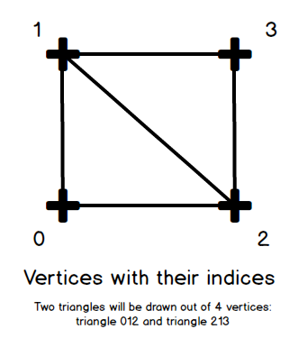
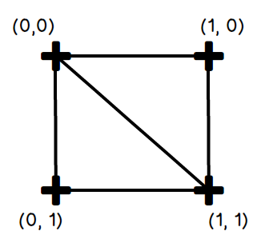
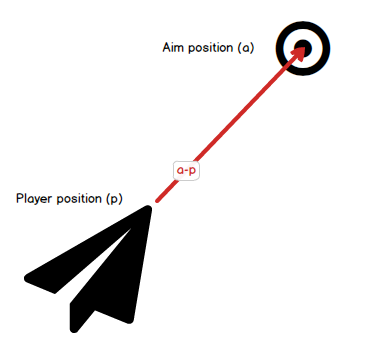
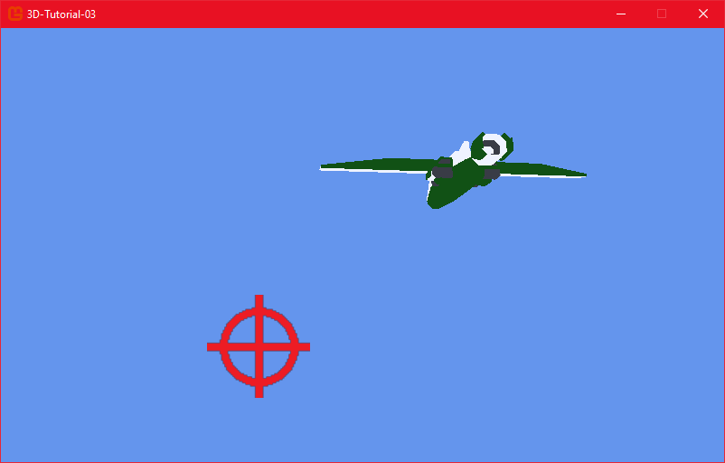

# Step 3: Aim and rotate the player

## Objective

In this chapter, we will create a target that the player will move with the mouse. The player's ship will rotate to aim at the target.

## Creating the target's quad

Our target will be a 2D image that will be displayed in the 3D world. This image must have a 3D mesh on which the texture will be applied. We will use a simple quad for this purpose.

A quad is a 2D plane that is composed of two triangles. For optimization purposes, we will have only four vertices for the triangles. Indices will tell which vertices to use to create the two different triangles.



> [!IMPORTANT]
>
> The order of the indices determines the orientation of the triangles. If the order is not correct, the triangles will be rendered in the wrong direction, and the texture will not be displayed correctly.

MonoGame allows us to create a mesh by specifying the vertices and the indices that define the triangles. We will create a quad using this in a *Quad.cs* file.

### The Quad data

```csharp
class Quad
{
  private VertexPositionNormalTexture[] vertices;
  private int[] indices;

  private Vector3 origin;
  private Vector3 up;
  private Vector3 normal;
  private Vector3 left;

  public Vector3 upperLeft;
  public Vector3 upperRight;
  public Vector3 lowerLeft;
  public Vector3 lowerRight;

  private BasicEffect effect;
}
```

We use the ``VertexPositionNormalTexture`` class for our vertices. Our quad's vertices will store the position, normal, and texture coordinates. We will also store the indices that define the triangles in our `Quad` class.

[Link to MonoGame VertexPositionNormalTexture documentation](https://docs.monogame.net/api/Microsoft.Xna.Framework.Graphics.VertexPositionNormalTexture.html)

The origin, ``up``, ``normal``, and ``left`` vectors will be used to position the quad in the 3D world. The ``upperLeft``, ``upperRight``, ``lowerLeft``, and ``lowerRight`` vectors will store the position of the quad's corners.

> [!NOTE] About texture coordinates
>
> Texture coordinates, also called UVs, indicate how to map a texture onto a mesh. They are usually in the range [0, 1], where (0, 0) is the upper left corner of the texture and (1, 1) is the lower right corner.
>
> 

We will use a `BasicEffect` to render the quad. We will set the effect's texture to the texture we want to apply to the quad.

### Filling the vertices

Let's fill the vertices with the quad's position, normal, and texture coordinates. We will also set the indices for the triangles. This will happen in a `FillVertices` function.

```csharp
private void FillVertices()
{
  Vector2 textureUpperLeft = new Vector2(0.0f, 0.0f);
  Vector2 textureUpperRight = new Vector2(1.0f, 0.0f);
  Vector2 textureLowerLeft = new Vector2(0.0f, 1.0f);
  Vector2 textureLowerRight = new Vector2(1.0f, 1.0f);

  for (int i = 0; i < this.vertices.Length; i++)
  {
      vertices[i].Normal = normal;
  }

  vertices[0].Position = lowerLeft;
  vertices[0].TextureCoordinate = textureLowerLeft;
  vertices[1].Position = upperLeft;
  vertices[1].TextureCoordinate = textureUpperLeft;
  vertices[2].Position = lowerRight;
  vertices[2].TextureCoordinate = textureLowerRight;
  vertices[3].Position = upperRight;
  vertices[3].TextureCoordinate = textureUpperRight;

  indices[0] = 0;
  indices[1] = 1;
  indices[2] = 2;
  indices[3] = 2;
  indices[4] = 1;
  indices[5] = 3;
}
```

### Building the quad

We will create the quad in the constructor of the ``Quad`` class. We will set the ``origin``, ``up``, ``normal``, and ``left`` vectors. We will also set the position of the quad's corners. Finally, we will call the ``FillVertices`` function and store the ``BasicEffect`` we will use to draw.

```csharp
public Quad(Vector3 origin, Vector3 normal, Vector3 up,
    float width, float height, BasicEffect effect)
{
  vertices = new VertexPositionNormalTexture[4];
  indices = new int[6];
  this.origin = origin;
  this.normal = normal;
  this.up = up;

  // Calculate the quad corners
  left = Vector3.Cross(normal, this.up);
  Vector3 uppercenter = (this.up * height / 2) + origin;
  upperLeft = uppercenter + (this.left * width / 2);
  upperRight = uppercenter - (this.left * width / 2);
  lowerLeft = this.upperLeft - (this.up * height);
  lowerRight = this.upperRight - (this.up * height);

  FillVertices();
  this.effect = effect;
}
```

### Drawing the quad

Drawing a mesh set by hand is different from drawing a model. As with the player, we will need a world, view, and projection matrix to draw the quad. The difference is that we  will call the ``GraphicsDevice.DrawUserIndexedPrimitives`` function to draw the quad, and trigger the application of the shader pass. In order to do those last two operations, we will need an access to the ``GraphicsDevice``.

```csharp
public void Draw(GraphicsDevice device, Matrix world, Matrix view, Matrix projection)
{
  effect.World = world;
  effect.View = view;
  effect.Projection = projection;
  foreach (EffectPass pass in effect.CurrentTechnique.Passes)
  {
    pass.Apply();
    device.DrawUserIndexedPrimitives<VertexPositionNormalTexture>(
      PrimitiveType.TriangleList, vertices, 0, 4, indices, 0, 2
    );
  }
}
```

The `GraphicsDevice` contains differents methods related to graphics. Here is a link to the [MonoGame GraphicsDevice documentation](https://docs.monogame.net/api/Microsoft.Xna.Framework.Graphics.GraphicsDevice.html).

## Creating and showing the target

Now the ``Quad`` class is ready, we can create a target that we will be able to move, and that will use the quad to display itself. This target will be contained in a *PlayerAim.cs* file.

In order to draw the player aim's texture, we will need to load it. Add the *Crosshair.png* file into the MGCB and build it. We will then load the texture in the ``Load`` function.

### The PlayerAim class

```csharp
class PlayerAim
{
  private Quad quad;
  private Vector3 position;
  private Quaternion orientation;
  private Matrix world;
  GraphicsDevice device;

  public Vector3 Position
  {
      get { return position; }
  }
}
```

The ``PlayerAim`` class will contain a quad that will be used to display the target. We will also store the position and orientation of the target, and the world matrix and graphics device to draw the quad.

We will also create a property to access the position of the target, so that the player will be able to orientate toward it.

### Setting up the quad and its basic effect

We will use the ``Load`` function to set up our member variables. The position of the target will be set to *(0, 0, -5000)* to place it in front of the camera. We will create a ``BasicEffect`` and set its texture to the *Crosshair* texture. We will then create the quad, orientated towards the player.

```csharp
  public void Load(ContentManager content, GraphicsDevice device)
  {
      position = new Vector3(0, 0, -5000);

      this.device = device;
      BasicEffect effect = new BasicEffect(device);
      effect.VertexColorEnabled = false;
      effect.TextureEnabled = true;
      effect.Texture = content.Load<Texture2D>("Crosshair");
      quad = new Quad(Vector3.Zero, -Vector3.Forward, Vector3.Up, 1000, 1000, effect);
  }
```

### Updating the target

We will update the target in the ``Update`` function. We will use the mouse to move the target. We will then update the world matrix of the quad.

```csharp
  public void Update(double dt)
  {
      MouseState mouse = Mouse.GetState();
      position.X = (mouse.X - device.Viewport.Width / 2) * 10.04f;
      position.Y = (mouse.Y - device.Viewport.Height / 2) * -10.04f;

      world = Matrix.CreateTranslation(position);
  }
```

> [!NOTE]
>
> The player's aim quad won't rotate, so we don't need to set the orientation. The world matrix is simply a translation matrix.

The multiplication by -10.04f is used make the mouse move more dynamic. The multiplication by -10.04f is used to invert the Y axis.

### Drawing the target

We can now call the ``Draw`` function of the quad in the ``Draw`` function of the ``PlayerAim`` class.

```csharp
  public void Draw(Matrix view, Matrix projection)
  {
      quad.Draw(device, world, view, projection);
  }
```

Now we need to create our ``PlayerAim`` object from the ``Game1`` class.

## Managing the PlayerAim

We will now create a ``PlayerAim`` object in the ``Game1`` class. As usual, we will load it in the ``LoadContent`` function, update it in the ``Update`` function, and draw it in the ``Draw`` function.

```csharp
public class Game1 : Game
{
  ...
  private Player player;
  private PlayerAim playerAim;
  ...
  protected override void LoadContent()
  {
    _spriteBatch = new SpriteBatch(GraphicsDevice);

    playerAim = new PlayerAim();
    playerAim.Load(Content, GraphicsDevice);

    player = new Player(playerAim);
    player.Load(Content);
  }

  protected override void Update(GameTime gameTime)
  {
    if (GamePad.GetState(PlayerIndex.One).Buttons.Back == ButtonState.Pressed || Keyboard.GetState().IsKeyDown(Keys.Escape))
      Exit();

    double dt = gameTime.ElapsedGameTime.TotalSeconds;
    playerAim.Update(dt);
    player.Update(dt);

    base.Update(gameTime);
  }

  protected override void Draw(GameTime gameTime)
  {
    GraphicsDevice.Clear(Color.CornflowerBlue);

    GraphicsDevice.BlendState = BlendState.Opaque;
    player.Draw(view, projection);

    GraphicsDevice.BlendState = BlendState.NonPremultiplied;
    playerAim.Draw(view, projection);

    base.Draw(gameTime);
  }
}
```

> [!NOTE]
>
> - The player's constructor now takes a PlayerAim object as a parameter.
> - When drawing the PlayerAim, we set the BlendState to NonPremultiplied to ensure transparency.

We will now update the ``Player`` so that it rotates toward its ``PlayerAim``.

## Orienting the Player toward the PlayerAim

First, we need to add a ``PlayerAim`` member variable to the ``Player`` class. It will be passed to they player in a new constructor.

```csharp
  private PlayerAim playerAim;

  public Player(PlayerAim playerAim)
  {
      this.playerAim = playerAim;
  }
```

### The HandleAiming function

In the Player class, we will create an ``HandleAiming`` function that will rotate the player toward the target. We will then call this function in the ``Update`` function.

```csharp
  private void HandleAiming()
  {

  }

  public void Update(double dt)
  {
    HandlingInput(dt);
    HandleAiming();

    world = Matrix.CreateScale(scale) * Matrix.CreateFromQuaternion(orientation) * Matrix.CreateTranslation(position);
  }
```

### Calculating the rotation to follow the aim

The general idea here will be to compute the direction between the player and the aim, then create a rotation matrix from this direction.

We can get the direction by subtracking the aim's position from the player's position. We will then normalize this direction vector to get a unit vector.



Then, in order to create this rotation matrix, and if we consider the direction vector as a forward vector, we need to create two other vectors: the right vector (xAxis) and the up vector (yAxis), relative to our forward vector. We will then create a matrix from these three vectors, by setting the matrix's value by hand.

When we have the orientation matrix, we create a quaternion from it and set it as the player's orientation.

```csharp
  private void HandleAiming()
  {
    Vector3 direction = playerAim.Position - position;
    direction.Normalize();

    Vector3 xAxis = Vector3.Cross(Vector3.Up, direction);
    xAxis.Normalize();

    Vector3 yAxis = Vector3.Cross(direction, xAxis);
    yAxis.Normalize();

    Matrix aim = Matrix.Identity;
    aim.M11 = xAxis.X;
    aim.M21 = yAxis.X;
    aim.M31 = direction.X;

    aim.M12 = xAxis.Y;
    aim.M22 = yAxis.Y;
    aim.M32 = direction.Y;

    aim.M13 = xAxis.Z;
    aim.M23 = yAxis.Z;
    aim.M33 = direction.Z;

    orientation = Quaternion.CreateFromRotationMatrix(aim);
  }
```

Everything is ready! Run the game and rotate the player toward the target while moving the ship with the keys and the mouse.



## Conclusion

In this chapter, we created a target that the player can aim at using the mouse. The player rotates to face the target. We also learned how to create a quad mesh and apply a texture to it.

In the next chapter, we will add a shooting mechanic to the player, allowing it to shoot in the direction of the target. We will also create a projectile class to handle the bullets' behavior and rendering.
