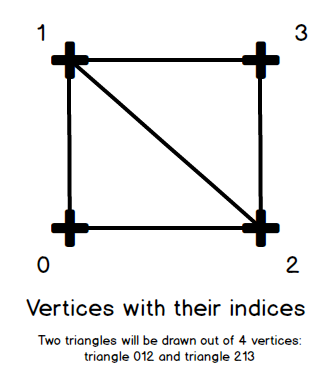
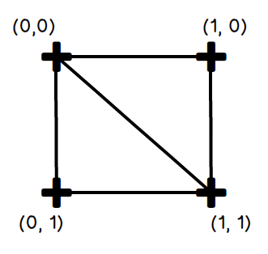
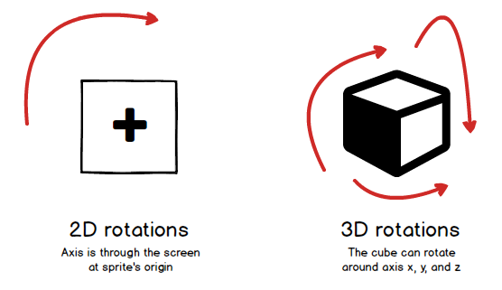
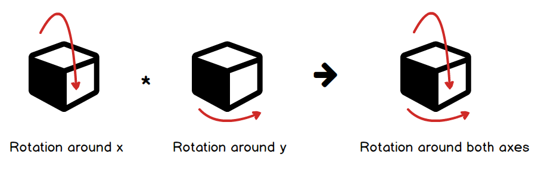
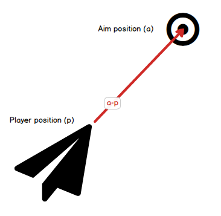
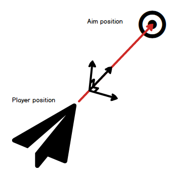
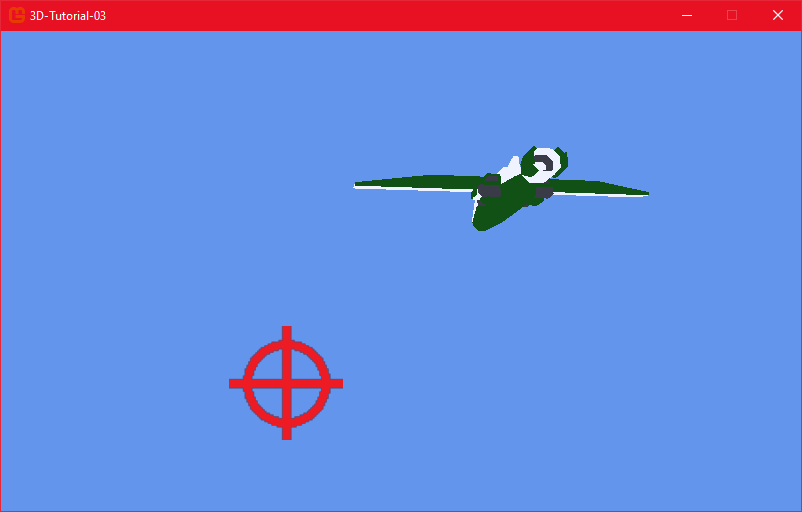

# Step 3: Aim and rotate the player

## Objective

In this chapter, we will create a target that the player will move with the mouse. The player's ship will rotate to aim at the target.

> [!WARNING]
>
> This chapter is quite mathematical. You need to have understood [Chapter 1](../01_display_a_3d_ship/index.md) and vector mathematics well. You can also review the explanations about matrices.

## Creating the target's quad

Our target will be a 2D image that will be displayed in the 3D world. This image must have a 3D mesh on which the texture will be applied. We will use a simple **quad** for this purpose.

A quad is a 2D plane that is composed of two triangles. For optimization purposes, we will have only four vertices for the triangles, and tell the GPU to use 3 vertices for one triangle, and three others for the second triangle — using the same vertices for the diagonal so the two triangles will share one edge. **Indices** will tell which vertices to use to create the two different triangles.

|  |
| :-----------------------------------------------------------------------------------------------: |
| **Figure 3-1: A quad** |

> [!IMPORTANT]
>
> The order of the indices determines the orientation of the triangles. If the order is not correct, the triangles will be rendered in the wrong direction and the texture will not be displayed correctly.

MonoGame allows us to create a mesh by specifying the vertices and the indices that define the triangles. We will create a quad using this in a *Quad.cs* file. Create this new file for the `Quad` class.

### The Quad data

```csharp
class Quad
{
  private VertexPositionNormalTexture[] vertices;
  private int[] indices;

  private Vector3 origin;
  private Vector3 up;
  private Vector3 normal;
  private Vector3 left;

  public Vector3 upperLeft;
  public Vector3 upperRight;
  public Vector3 lowerLeft;
  public Vector3 lowerRight;

  private BasicEffect effect;
}
```

We use MonoGame's [**VertexPositionNormalTexture**](xref:Microsoft.Xna.Framework.Graphics.VertexPositionNormalTexture) class for our vertices. This class represents a vertex with a position, **normal**, and **texture coordinate** (see below). You already know the position of a vertex. We will also store the indices that define the triangles in our `Quad` class.

[Link to MonoGame VertexPositionNormalTexture documentation](https://docs.monogame.net/api/Microsoft.Xna.Framework.Graphics.VertexPositionNormalTexture.html)

The origin, `up`, `normal`, and `left` vectors will be used to position the quad in the 3D world. The `upperLeft`, `upperRight`, `lowerLeft`, and `lowerRight` vectors will store the position of the quad's corners.

> [!NOTE]
>
> **Texture coordinates**, also called UVs, indicate how to map a texture onto a mesh. They are usually in the range [0, 1], where (0, 0) is the upper-left corner of the texture and (1, 1) is the lower-right corner.
>
> |  |
> | :-----------------------------------------------------------------------------------------------: |
> | **Figure 3-2: Quad's texture coordinates** |

> [!NOTE]
>
> The **normal vector** is a vector that is perpendicular to the surface of the quad at the vertex position. It is used in various geometrical operations, particularly in lighting calculations to determine how light interacts with the surface.

We will use a `BasicEffect` to render the quad. We will set the effect's texture to the texture we want to apply to the quad.

### Filling the vertices

Let's fill the vertices with the quad's position, normal, and texture coordinates. We will also set the indices for the triangles. This will happen in a `FillVertices` function you have to create.

```csharp
private void FillVertices()
{
  Vector2 textureUpperLeft = new Vector2(0.0f, 0.0f);
  Vector2 textureUpperRight = new Vector2(1.0f, 0.0f);
  Vector2 textureLowerLeft = new Vector2(0.0f, 1.0f);
  Vector2 textureLowerRight = new Vector2(1.0f, 1.0f);

  for (int i = 0; i < this.vertices.Length; i++)
  {
      vertices[i].Normal = normal;
  }

  vertices[0].Position = lowerLeft;
  vertices[0].TextureCoordinate = textureLowerLeft;
  vertices[1].Position = upperLeft;
  vertices[1].TextureCoordinate = textureUpperLeft;
  vertices[2].Position = lowerRight;
  vertices[2].TextureCoordinate = textureLowerRight;
  vertices[3].Position = upperRight;
  vertices[3].TextureCoordinate = textureUpperRight;

  indices[0] = 0;
  indices[1] = 1;
  indices[2] = 2;
  indices[3] = 2;
  indices[4] = 1;
  indices[5] = 3;
}
```

### Building the quad

We will create the quad in the constructor of the `Quad` class. We will set the `origin`, `up`, `normal`, and `left` vectors. We will also set the position of the quad's corners: because we consider the quad's general position in 3D space to be centered on its origin, the corners will be calculated by going half the width and height in each direction from the center. Finally, we will call the `FillVertices` function and store the `BasicEffect` we will use to draw.

Create this constructor:

```csharp
public Quad(Vector3 origin, Vector3 normal, Vector3 up,
    float width, float height, BasicEffect effect)
{
  vertices = new VertexPositionNormalTexture[4];
  indices = new int[6];
  this.origin = origin;
  this.normal = normal;
  this.up = up;
  left = Vector3.Cross(normal, this.up);

  // Calculate the quad corners
  Vector3 uppercenter = (this.up * height / 2) + origin;
  upperLeft = uppercenter + (this.left * width / 2);
  upperRight = uppercenter - (this.left * width / 2);
  lowerLeft = this.upperLeft - (this.up * height);
  lowerRight = this.upperRight - (this.up * height);

  FillVertices();
  this.effect = effect;
}
```

### Drawing the quad

Drawing a mesh set by hand is different from drawing a model. As with the player, we will need a world, view, and projection matrix to draw the quad. The difference is that we will call the `GraphicsDevice.DrawUserIndexedPrimitives` function to draw the quad, and trigger the application of the shader (this is called a **shader pass**). In order to do those last two operations, we will need access to the `GraphicsDevice` in the quad's `Draw` function. Create this function:

```csharp
public void Draw(GraphicsDevice device, Matrix world, Matrix view, Matrix projection)
{
  effect.World = world;
  effect.View = view;
  effect.Projection = projection;
  foreach (EffectPass pass in effect.CurrentTechnique.Passes)
  {
    pass.Apply();
    device.DrawUserIndexedPrimitives<VertexPositionNormalTexture>(
      PrimitiveType.TriangleList, vertices, 0, 4, indices, 0, 2
    );
  }
}
```

We use the `PrimitiveType.TriangleList` to indicate that we want to draw triangles. The `DrawUserIndexedPrimitives` function takes the vertices and indices we created to draw the quad. The first `0` indicates we have no offset, that is we want to draw from the first vertex. The `4` indicates the number of vertices we have. The second `0` indicates we have no offset in the indices, and the `2` indicates the number of **primitives** (here triangles) to draw.

> [!NOTE]
>
> A primitive is a basic shape that can be drawn, in our case a triangle. Other primitive types exist, like lines or points.

The **[GraphicsDevice](xref:Microsoft.Xna.Framework.Graphics.GraphicsDevice)** contains different methods related to graphics. Here is a link to the [MonoGame GraphicsDevice documentation](https://docs.monogame.net/api/Microsoft.Xna.Framework.Graphics.GraphicsDevice.html).

## Creating and showing the target

Now that the `Quad` class is ready, we can create a target that we will be able to move, and that will use the quad to display itself. This target will be contained in a *PlayerAim.cs* file you need to create.

In order to draw the player aim's texture, we will need to load it. Add the *Crosshair.png* file into the MGCB and build it. We will then load the texture in the `Load` function, in the next paragraph.

### The PlayerAim class

```csharp
class PlayerAim
{
  private Quad quad;
  private Vector3 position;
  private Quaternion orientation;
  private Matrix world;
  GraphicsDevice device;

  public Vector3 Position
  {
      get { return position; }
  }
}
```

The `PlayerAim` class will contain a quad that will be used to display the target. We will also store the position and orientation of the target, and the world matrix and graphics device to draw the quad.

We also need to create a property to access the position of the target, so that the player will be able to orient toward it.

### Setting up the quad and its basic effect

We will use the `Load` function to set up our member variables. The position of the target will be set to `(0, 0, -5000)` to place it in front of the camera. We will create a `BasicEffect` and set its texture to the *Crosshair* texture. We will then create the quad, oriented towards the player. Implement the `Load` function like this:

```csharp
  public void Load(ContentManager content, GraphicsDevice device)
  {
      position = new Vector3(0, 0, -5000);

      this.device = device;
      BasicEffect effect = new BasicEffect(device);
      effect.VertexColorEnabled = false;
      effect.TextureEnabled = true;
      effect.Texture = content.Load<Texture2D>("Crosshair");
      quad = new Quad(Vector3.Zero, -Vector3.Forward, Vector3.Up, 1000, 1000, effect);
  }
```

Note that we need to enable textures on the `BasicEffect` by setting the `TextureEnabled` property to true. 

### Updating the target

We will update the target in the `Update` function. We will use the mouse to move the target. We will then update the world matrix of the quad. Implement the `Update` function:

```csharp
  public void Update(double dt)
  {
      MouseState mouse = Mouse.GetState();
      position.X = (mouse.X - device.Viewport.Width / 2) * 10.04f;
      position.Y = (mouse.Y - device.Viewport.Height / 2) * -10.04f;

      world = Matrix.CreateTranslation(position);
  }
```

> [!NOTE]
>
> The player's aim quad won't rotate, so we don't need to set the orientation. The world matrix is simply a translation matrix.

The factor `10.04f` scales the mouse movement to make it more dynamic; the negative sign in the Y expression inverts the Y axis.

### Drawing the target

We can now call the `Draw` function of the quad in the `Draw` function of the `PlayerAim` class.

```csharp
  public void Draw(Matrix view, Matrix projection)
  {
      quad.Draw(device, world, view, projection);
  }
```

Now we need to create our `PlayerAim` object from the `Game1` class.

## Managing the PlayerAim

We will now create a `PlayerAim` object in the `Game1` class. As usual, we will load it in the `LoadContent` function, update it in the `Update` function, and draw it in the `Draw` function. Let's review the changes to make in those three functions:

```csharp
public class Game1 : Game
{
  ...
  private Player player;
  private PlayerAim playerAim;
  ...
  protected override void LoadContent()
  {
    _spriteBatch = new SpriteBatch(GraphicsDevice);

    playerAim = new PlayerAim();
    playerAim.Load(Content, GraphicsDevice);

    player = new Player(playerAim);
    player.Load(Content);
  }

  protected override void Update(GameTime gameTime)
  {
    if (GamePad.GetState(PlayerIndex.One).Buttons.Back == ButtonState.Pressed || Keyboard.GetState().IsKeyDown(Keys.Escape))
      Exit();

    double dt = gameTime.ElapsedGameTime.TotalSeconds;
    playerAim.Update(dt);
    player.Update(dt);

    base.Update(gameTime);
  }

  protected override void Draw(GameTime gameTime)
  {
    GraphicsDevice.Clear(Color.CornflowerBlue);

    GraphicsDevice.BlendState = BlendState.Opaque;
    player.Draw(view, projection);

    GraphicsDevice.BlendState = BlendState.NonPremultiplied;
    playerAim.Draw(view, projection);

    base.Draw(gameTime);
  }
}
```

> [!NOTE]
>
> - The player's constructor now takes a `PlayerAim` object as a parameter.
> - When drawing the `PlayerAim`, we set the `BlendState` to `NonPremultiplied` to ensure transparency.

We will now update the `Player` so that it rotates toward its `PlayerAim`. But before, we need to explain how rotation works in 3D.

## Understanding 3D Rotation

### How to represent rotations in 3D games?

While in 2D games, we can use just one angle to represent rotations, in 3D games, it is not that simple. While 2D objects were just rotated around a single axis, 3D objects can be rotated around three axes: x, y and z. This means that we need to represent rotations in a more complex way than just using angles.

|  |
| :-----------------------------------------------------------------------------------------------: |
| **Figure 3-3: 2D vs 3D rotations** |

After some research, game programmers settled on two main mathematical objects to represent 3D rotations: **rotation matrices** and **quaternions**.

As we have already stated in the first chapter, *3D matrices* or *transforms* are a table of 4 by 4 numbers that can contain at the same time translation, rotation and scale information. If we use them for rotations, they have a marvelous feature: they can be multiplied together to apply several rotations at once. This is a very powerful property, but they have a big drawback: they are quite heavy to compute, and they can suffer from **gimbal lock**. Gimbal lock is a problem that occurs when two of the three axes align, causing a loss of one degree of freedom in rotation. This can lead to unexpected behavior in 3D games.

A **[Quaternion](xref:Microsoft.Xna.Framework.Quaternion)** is a fairly abstract mathematical object represented with 4 numbers. Quaternions can be multiplied together (we say *concatenated*) to apply several rotations at once. They do not suffer from gimbal lock and are more efficient to compute than matrices. Nevertheless, quaternions can only represent rotations, not translations nor scales like matrices do.

The following consensus was finally found. Because they can represent translations, rotations and scales, matrices would be used to contain the final transformation of a 3D object and sent to the GPU to draw objects. Meanwhile, quaternions being more efficient to rotate the 3D objects around, we would use them to execute any rotation during a frame, and then convert them to matrices to apply the final transformation to the 3D object.

We will implement this consensus in our game: use a quaternion to represent the orientation of our ship, rotate it with other quaternions, and then convert it to a matrix to apply the final transformation to the ship's model.

### About Quaternions

#### Quaternions for our game

The orientation variable will hold the rotation of the ship. As stated before, we will use quaternions to represent rotations.

```csharp
  public void Load(ContentManager content)
  {
    model = content.Load<Model>("Ship");
    position = new Vector3(0, 0.0f, -250.0f);
    orientation = Quaternion.Identity;
    scale = new Vector3(2f, 2f, 2f);
  }
```

The *identity quaternion* is the quaternion that does not rotate the object. It is the equivalent of the zero vector for the `Vector3` class.

#### Quaternions in MonoGame

Usually, in this tutorial's code, we will create quaternions just before multiplying them to handle rotations.

In this case we will use the `Quaternion.CreateFromAxisAngle` function. With this function the quaternion will represent a rotation around a certain axis, by the angle given in radians.

Let's review a case where we create two rotations, one around the x axis and one around the y axis, then multiply (*concatenate*) them together to get a final orientation:

```csharp
var xRotation = Quaternion.CreateFromAxisAngle(Vector3.Right, -MathF.PI / 2);
var yRotation = Quaternion.CreateFromAxisAngle(Vector3.Up, MathF.PI / 4);
orientation = xRotation * yRotation;
// We could have used: Quaternion.Concatenate(xRotation, yRotation);
```

|  |
| :-----------------------------------------------------------------------------------------------: |
| **Figure 3-4: Rotation concatenation** |

> [!NOTE]
>
> Sometimes, for a specific reason, we will have a matrix containing the rotation that interests us. In this case, we can create a quaternion from a rotation matrix, using the `Quaternion.CreateFromRotationMatrix` function:
> 
> ```csharp
> return Quaternion.CreateFromRotationMatrix(aim);
> ```

As stated earlier, when we have multiplied quaternions together to get a final orientation, we convert the result back to a rotation matrix using `Matrix.CreateFromQuaternion`, so we can apply it to our 3D model.

```csharp
var rotationMatrix = Matrix.CreateFromQuaternion(orientation);
```

To learn more about quaternions in MonoGame, see [MonoGame's Quaternion Documentation](https://docs.monogame.net/api/Microsoft.Xna.Framework.Quaternion.html).

#### Why Not Just Use Angles?

Before discussing quaternions, it's important to understand why we don't just use Euler angles (pitch, yaw, roll) with rotation matrices. While angles are intuitive, they have significant limitations in 3D graphics:

- Gimbal Lock: When rotations on one axis cause another axis to align, losing a degree of freedom, rotation becomes unpredictable.
- Interpolation Problems: Smoothly transitioning between rotations is difficult with angles.
- Numerical Stability: Accumulated errors can cause issues over time.

#### What is a Quaternion?

Now that we know how to use them, let's understand further what a quaternion is.

Mathematically, a quaternion is a four-dimensional number represented as:

$$
q = w + xi + yj + zk
$$

Where:

- *w* is the real component
- *x*, *y*, *z* are imaginary components
- *i*, *j*, *k* are special operators with properties like $i^2 = j^2 = k^2 = ijk = -1$

Yes, this last property feels a bit weird. You may have learned that real numbers (numbers from $\mathbb{R}$), when squared, cannot be negative - so their squared values cannot be equal to -1. Actually, there are other sets of numbers than real numbers. You might have heard about complex numbers (in $\mathbb{C}$), which are numbers that can be represented as $a + bi$, where $a$ and $b$ are real numbers and $i$ is the imaginary unit, with the property that $i² = -1$. Quaternions are an extension of complex numbers, living in a 4 dimensions space called the Hamiltonian space ($\mathbb{H}$).

In code, a quaternion is stored as four components (x, y, z, w).

> [!NOTE]
>
> You cannot represent yourself a number in 4 dimensions? That is normal: it is a quite abstract mathematical object. Actually, you do not need to understand the underlying mathematics to use quaternions. You can consider it as a tool to ease rotation computations.

#### Mathematical properties

**1. Quaternion.Identity:** Represents "no rotation" (like in your code)

```csharp
Quaternion.Identity = Quaternion(0, 0, 0, 1)
// Here, w = 1, x = 0, y = 0, z = 0. 
// w is the last component in the constructor.
```

**2. Normalization:** Like vectors, quaternions must be normalized for rotation. Using a non-normalized quaternion can cause unexpected rotations.

$$
|q| = \sqrt{w^2 + x^2 + y^2 + z^2}
$$

$$
\hat{q} = \frac{q}{|q|}
$$

```csharp
orientation.Normalize();
```

**3. Quaternion Multiplication:** Combines rotations.

This is the key to quaternions' efficiency, because it is much quicker to multiply quaternions than to multiply rotation matrices.

$$
q_1 * q_2 = (w_1w_2 - x_1x_2 - y_1y_2 - z_1z_2) + (w_1x_2 + x_1w_2 + y_1z_2 - z_1y_2)i + (w_1y_2 - x_1z_2 + y_1w_2 + z_1x_2)j + (w_1z_2 + x_1y_2 - y_1x_2 + z_1w_2)k
$$

MonoGame allows us to multiply quaternions:

```csharp
orientation = orientation * Quaternion.CreateFromAxisAngle(Vector3.Up, MathHelper.Pi);
```

**4. Converting to a Rotation Matrix:** When we have computed the final orientation of our object with quaternions, we can convert it to a rotation matrix to apply it to our object.

```text
Matrix rotationMatrix = Matrix.CreateFromQuaternion(orientation);
```

**Application of Quaternions in Game Development:** Quaternions are used for:

- Representing object orientation (like your ship)
- Smooth rotation interpolation (SLERP - Spherical Linear Interpolation)
- Camera control
- Character animation

Again, this list is far from exhaustive! But for now, that's ok. If you want more information about vectors, matrices and quaternions, you can read [this article](https://docs.monogame.net/articles/getting_to_know/whatis/vector_matrix_quat/index.html) which will help you understand these concepts better.

We can return to our game and use quaternions to rotate our player toward the aim target.

## Orienting the Player toward the PlayerAim

First, we need to add a `PlayerAim` member variable to the `Player` class. It will be passed to the player in a new constructor introduced earlier. Create this new constructor:

```csharp
  private PlayerAim playerAim;

  public Player(PlayerAim playerAim)
  {
      this.playerAim = playerAim;
  }
```

### The HandleAiming function

In the `Player` class, we will create a `HandleAiming` function that will rotate the player toward the target. We will then call this function in the `Update` function. Implement this:

```csharp
  private void HandleAiming()
  {

  }

  public void Update(double dt)
  {
    HandlingInput(dt);
    HandleAiming();

    world = Matrix.CreateScale(scale) * Matrix.CreateFromQuaternion(orientation) * Matrix.CreateTranslation(position);
  }
```

### Calculating the rotation to follow the aim

The general idea here is to compute the direction between the player and the aim, then create a rotation matrix from this direction, and then convert this matrix into a quaternion.

We can get the direction by subtracting the player's position from the aim's position. We will then normalize this direction vector to get a unit vector.

|  |
| :-----------------------------------------------------------------------------------------------: |
| **Figure 3-5: Player aiming at the target** |

To orientate the player, we will build with our little hands an orientation matrix. It is not the simplest solution here but it will be useful for you to help understand that a matrix represent a coordinate system relative to an object. In the end, we will have a matrix that represents the coordinate system of the player, oriented toward the target.

We already have a normalized vector toward the target. We build a perpendicular vector to this vector by executing a cross product between the normalized direction vector and the world's up vector. We normalize the result. Finally, we create a last normalized perpendicular vector — this time perpendicular to both the direction and the second vector. Those three normalized vectors create a coordinate system specific to the player's orientation. The following diagram represents the coordinate system we just created:

|  |
| :-----------------------------------------------------------------------------------------------: |
| **Figure 3-6: How to build an orientation matrix?** |

When we have the orientation matrix, we create a quaternion from it and set it as the player's orientation. You will implement all this in the `HandleAiming` function:

```csharp
  private void HandleAiming()
  {
    Vector3 direction = playerAim.Position - position;
    direction.Normalize();

    Vector3 xAxis = Vector3.Cross(Vector3.Up, direction);
    xAxis.Normalize();

    Vector3 yAxis = Vector3.Cross(direction, xAxis);
    yAxis.Normalize();

    Matrix aim = Matrix.Identity;
    aim.M11 = xAxis.X;
    aim.M21 = yAxis.X;
    aim.M31 = direction.X;

    aim.M12 = xAxis.Y;
    aim.M22 = yAxis.Y;
    aim.M32 = direction.Y;

    aim.M13 = xAxis.Z;
    aim.M23 = yAxis.Z;
    aim.M33 = direction.Z;

    orientation = Quaternion.CreateFromRotationMatrix(aim);
  }
```

Everything is ready! Run the game and rotate the player toward the target with the mouse while moving the ship with the keys.

|  |
| :-----------------------------------------------------------------------------------------------: |
| **Figure 3-7: Chapter 3 final result** |

## Conclusion

In this chapter, we created a target that the player can aim at using the mouse. The player rotates to face the target. We also learned how to create a quad mesh and apply a texture to it.

In the next chapter, we will add a shooting mechanic to the player, allowing it to shoot in the direction of the target. We will also create a projectile class to handle the bullets' behavior and rendering.
