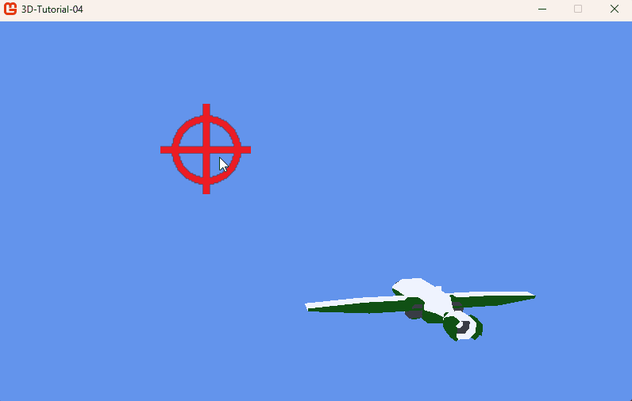

# Step 4: Shoot projectiles

## Objectives

We will now allow the player to shoot projectiles. The projectile will be a simple colored cube that will be scaled in the depth direction to look like a bullet.

Because projectiles will partially use similar member variables as the player, we will create a new mother class for both. This class will be called `Entity`. We will refactor the ``Player`` and the ``PlayerAim`` to inherit from this class.

## The Entity class

### The entity itself

Create a *Entity.cs* file. Its code will be globally similar to the player's code, but without the input handling.

```csharp
class Entity
{
  protected Model model;
  protected Vector3 position;
  protected Quaternion orientation;
  protected Vector3 scale;
  protected Matrix world;

  public Vector3 Position
  {
      get { return position; }
  }

  public Entity()
  {
    position = Vector3.Zero;
    orientation = Quaternion.Identity;
    scale = Vector3.One;
    world = Matrix.Identity;
  }

  public virtual void Load(ContentManager content, string modelName)
  {
    model = content.Load<Model>(modelName);
  }

  public virtual void Update(double dt)
  {
      world = Matrix.CreateScale(scale) * Matrix.CreateFromQuaternion(orientation) * Matrix.CreateTranslation(position);
  }

  public virtual void Draw(Matrix view, Matrix projection)
  {
    foreach (ModelMesh mesh in model.Meshes)
    {
      foreach (BasicEffect effect in mesh.Effects)
      {
        effect.World = world;
        effect.View = view;
        effect.Projection = projection;
      }

      mesh.Draw();
    }
  }
}
```

### Refactoring the player

Now, we will make the player inherit from the Entity class.

We will now refactor the player's code to use the ``Entity`` class. We wil update the ``Load`` and the ``Update`` functions. The ``Draw`` function is no longer needed, as it is already defined in the ``Entity`` class.

```csharp
class Player : Entity
{
  ...
  public Player(PlayerAim playerAim) : base()
  {
    this.playerAim = playerAim;
  }

  public override void Load(ContentManager content, string modelName)
  {
      base.Load(content, modelName);
      position = new Vector3(0.0f, 0.0f, -250.0f);
      scale = new Vector3(2.0f, 2.0f, 2.0f);
  }

  ...

  public override void Update(double dt)
  {
      HandlingInput(dt);
      HandleAiming();

      base.Update(dt);
  }
}
```

### Refactoring the player aim

We will now make the player aim inherit from the ``Entity`` class.

```csharp
class PlayerAim : Entity
{
  private Quad quad;
  GraphicsDevice device;

  public PlayerAim() : base()
  {
  }

  public void Load(ContentManager content, GraphicsDevice device)
  {
    position = new Vector3(0, 0, -5000);

    this.device = device;
    BasicEffect effect = new BasicEffect(device);
    effect.VertexColorEnabled = false;
    effect.TextureEnabled = true;
    effect.Texture = content.Load<Texture2D>("Crosshair");
    quad = new Quad(Vector3.Zero, -Vector3.Forward, Vector3.Up, 1000, 1000, effect);
  }

  public override void Update(double dt)
  {
    MouseState mouse = Mouse.GetState();
    position.X = (device.Viewport.Width / 2 - mouse.X) * -10.04f;
    position.Y = (device.Viewport.Height / 2 - mouse.Y) * 10.04f;

    base.Update(dt);
  }

  public override void Draw(Matrix view, Matrix projection)
  {
    quad.Draw(device, world, view, projection);
  }
}
```

Note that, in this case, we do not need to use the ``Entity``'s ``Load`` or ``Draw`` function.

## The projectile

Our projectile will be a simple cube. Add the *Cube.fbx* file in MGCB.

### The projectile class

Now we will create the *Projectile.cs* file. ``Projectile`` will inherit from the ``Entity`` class.

The projectile will borrow its direction and its position from its shooter. It will have a constant speed and a bool variable to tell if the projectile is issued from the player or from an enemy.

```csharp
class Projectile : Entity
{
  private float speed;
  private bool fromPlayer;

  public bool FromPlayer
  {
    get { return fromPlayer; }
  }

  public Projectile(Vector3 position, Quaternion orientation, float speed, bool fromPlayer = true) : base()
  {
    this.position = position;
    this.orientation = orientation;
    this.speed = speed;
    this.fromPlayer = fromPlayer;
  }

  public override void Load(ContentManager content, string modelName)
  {
    base.Load(content, modelName);
    scale = new Vector3(5f, 5f, 50f);
  }

  public override void Update(double dt)
  {
    Vector3 direction = Vector3.Transform(-Vector3.Forward, orientation);
    position += direction * speed * (float)dt;
    base.Update(dt);
  }
}
```

As you can see, in `Update`, we have used ``Vector3.Transform`` to orientate the direction vector with a quaternion. Indeed, `Vector3.Transform` works either with matrices or quaternions.

### Managing projectils in the Game1 class

The ``Game1`` class will manage the projectiles. We will add a list of projectiles in it. The class will be responsible for updating and drawing the projectiles.

We will also add an ``UpdateProjectiles`` function and a ``AddProjectile`` function, to add a projectile in the managed projectiles list, that will be called from the ``Player``'s class when hitting the shooting input.

```csharp
public class Game1 : Game
{
  ...
  private List<Projectile> projectiles = new List<Projectile>();
  ...

  protected override void Update(GameTime gameTime)
  {
    if (GamePad.GetState(PlayerIndex.One).Buttons.Back == ButtonState.Pressed || Keyboard.GetState().IsKeyDown(Keys.Escape))
      Exit();

    double dt = gameTime.ElapsedGameTime.TotalSeconds;
    playerAim.Update(dt);
    player.Update(dt);

    UpdateProjectiles(dt);

    base.Update(gameTime);
  }

  private void UpdateProjectiles(double dt)
  {
    for (int i = projectiles.Count - 1; i >= 0; i--)
    {
      projectiles[i].Update(dt);
      if (projectiles[i].Position.Z < -10000)
      {
          projectiles.RemoveAt(i);
          continue;
      }
    }
  }

  protected override void Draw(GameTime gameTime)
  {
    GraphicsDevice.Clear(Color.CornflowerBlue);

    GraphicsDevice.BlendState = BlendState.Opaque;
    player.Draw(view, projection);

    foreach (Projectile projectile in projectiles)
    {
      projectile.Draw(view, projection);
    }

    GraphicsDevice.BlendState = BlendState.NonPremultiplied;
    playerAim.Draw(view, projection);

    base.Draw(gameTime);
  }

  public void AddProjectile(Vector3 position, Quaternion orientation, float speed, bool fromPlayer = true)
  {
    var newProjectile = new Projectile(position, orientation, speed, fromPlayer);
    newProjectile.Load(Content, "Cube");
    projectiles.Add(newProjectile);
  }
}
```

### Shooting the projectile

Now we can update the player to shoot the projectile when the player presses the left mouse button. We will introduce a cooldown mecanism to avoid the player to shoot too many projectiles at once.

Note that the player will now receive a reference to the ``Game1`` class, so that it can call ``Game1.AddProjectile``.

```csharp
class Player : Entity
{
  private PlayerAim playerAim;
  private Game1 game;
  ...
  const float COOLDOWN = 0.25f;
  private float cooldownTimer = 0.0f;

  public Player(PlayerAim playerAim, Game1 game) : base()
  {
    this.playerAim = playerAim;
    this.game = game;
  }
  ...

  public override void Update(double dt)
  {
    HandlingInput(dt);
    HandleAiming();

    // Handle shooting
    MouseState mouse = Mouse.GetState();
    if (mouse.LeftButton == ButtonState.Pressed && cooldownTimer <= 0)
    {
      game.AddProjectile(position, orientation, 1000.0f);
      cooldownTimer = COOLDOWN;
    }
    cooldownTimer -= (float)dt;

    base.Update(dt);
  }
}
```

That's it! You can now shoot projectiles from the player's position to the target. You can now move the player and aim with the mouse, and shoot with the left mouse button.



### Conclusion

In this step, we have created a new `Entity` class to encapsulate common properties and methods for the player, the player's aim and projectiles. We refactored the player and player aim classes to inherit from this new class. We also created a `Projectile` class that can be instantiated and managed by the `Game1` class, allowing the player to shoot projectiles.

In the next step, we will implement collision detection between projectiles and enemies, allowing the player to defeat enemies by shooting them.