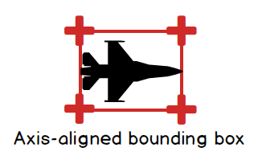
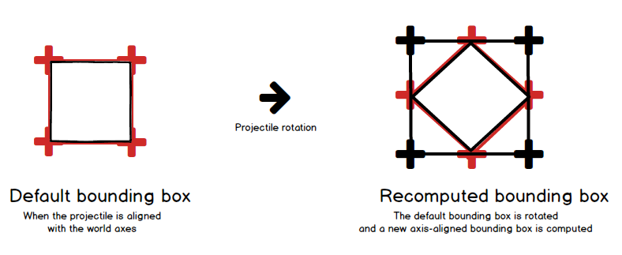

# Step 5: Projectile collisions

## Objectives

We will now make the projectiles collide with a target. The target will be our enemy model.

However, we will not directly use our models to detect collisions. We will create bounding box (an invisible mathematical cube) around both the projectile and the target, and check if those bounding boxes are colliding. Testing for collisions with bounding boxes is much faster than testing for collisions with models, and it is also more forgiving, as the bounding boxes can be larger than the actual models.



Let's start by creating the target.

## The Enemy

Add the `Saucer.fbx` model to MGCB.

### An Enemy class blueprint

Create an *Enemy.cs* file. The ``Enemy`` will inherit from ``Entity``.

```csharp
class Enemy : Entity
{
    private const float COLLIDER_SCALE = 30.0f;
    private BoundingBox boundingBox;

    public BoundingBox BoundingBox
    {
      get { return boundingBox; }
    }

    public Enemy(Vector3 position) : base()
    {
      this.position = position;
      scale = new Vector3(2f, 2f, 2f);
    }

    private BoundingBox CreateBoundingBox()
    {
      Vector3 min = new Vector3(-0.5f * COLLIDER_SCALE, -0.5f * COLLIDER_SCALE, -0.5f * COLLIDER_SCALE);
      Vector3 max = new Vector3(0.5f * COLLIDER_SCALE, 0.5f * COLLIDER_SCALE, 0.5f * COLLIDER_SCALE);
      min = Vector3.Transform(min, world);
      max = Vector3.Transform(max, world);
      return new BoundingBox(min, max);
    }

    public override void Update(double dt)
    {
      base.Update(dt);
      boundingBox = CreateBoundingBox();
    }

    public void SetRandomPosition()
    {
      Random random = new Random();
      position = new Vector3(random.Next(-100, 100), random.Next(-100, 100), -500);
    }
}
```

A bounding box is most of the time created from a minimum and a maximum point. In our case, we create a bounding box that is centered on the enemy model, with a size of 30 units in each direction (X, Y, Z).

> [!TIP]
>
> The bounding box is created with a size superior to the actual enemy model. This is to make the collision detection more forgiving. It is recreated at each frame, taking into account the enemy's world matrix, so that it follows the model's position.

We will also add a ``SetRandomPosition`` function to place the enemy at a random position after it has been hit. This will allow us to test our shooting system in a more dynamic way.

### Managing enemies in the Game1 class

We will now add a list of enemies in the ``Game1`` class. The class will be responsible for updating and drawing the enemies. For now, we'll start with a single enemy.

```csharp
public class Game1 : Game
{
  ...
  private List<Enemy> enemies = new List<Enemy>();
  ...

  protected override void LoadContent()
  {
    ...
    enemies.Add(new Enemy(new Vector3(0, 0, -500)));
    enemies[0].Load(Content, "Saucer");
  }

  protected override void Update(GameTime gameTime)
  {
    if (GamePad.GetState(PlayerIndex.One).Buttons.Back == ButtonState.Pressed || Keyboard.GetState().IsKeyDown(Keys.Escape))
      Exit();

    double dt = gameTime.ElapsedGameTime.TotalSeconds;
    if (dt > 0.1) dt = 0.1;

    playerAim.Update(dt);
    player.Update(dt);

    UpdateProjectiles(dt);
    UpdateEnemies(dt);

    base.Update(gameTime);
  }

  ...

  private void UpdateEnemies(double dt)
  {
    for (int i = enemies.Count - 1; i >= 0; i--)
    {
        enemies[i].Update(dt);
    }
  }

  protected override void Draw(GameTime gameTime)
  {
    GraphicsDevice.Clear(Color.CornflowerBlue);

    GraphicsDevice.BlendState = BlendState.Opaque;
    player.Draw(view, projection);

    foreach (Projectile projectile in projectiles)
    {
        projectile.Draw(view, projection);
    }

    foreach (Enemy enemy in enemies)
    {
        enemy.Draw(view, projection);
    }

    GraphicsDevice.BlendState = BlendState.NonPremultiplied;
    playerAim.Draw(view, projection);

    base.Draw(gameTime);
  }
...

}
```

The ``UpdateProjectiles`` function will be written later to handle collisions.

> [!TIP]
>
> We have added `if (dt > 0.1) dt = 0.1;` just after computing the delta time. This is to prevent the game elements from too large movements if the delta time is too high, when, for instance, you use breakpoints to debug your code.

## Projectile collisions

### Creating a bounding box for the projectile

The projectile will also need a bounding box.

Because the projectile can have a rotation and our bounding boxes are aligned with axes (*AABB*), we will need to create a bounding box that is big enough to contain the projectile at any rotation. The idea will be to transform each corner of the projectile's bounding box by the projectile's world matrix, and then create a new bounding box from these transformed points.



MonoGame provides a function to create a bounding box from a list of points, so that any point inside this list is also inside the bounding box.

[Link to MonoGame BoundingBox documentation](https://docs.monogame.net/api/Microsoft.Xna.Framework.BoundingBox.html)

```csharp
class Projectile : Entity
{
  ...
  private BoundingBox boundingBox;

  public BoundingBox BoundingBox
  {
      get { return boundingBox; }
  }
  ...

  public override void Update(double dt)
  {
    Vector3 direction = Vector3.Transform(-Vector3.Forward, orientation);
    position += direction * speed * (float)dt;
    base.Update(dt);
    boundingBox = CreateBoundingBox();
  }

  private BoundingBox CreateBoundingBox()
  {
    Vector3[] vertices = {
      new Vector3(-0.5f, -0.5f, 0.5f), new Vector3(-0.5f, -0.5f, -0.5f),
      new Vector3(-0.5f, 0.5f, 0.5f), new Vector3(-0.5f, 0.5f, -0.5f),
      new Vector3(0.5f, -0.5f, 0.5f), new Vector3(0.5f, -0.5f, -0.5f),
      new Vector3(0.5f, 0.5f, 0.5f), new Vector3(0.5f, 0.5f, -0.5f)
    };
    for (int i = 0; i < vertices.Length; i++)
    {
      vertices[i] = Vector3.Transform(vertices[i], world);
    }
    return BoundingBox.CreateFromPoints(vertices);
  }
}
```

### Checking for collisions in the Game1 class

Now we will update the ``UpdateProjectiles`` function to check for collisions. If a collision is detected, we will remove the projectile and set the enemy to a different random position.

Also, we will remove projectiles that are out of bounds.

```csharp
  private void UpdateProjectiles(double dt)
  {
    for (int i = projectiles.Count - 1; i >= 0; i--)
    {
      projectiles[i].Update(dt);
      // Remove projectiles that are out of bounds
      if (projectiles[i].Position.Z < -10000)
      {
        projectiles.RemoveAt(i);
        continue;
      }
      // Collision with enemies
      foreach (Enemy enemy in enemies)
      {
        if (enemy.BoundingBox.Intersects(projectiles[i].BoundingBox)
            && projectiles[i].FromPlayer)
        {
          enemy.SetRandomPosition();
          projectiles.RemoveAt(i);
          break;
        }
      }
    }
  }
```

That's it! You can now shoot at the enemy model and see it move to a different position when hit.

## Conclusion

In this step, we learned how to create bounding boxes for both the projectile and the enemy model, and how to check for collisions between them. This is an important step in our quest for fun interactivity!

In the next step, we will use our collision detection system to create a power up for the player, which will allow them to shoot multiple projectiles at once.
