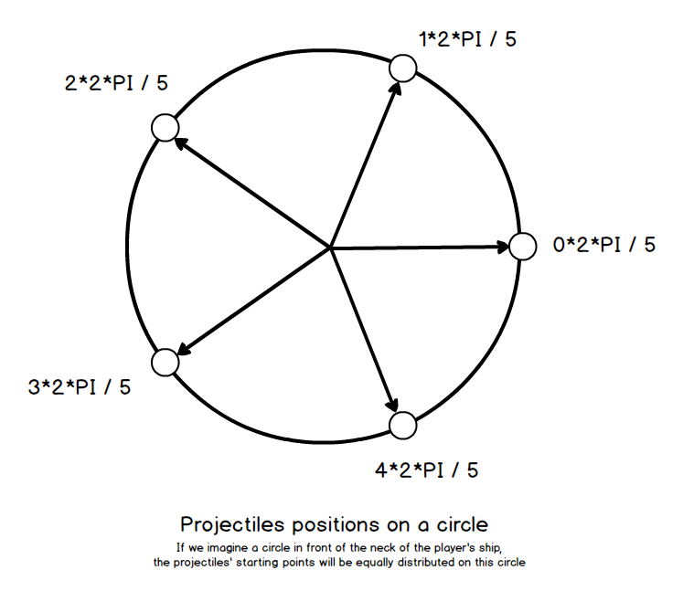
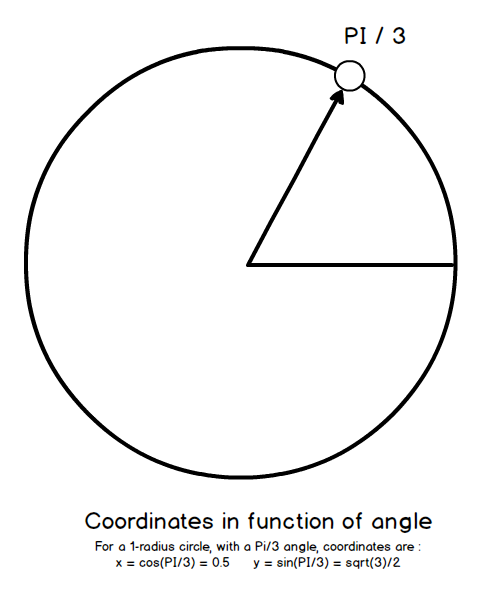
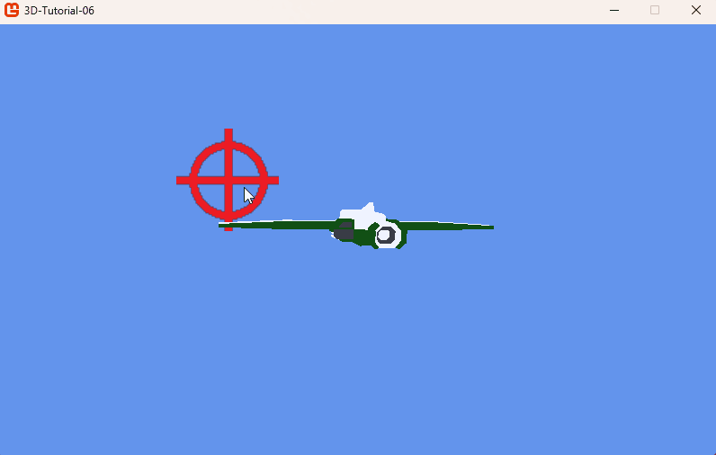

# Step 6: Projectile collisions

## Objectives

A shooter game would not be a shooter game if we could not improve our weapons! In this step, we will make the player's weapon more powerful when the player collides with a power-up. The power-up will be a simple sphere, and the player will shoot more projectiles when colliding with it.

In order to achieve this, we will need to create a new class for the power-up, and modify the player's shooting mechanism to take into account the power-up. The `Game1` class will manage the collisions. Each time the player collides with the power-up, the player will shoot one more projectile.

## The Power Up

Create a new class named `PowerUp.cs`. The `PowerUp` will inherit from `Entity`. It will be a simple sphere that moves towards the player, and will have a bounding box to detect collisions. It will also contain a `SetRandomPosition` method to position it when we want it to appear.

```csharp
class PowerUp : Entity
{
  private float speed;
  private BoundingBox boundingBox;

  public BoundingBox BoundingBox
  {
    get { return boundingBox; }
  }

  public PowerUp(Vector3 position, float speed)
  {
    this.position = position;
    this.speed = speed;
    scale = new Vector3(10f, 10f, 10f);
  }

  public override void Update(double dt)
  {
    position.Z += speed * (float)dt;
    base.Update(dt);
    boundingBox = CreateBoundingBox();
  }

  private BoundingBox CreateBoundingBox()
  {
    Vector3 min = new Vector3(-2, -2, -2);
    Vector3 max = new Vector3(2, 2, 2);
    min = Vector3.Transform(min, world);
    max = Vector3.Transform(max, world);
    return new BoundingBox(min, max);
  }

  public void SetRandomPosition()
  {
    Random random = new Random();
    position = new Vector3(random.Next(-200, 200), random.Next(-100, 100), -1000);
  }
}
```

We set the scale to `10f` so that the power-up is easy to catch for the player.

> [!TIP]
>
> When making a game, it is nearly always better to favorise player's comfort than exact numbers.

## Setting up the player for power-ups

### Allow the player to collide power-ups

First we need the player to be able to collide with the power-up.

In the `Player` class, we will add a `BoundingBox` property, and a `CreateBoundingBox` method to create the bounding box of the player in its `Update` method.

```csharp
class Player : Entity
{
  ...
  private BoundingBox boundingBox;

  public BoundingBox BoundingBox
  {
      get { return boundingBox; }
  }
  ...

  public override void Update(double dt)
  {
    ...
    base.Update(dt);
    boundingBox = CreateBoundingBox();
  }
  ...

  private BoundingBox CreateBoundingBox()
  {
    Vector3[] vertices = {
        new Vector3(-64f, -7f, -67f), new Vector3(64f, -7f, -67f),
        new Vector3(-64f, 25f, -67f), new Vector3(64f, 25f, -67f),
        new Vector3(-64f, -7f, 77f), new Vector3(64f, -7f, 77f),
        new Vector3(-64f, 25f, 77f), new Vector3(64f, 25f, 77f)
    };
    for (int i = 0; i < vertices.Length; i++)
    {
        vertices[i] = Vector3.Transform(vertices[i], world);
    }
    return BoundingBox.CreateFromPoints(vertices);
  }
```

This bounding box is specifically set for our player model. It is bigger than the model so there is no annoying collision detail to take into account when playing. If you want to change the player model, you will need to change the vertices of the bounding box accordingly.

## Make the player shoot more projectiles

Now that we have a `PowerUp` class, we need to modify the player's shooting mechanism to take into account the power-up. We will add a `projectileNumber` variable to the `Player` class, which will be the number of projectiles the player will shoot. Also, we will need a public `PowerUp` method to increase the `projectileNumber` when the player collides with the power-up.

The projectiles will be positionned on a circle in front of the player. In order to achieve that, we will use basic trigonometry: the player will shoot `projectileNumber` projectiles, each one at an angle of `2 * PI / projectileNumber` from the previous one. For instance, if we have 5 projectiles, the third projectile will be positionned at the angle `2 * 2 * PI / 5`:



Once we have this angle, if we consider a cercle of radius 1, the projectile x coordinate is the cosine of the angle, and the y coordinate is the sine of the angle.



Because we want a circle bigger than 1, the circle will be given a `PROJECTILES_RADIUS`, to make the circle bigger. We just have to multiply the projectiles coordinate by this radius.

By the way, because the first projectile (when we shoot without any power up) should be issued from the center of this circle, we will manage this situation specifically, and keep our former shooting logic.

```csharp
class Player : Entity
{
  ...
  const float PROJECTILES_RADIUS = 25.0f;
  private int projectileNumber = 1;
  ...

  public override void Update(double dt)
  {
    HandlingInput(dt);
    HandleAiming();

    // Handle shooting
    MouseState mouse = Mouse.GetState();
    if (mouse.LeftButton == ButtonState.Pressed && cooldownTimer <= 0)
    {
        if (projectileNumber == 1)
        {
            game.AddProjectile(position, orientation, 1000.0f);
        }
        else
        {
            CreateProjectiles();
        }
        cooldownTimer = COOLDOWN;
    }
    cooldownTimer -= (float)dt;

    base.Update(dt);
    boundingBox = CreateBoundingBox();
  }

  private void CreateProjectiles()
  {
      List<Projectile> projectiles = new List<Projectile>();
      for (int i = 0; i < projectileNumber; i++)
      {
          Vector3 offset = new Vector3(0, 0, 0);
          float projectileAngle = 2 * MathHelper.Pi / projectileNumber * i;
          offset.X = PROJECTILES_RADIUS * MathF.Cos(projectileAngle);
          offset.Y = PROJECTILES_RADIUS * MathF.Sin(projectileAngle);
          game.AddProjectile(position + offset, orientation, 1000.0f);
      }
  }

  public void PowerUp()
  {
      projectileNumber++;
  }
  ...
}
```

## Managing power-ups in the Game1 class

Now that we have a `PowerUp` class and the player can collide with it, we need to manage the power-ups in the `Game1` class. We will add a `powerUps` list to the `Game1` class, and we will create the `UpdatePowerUps` method to manage the power-up collisions and player's projectiles number increase.

In this current step, in order to test the power-up, we will make the power-up appear every 5 seconds, and manage this time with a `powerUpTimer` variable.

```csharp
public class Game1 : Game
{
  ...
  private List<PowerUp> powerUps = new List<PowerUp>();
  const float POWER_UP_TIME = 5.0f;
  float powerUpTimer = 1;
  ...

  protected override void Update(GameTime gameTime)
  {
    if (GamePad.GetState(PlayerIndex.One).Buttons.Back == ButtonState.Pressed || Keyboard.GetState().IsKeyDown(Keys.Escape))
      Exit();

    double dt = gameTime.ElapsedGameTime.TotalSeconds;
    if (dt > 0.1) dt = 0.1;

    playerAim.Update(dt);
    player.Update(dt);

    UpdateProjectiles(dt);
    UpdateEnemies(dt);

    // Power up test
    powerUpTimer -= (float)dt;
    if (powerUpTimer <= 0)
    {
      powerUps.Add(new PowerUp(new Vector3(0, 0, 0), 200.0f));
      powerUps[powerUps.Count - 1].Load(Content, "BeachBall");
      powerUps[powerUps.Count - 1].SetRandomPosition();
      powerUpTimer = POWER_UP_TIME;
    }
    UpdatePowerUps(dt);

    base.Update(gameTime);
  }
  ...

  private void UpdatePowerUps(double dt)
  {
    for (int i = powerUps.Count - 1; i >= 0; i--)
    {
      powerUps[i].Update(dt);
      if (player.BoundingBox.Intersects(powerUps[i].BoundingBox))
      {
        player.PowerUp();
        powerUps.RemoveAt(i);
        break;
      }
      if (powerUps[i].Position.Z > 500)
      {
        powerUps.RemoveAt(i);
        break;
      }
    }
  }

  protected override void Draw(GameTime gameTime)
  {
    GraphicsDevice.Clear(Color.CornflowerBlue);

    GraphicsDevice.BlendState = BlendState.Opaque;
    player.Draw(view, projection);

    foreach (Projectile projectile in projectiles)
    {
      projectile.Draw(view, projection);
    }

    foreach (Enemy enemy in enemies)
    {
      enemy.Draw(view, projection);
    }

    foreach (PowerUp powerUp in powerUps)
    {
      powerUp.Draw(view, projection);
    }

    GraphicsDevice.BlendState = BlendState.NonPremultiplied;
    playerAim.Draw(view, projection);

    base.Draw(gameTime);
  }
  ...
}
```

Now, power-ups appear at a regular rate. You can use them to check that our projectile system is working as expected.



## Conclusion

In this step, we have added a power-up to the game. When the player collides with the power-up, the player's weapon will shoot more projectiles. This system is quite simple, but could easylly be extended to more complex power-ups, such as a power-up that makes the player invincible for a short period of time, or different kind of projectiles patterns.

In the next step, we will manage the enemies' movements and behaviors.
