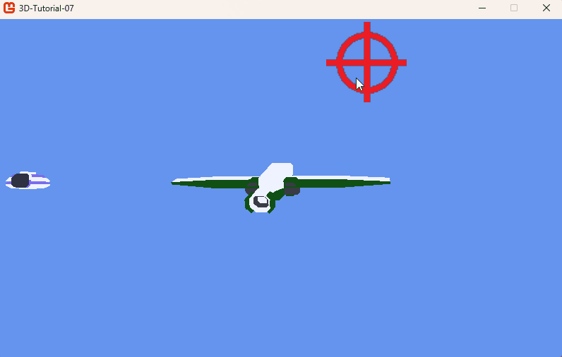

# Step 7: Enemy phases

## Objectives

We will now start to code one of the pleasures of shooters: the enemy choreography. In this chapter, we will focus on one enemy: it will enter the game, wait for a few seconds, and then exit. We will be able to choose which "side" of the screen the enemy will enter or exit from: left side, right side, bottom side, top side, player's back, horizon. This will be the first step to create a more complex system: waves of enemies coming and going.

By the way, we will implement a simple HP management system for the enemies. When the enemy is hit by a projectile, it will lose 1 HP. When the HP reaches 0, the enemy will be destroyed.

## The enemy state machine

The enemy will have different states, that we will call `Phase`:

- **Enter**: the enemy is entering the game. It is spawned outside the player's view and will move from outside the screen to its target position.
- **Main Phase**: the enemy is waiting. It will stay at its position for a specified time. Later in this tutorial, we will make the enemy shoot at the player during this phase.
- **Exit**: the enemy is exiting the game. It will move from its position to outside the screen. Once outside the screen, the enemy will be destroyed.

Note: we will give the possibility for an enemy to stay in the Main Phase for an infinite amount of time. In this case the main phase duration will be set to -1. This will be useful for enemies we want the player to destroy in a mandatory way, like bosses.

### Enums and variables

We will create an enum to represent the enemy's phase, and another enum to represent screen sides. We will also add some variables to the `Enemy` class to manage the enemy's phase:

```csharp
enum Phase
{
    Enter,
    Main,
    Exit
}

enum ScreenSide
{
    Top,
    Bottom,
    Left,
    Right,
    Horizon,
    Back
}

internal class Enemy : Entity
{
  ...
  private Vector3 targetPosition = Vector3.Zero;
  private Vector3 velocity = Vector3.Zero;
  private float speed = 300.0f;
  private Phase phase = Phase.Enter;
  private ScreenSide screenSideEnter = ScreenSide.Left;
  private ScreenSide screenSideExit = ScreenSide.Right;
  private float mainPhaseDuration = 5.0f;
  private float mainPhaseCounter = 5.0f;
  private int hp = 5;
  bool isDead = false;

  public bool IsDead
  {
      get { return isDead || hp <= 0; }
  }
  ...
```

The `targetPosition` will be the position the enemy will move to during the `Enter` and `Exit` phases. The `velocity` will be the 3D speed at which the enemy will move, and the `speed` variable is the rate of that movement. The `phase` will be the current phase of the enemy. The `screenSideEnter` and `screenSideExit` specify where the enemy enters and exits. The `mainPhaseDuration` is the duration of the `Main` phase. The `mainPhaseCounter` is a counter used to determine when the Main Phase is over.

The `hp` will be the enemy's hit points. The `isDead` variable will be used to mark the enemy as dead. This variable will also be useful when the enemy goes out of the screen during the `Exit` phase: when the enemy is out of the screen, it will be destroyed.

### Using the enemy state machine

We will refactor the `Update` function to implement different behaviour depending on the enemy's phase.

```csharp
public override void Update(double dt)
{
  switch(phase)
  {
    case Phase.Enter:
      UpdateEnterPhase(dt);
      break;
    case Phase.Main:
      UpdateMainPhase(dt);
      break;
    case Phase.Exit:
      UpdateExitPhase(dt);
      break;
  }

  if (hp <= 0)
  {
    isDead = true;
  }

  position += velocity * (float)dt;
  base.Update(dt);
  boundingBox = CreateBoundingBox();
}
```

We will create the `UpdateEnterPhase`, `UpdateMainPhase` and `UpdateExitPhase` functions to implement the behaviour of the enemy in each phase.

During the `Enter` phase, the enemy will move to its target position. When the enemy is close enough to its target position, it will change its phase to `Main`.

During the `Main` phase, the enemy will wait for the specified duration. When the duration is over, the enemy will change its phase to `Exit`. If the `mainPhaseDuration` is set to -1, the enemy will stay in the `Main` phase indefinitely — or until the player destroys it.

During the `Exit` phase, the enemy will move to its target position. When the enemy is close enough to its target position, it will be marked dead.

```csharp
private void UpdateEnterPhase(double dt)
{
  MoveToTargetPosition(dt);
  if (Vector3.Distance(position, targetPosition) < 5.0f)
  {
    ChangePhase(Phase.Main);
  }
}

private void UpdateMainPhase(double dt)
{
  mainPhaseCounter += (float)dt;
  if (mainPhaseDuration == -1f) return;
  if (mainPhaseCounter > mainPhaseDuration)
  {
    ChangePhase(Phase.Exit);
  }
}

private void UpdateExitPhase(double dt)
{
  MoveToTargetPosition(dt);
  if (Vector3.Distance(position, targetPosition) < 5.0f)
  {
    isDead = true;
  }
}
```

We also need to create the `MoveToTargetPosition` function that will move the enemy to its target position.

```csharp
  private void MoveToTargetPosition(double dt)
  {
    Vector3 direction = targetPosition - position;
    direction.Normalize();
    velocity = direction * speed;
  }
```

### Change the enemy's phase

Each phase transition needs specific behaviour:

- When the enemy enters the game, it will be placed outside the screen and will move to its target position.
- When the enemy is in the `Main` phase, it should stop and wait for the specified duration.
- When the enemy exits the game, it should move to a target position outside the screen and be destroyed once out of view.

We will create the `ChangePhase` function to handle those behaviours:

```csharp
private void ChangePhase(Phase newPhase)
{
  phase = newPhase;
  switch (phase)
  {
    case Phase.Enter:
      phase = Phase.Enter;
      position = GetPositionFromScreenSide(screenSideEnter);
      break;

    case Phase.Main:
      phase = Phase.Main;
      mainPhaseCounter = 0.0f;
      velocity = Vector3.Zero;
      break;

    case Phase.Exit:
      phase = Phase.Exit;
      targetPosition = GetPositionFromScreenSide(screenSideExit);
      break;
  }
}
```

The `GetPositionFromScreenSide` function will return a position outside the screen depending on the chosen side.

```csharp
private Vector3 GetPositionFromScreenSide(ScreenSide side)
{
    Vector3 position = Vector3.Zero;
    float startZ = -5000;
    switch (side)
    {
        case ScreenSide.Left:
            position = targetPosition - new Vector3(100 * MathF.Abs(targetPosition.Z) / 100f, 0, 0);
            break;
        case ScreenSide.Right:
            position = targetPosition + new Vector3(100 * MathF.Abs(targetPosition.Z) / 100f, 0, 0);
            break;
        case ScreenSide.Top:
            position = targetPosition + new Vector3(0, 100 * MathF.Abs(targetPosition.Z) / 100f, 0);
            break;
        case ScreenSide.Bottom:
            position = targetPosition - new Vector3(0, 100 * MathF.Abs(targetPosition.Z) / 100f, 0);
            break;
        case ScreenSide.Horizon:
            startZ = MathF.Min(targetPosition.Z, -10000 + targetPosition.Z);
            position = new Vector3(targetPosition.X, targetPosition.Y, startZ);
            break;
        case ScreenSide.Back:
            startZ = MathF.Max(1000, 1000 + targetPosition.Z);
            position = new Vector3(targetPosition.X, targetPosition.Y, startZ);
            break;
    }
    return position;
}
```

> [!NOTE]
>
> The target position depends on the enemy's Z coordinate. This way, the enemy will always move outside the screen, no matter where it is in the game world.

### Enemy's constructor

Modify the `Enemy` constructor to set the target position to the enemy's initial position. The enemy will start in the `Enter` phase.

```csharp
public Enemy(Vector3 position) : base()
{
  this.targetPosition = position;
  mainPhaseDuration = 5.0f;
  scale = new Vector3(10f, 10f, 10f);
  ChangePhase(Phase.Enter);
}
```

Because the enemy's `Update` function is already called in the `Game` class, we don't need to change the `Game` class to make the enemy enter the game. We will, however, add a way to reduce enemy HP when hit by a projectile.

## Destroy enemies by shooting them

### Deplete enemy HP

Just add a public function to the `Enemy` class that will decrement the enemy's hp. We will call it when it is hit by a projectile.

```csharp
  public void RemoveHp()
  {
    hp--;
  }
```

### Make enemies die

Update the `UpdateProjectiles` function in the `Game` class to decrement an enemy's HP when hit:

```csharp
  private void UpdateProjectiles(double dt)
  {
    for (int i = projectiles.Count - 1; i >= 0; i--)
    {
      projectiles[i].Update(dt);
      // Remove projectiles that are out of bounds
      if (projectiles[i].Position.Z < -10000)
      {
          projectiles.RemoveAt(i);
          continue;
      }
      // Collision with enemies
      foreach (Enemy enemy in enemies)
      {
        if (enemy.BoundingBox.Intersects(projectiles[i].BoundingBox)
            && projectiles[i].FromPlayer)
        {
          enemy.RemoveHp();
          projectiles.RemoveAt(i);
          break;
        }
      }
    }
  }
```

Also change `UpdateEnemies` to remove enemies that are dead:

```csharp
  private void UpdateEnemies(double dt)
  {
    for (int i = enemies.Count - 1; i >= 0; i--)
    {
      enemies[i].Update(dt);
      // Remove dead enemies
      if (enemies[i].IsDead)
      {
          enemies.RemoveAt(i);
      }
    }
  }
```

Note: the loop runs backwards to safely remove elements while iterating.

## Removing test power-ups

We will remove the test power-up timer from the previous chapter. The `Game1.Update` function will be simplified:

```csharp
  protected override void Update(GameTime gameTime)
  {
    if (GamePad.GetState(PlayerIndex.One).Buttons.Back == ButtonState.Pressed || Keyboard.GetState().IsKeyDown(Keys.Escape))
      Exit();

    double dt = gameTime.ElapsedGameTime.TotalSeconds;
    if (dt > 0.1) dt = 0.1;

    playerAim.Update(dt);
    player.Update(dt);

    UpdateProjectiles(dt);
    UpdateEnemies(dt);
    UpdatePowerUps(dt);

    base.Update(gameTime);
  }
```

## Conclusion

We implemented a simple enemy state machine. The enemy enters the game, waits for a few seconds, and then exits. When the enemy is hit by a projectile, it loses HP; when HP reaches zero, the enemy is destroyed.

|  |
| :-----------------------------------------------------------------------------------------------: |
| **Figure 7-1: Final screenshot, a moving enemy** |

In the next step, we will make the enemy shoot at the player during its main phase!
