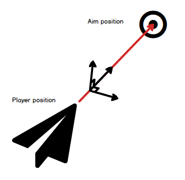
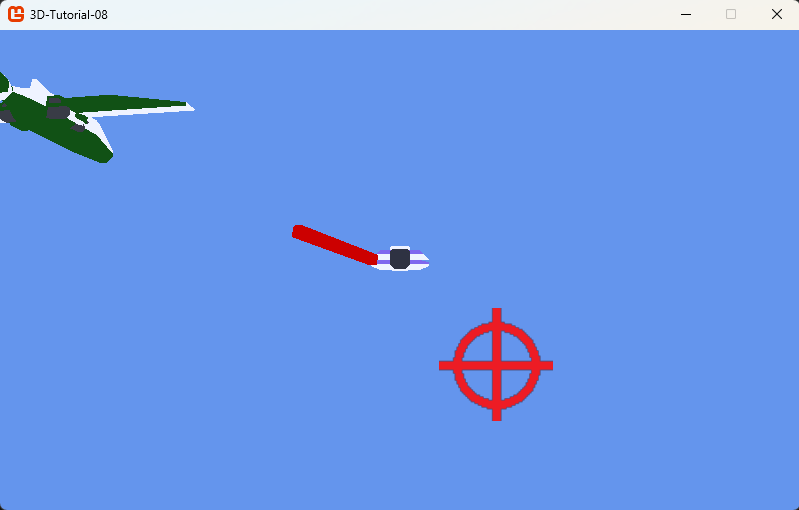

# Step 8: Enemies attack

## Objective

Now that our enemies enter and exit the screen, it's time to make them shoot some projectiles. We will make them shoot during their main phase. We will choose how many projectiles they will shoot and the timing between each shot.

## Projectile and player update

### Projectile related changes

Because both the player and the enemies will shoot projectiles, we need to move the function that determine the projectile orientation to the `Projectile.cs` class.

To orientate the projectile, we will build an orientation matrix. This is very similar to what we did to orientate the player in the Chapter 3.

We will start with the projectile's direction - which will be the subtraction of the target's position and shooter position. We normalize it. We then build a perpendicular vector to this vector, by executing a cross product between our normalized direction vector and the world's up vector. We normalize the result. Finally, we create a last normilized perpendicular vector - this time perpendicalar to both the direction and the second vector. Those three normalized vector create a coordinate system specific to the projectile direction. The following diagram reprensents the coordinate system we just created:



We can use the coordinates of those three vectors to create a matrix that represent the transformation leading to this coordinate system. We then create a quaternion from this matrix.

```csharp
internal class Projectile : Entity
{
  ...
  public static Quaternion CreateQuaternionFromDirection(Vector3 direction)
  {
    direction.Normalize();

    Vector3 xAxis = Vector3.Cross(Vector3.Up, direction);
    xAxis.Normalize();

    Vector3 yAxis = Vector3.Cross(direction, xAxis);
    yAxis.Normalize();

    Matrix aim = Matrix.Identity;
    aim.M11 = xAxis.X;
    aim.M21 = yAxis.X;
    aim.M31 = direction.X;

    aim.M12 = xAxis.Y;
    aim.M22 = yAxis.Y;
    aim.M32 = direction.Y;

    aim.M13 = xAxis.Z;
    aim.M23 = yAxis.Z;
    aim.M33 = direction.Z;

    return Quaternion.CreateFromRotationMatrix(aim);
  }
}
```

This will make us update the `Player.cs` class. The `HandleAiming` function will now looks like:

```csharp
internal class Player : Entity
{
  ...
  private void HandleAiming()
  {
    Vector3 direction = playerAim.Position - position;
    orientation = Projectile.CreateQuaternionFromDirection(direction);
  }
  ...
}
```

### Player's hp

The enemy will shoot at the player, so it has to have an impact on the player when he or she is hit.

We will add a `hp` and `idDead` fields to the `Player.cs` class. This will allow us to make the player lose health when hit by an enemy projectile. This removal will be handled by a `RemoveHp` function.

```csharp
internal class Player : Entity
{
  ...
  private int hp = 10;
  bool isDead = false;
  ...
  public void RemoveHp()
  {
    hp--;
    if (hp <= 0)
    {
      isDead = true;
      game.GameOver();
    }
  }
}
```

This will make us add a `GameOver` function to the `Game1.cs` class. This function will be called when the player's hp reaches 0.

```csharp
  public void GameOver()
  {
      Exit();
  }
```

For now, when the game is over, the game just shuts down. We will add a game over screen at the very end of this tutorial.

## An enemy shooting projectiles

### A state machine inside a state machine

For now, our `Enemy` has three phases: `Enter`, `Main` and `Exit`. During the `Main` phase, we create an other state machine to handle the shooting of projectiles. The states will be the following:

```csharp
  enum ShootState
  {
      Waiting,
      Shooting,
      Cooldown,
      OutsideMainPhase
  }
```

When the enemy enters the main phase, it is first `Waiting` for the first shot, during the duration of a `SHOOTING_TIME` constant. Then it starts `Shooting` a projectile. There will be one or multiple projectiles shot. If more than one, between each projectile the enemy will wait for a constant `SHOOTING_INTERVAL` time. When all projectiles are shot, the enemy goes on `Cooldown`, for a `SHOOTING_COOLDOWN` time. If the main phase lasts more than this time, the enemy goes back to `Shooting` state. The `OutsideMainPhase` state is triggered by the enemy phase system. It is used during the exit phase.

In order to handle this state machine, we need to add the following fields to the `Enemy.cs` class:

```csharp
internal class Enemy : Entity
{
  ...
  private Game1 game;
  private ShootState shootState = ShootState.OutsideMainPhase;
  private const float SHOOTING_TIME = 2.0f;
  private const float SHOOTING_COOLDOWN = 3.0f;
  private const float SHOOTING_INTERVAL = 0.5f;
  private int PROJECTILE_NUMBER = 3;
  private float shootingTimer = 0.0f;
  private int projectileCount = 0;
  ...
}
```

Note that we add a `Game1` field to the `Enemy` class. This will allow us to create projectiles from the enemy and get the player's position. We need to add a `Game1` parameter to the `Enemy` constructor.

```csharp
...
  public Enemy(Vector3 position, Game1 game) : base()
  {
    this.targetPosition = position;
    this.game = game;
    mainPhaseDuration = 5.0f;
    scale = new Vector3(10f, 10f, 10f);
    ChangePhase(Phase.Enter);
  }
...
```

We also change the creation of the test enemy in the `Game1.cs` class, and add a property to get the player:

```csharp
  ...
  internal Player Player
  {
    get { return player; }
  }

  ...
  protected override void LoadContent()
  {
    ...
    enemies.Add(new Enemy(new Vector3(0, 0, -500), this));
    ...
  }
```

### The shooting logic

We can now modify the `UpdateMainPhase` function to handle the shooting logic.

```csharp
  private void UpdateMainPhase(double dt)
  {
    mainPhaseCounter += (float)dt;
    switch (shootState)
    {
      case ShootState.Waiting:
        shootingTimer += (float)dt;
        if (shootingTimer > SHOOTING_TIME)
        {
          shootState = ShootState.Shooting;
          shootingTimer = 0.0f;
          projectileCount = 0;
        }
        break;
      case ShootState.Shooting:
        shootingTimer += (float)dt;
        if (shootingTimer > SHOOTING_INTERVAL)
        {
          Vector3 direction = game.Player.Position - position;
          direction.Normalize();
          Quaternion directionRotation = Projectile.CreateQuaternionFromDirection(direction);
          game.AddProjectile(position, directionRotation, 500.0f, false);
          projectileCount++;
          shootingTimer = 0.0f;
        }
        if (projectileCount >= PROJECTILE_NUMBER)
        {
          shootingTimer = SHOOTING_INTERVAL * PROJECTILE_NUMBER;
          shootState = ShootState.Cooldown;
        }
        break;
      case ShootState.Cooldown:
        shootingTimer += (float)dt;
        if (shootingTimer > SHOOTING_COOLDOWN)
        {
          shootingTimer = 0.0f;
          shootState = ShootState.Shooting;
          projectileCount = 0;
        }
        break;
      case ShootState.OutsideMainPhase:
          break;
    }

    if (mainPhaseDuration == -1f) return;
    if (mainPhaseCounter > mainPhaseDuration)
    {
      ChangePhase(Phase.Exit);
    }
  }
```

In order to trigger the shooting logic, we need to change the shooting state when the enemy enters and exits the main phase.

```csharp
  private void ChangePhase(Phase newPhase)
  {
    phase = newPhase;
    switch (phase)
    {
      case Phase.Enter:
        phase = Phase.Enter;
        position = GetPositionFromScreenSide(screenSideEnter);
        break;

      case Phase.Main:
        phase = Phase.Main;
        mainPhaseCounter = 0.0f;
        velocity = Vector3.Zero;
        shootState = ShootState.Waiting;
        break;

      case Phase.Exit:
        phase = Phase.Exit;
        targetPosition = GetPositionFromScreenSide(screenSideExit);
        shootState = ShootState.OutsideMainPhase;
        break;
    }
  }
```

### Taking projectiles into account

We will update the `Game1.UpdateProjectiles` function to make the enemy projectiles collide with the player, removing hp.

```csharp
  private void UpdateProjectiles(double dt)
  {
    for (int i = projectiles.Count - 1; i >= 0; i--)
    {
      projectiles[i].Update(dt);
      // Remove projectiles that are out of bounds
      if (projectiles[i].Position.Z < -10000 || projectiles[i].Position.Z > 1000)
      {
        projectiles.RemoveAt(i);
        continue;
      }
      // Collision with player
      if (projectiles[i].BoundingBox.Intersects(player.BoundingBox)
        && !projectiles[i].FromPlayer)
      {
        player.RemoveHp();
        projectiles.RemoveAt(i);
        continue;
      }
      // Collision with enemies
      foreach (Enemy enemy in enemies)
      {
        if (enemy.BoundingBox.Intersects(projectiles[i].BoundingBox)
            && projectiles[i].FromPlayer)
        {
          enemy.RemoveHp();
          projectiles.RemoveAt(i);
          break;
        }
      }
    }
  }
```

In order to distinguish between player and enemy projectiles, we change the `AddProjectile` function in the `Game1.cs` class.

```csharp
  public void AddProjectile(Vector3 position, Quaternion orientation, float speed, bool fromPlayer = true)
  {
    string modelName = fromPlayer ? "Cube" : "CubeRed";
    var newProjectile = new Projectile(position, orientation, speed, fromPlayer);
    newProjectile.Load(Content, modelName);
    projectiles.Add(newProjectile);
  }
```

You will need to import the *CubeRed* model in the `Content` manager.

## Conclusion

In this step, we added the ability for the enemies to shoot projectiles at the player.



We also added a `hp` field to the player, and a `RemoveHp` function to handle the player's health. The enemy main phase now has a state machine to handle the shooting logic. We also added a `GameOver` function to the `Game1` class, which is called when the player's hp reaches 0.

In the next step, we will take profit of our new enemy behaviour to create waves of enemies, and orchestrate their entrance and exit.
