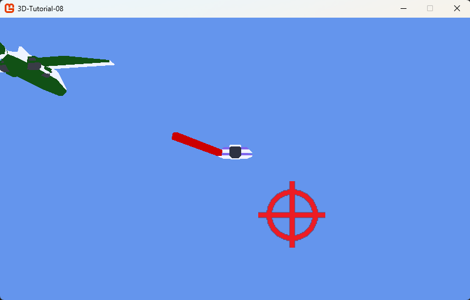

# Step 8: Enemies attack

## Objective

Now that our enemies enter and exit the screen, it's time to make them shoot projectiles. We will make them shoot during their main phase. We will choose how many projectiles they will fire and the timing between each shot.

## Projectile and player update

### Projectile related changes

Because both the player and the enemies will shoot projectiles, we need to move the function that determines the projectile orientation into `Projectile.cs`.

To orient the projectile, we will build an orientation matrix. This is very similar to what we did to orient the player in Chapter 3.

We start with the projectile's direction — which will be the target's position minus the shooter's position. We normalize that vector. We then build a perpendicular vector to this vector by executing a cross product between the normalized direction vector and the world's up vector, and normalize the result. Finally, we create a third normalized perpendicular vector, perpendicular to both the direction and the second vector. Those three normalized vectors define a coordinate system specific to the projectile's direction. The following diagram represents the coordinate system we created:

|  |
| :-----------------------------------------------------------------------------------------------: |
| **Figure 8-1: Orientation matrix** |

We can use the coordinates of those three vectors to create a matrix representing the transformation to this coordinate system. Then we create a quaternion from that matrix, since rotations are stored as quaternions.

```csharp
internal class Projectile : Entity
{
  ...
  public static Quaternion CreateQuaternionFromDirection(Vector3 direction)
  {
    direction.Normalize();

    Vector3 xAxis = Vector3.Cross(Vector3.Up, direction);
    xAxis.Normalize();

    Vector3 yAxis = Vector3.Cross(direction, xAxis);
    yAxis.Normalize();

    Matrix aim = Matrix.Identity;
    aim.M11 = xAxis.X;
    aim.M21 = yAxis.X;
    aim.M31 = direction.X;

    aim.M12 = xAxis.Y;
    aim.M22 = yAxis.Y;
    aim.M32 = direction.Y;

    aim.M13 = xAxis.Z;
    aim.M23 = yAxis.Z;
    aim.M33 = direction.Z;

    return Quaternion.CreateFromRotationMatrix(aim);
  }
}
```

This will change the `Player.cs` class. The `HandleAiming` function will now look like:

```csharp
internal class Player : Entity
{
  ...
  private void HandleAiming()
  {
    Vector3 direction = playerAim.Position - position;
    orientation = Projectile.CreateQuaternionFromDirection(direction);
  }
  ...
}
```

### Player's HP

Enemies will shoot at the player, so the player must be affected when hit.

We will add `hp` and `isDead` fields to the `Player.cs` class. This allows the player to lose health when hit by an enemy projectile. The decrease is handled by a `RemoveHp` function.

```csharp
internal class Player : Entity
{
  ...
  private int hp = 10;
  bool isDead = false;
  ...
  public void RemoveHp()
  {
    hp--;
    if (hp <= 0)
    {
      isDead = true;
      game.GameOver();
    }
  }
}
```

This requires adding a `GameOver` function to `Game1.cs`, which is called when the player's HP reaches 0.

```csharp
  public void GameOver()
  {
      Exit();
  }
```

For now, the game simply exits when over. We'll add a game-over screen near the end of the tutorial.

## An enemy shooting projectiles

### A state machine inside a state machine

For now, our `Enemy` has three phases: `Enter`, `Main` and `Exit`. During the `Main` phase, we create another state machine to handle shooting. The states are:

```csharp
  enum ShootState
  {
      Waiting,
      Shooting,
      Cooldown,
      OutsideMainPhase
  }
```

When the enemy enters the main phase, it is first `Waiting` for the first shot during `SHOOTING_TIME`. Then it starts `Shooting` projectiles. There may be multiple projectiles. If more than one, between each projectile the enemy waits `SHOOTING_INTERVAL`. When all projectiles are shot, the enemy enters `Cooldown` for `SHOOTING_COOLDOWN`. If the main phase lasts beyond this time, the enemy returns to `Shooting`. `OutsideMainPhase` is used when the enemy is not in the main phase.

In order to handle this state machine, we need to add the following fields to the `Enemy.cs` class:

```csharp
internal class Enemy : Entity
{
  ...
  private Game1 game;
  private ShootState shootState = ShootState.OutsideMainPhase;
  private const float SHOOTING_TIME = 2.0f;
  private const float SHOOTING_COOLDOWN = 3.0f;
  private const float SHOOTING_INTERVAL = 0.5f;
  private int PROJECTILE_NUMBER = 3;
  private float shootingTimer = 0.0f;
  private int projectileCount = 0;
  ...
}
```

Note the `Game1` field so the enemy can create projectiles and access the player's position. Add a `Game1` parameter to the `Enemy` constructor.

```csharp
...
  public Enemy(Vector3 position, Game1 game) : base()
  {
    this.targetPosition = position;
    this.game = game;
    mainPhaseDuration = 5.0f;
    scale = new Vector3(10f, 10f, 10f);
    ChangePhase(Phase.Enter);
  }
...
```

Also change the test enemy creation in `Game1.cs` and add a Player property:

```csharp
  ...
  internal Player Player
  {
    get { return player; }
  }

  ...
  protected override void LoadContent()
  {
    ...
    enemies.Add(new Enemy(new Vector3(0, 0, -500), this));
    ...
  }
```

### The shooting logic

Modify `UpdateMainPhase` to implement shooting logic:

```csharp
  private void UpdateMainPhase(double dt)
  {
    mainPhaseCounter += (float)dt;
    switch (shootState)
    {
      case ShootState.Waiting:
        shootingTimer += (float)dt;
        if (shootingTimer > SHOOTING_TIME)
        {
          shootState = ShootState.Shooting;
          shootingTimer = 0.0f;
          projectileCount = 0;
        }
        break;
      case ShootState.Shooting:
        shootingTimer += (float)dt;
        if (shootingTimer > SHOOTING_INTERVAL)
        {
          Vector3 direction = game.Player.Position - position;
          direction.Normalize();
          Quaternion directionRotation = Projectile.CreateQuaternionFromDirection(direction);
          game.AddProjectile(position, directionRotation, 500.0f, false);
          projectileCount++;
          shootingTimer = 0.0f;
        }
        if (projectileCount >= PROJECTILE_NUMBER)
        {
          shootingTimer = SHOOTING_INTERVAL * PROJECTILE_NUMBER;
          shootState = ShootState.Cooldown;
        }
        break;
      case ShootState.Cooldown:
        shootingTimer += (float)dt;
        if (shootingTimer > SHOOTING_COOLDOWN)
        {
          shootingTimer = 0.0f;
          shootState = ShootState.Shooting;
          projectileCount = 0;
        }
        break;
      case ShootState.OutsideMainPhase:
          break;
    }

    if (mainPhaseDuration == -1f) return;
    if (mainPhaseCounter > mainPhaseDuration)
    {
      ChangePhase(Phase.Exit);
    }
  }
```

Trigger the shooting state when entering and exiting the main phase:

```csharp
  private void ChangePhase(Phase newPhase)
  {
    phase = newPhase;
    switch (phase)
    {
      case Phase.Enter:
        phase = Phase.Enter;
        position = GetPositionFromScreenSide(screenSideEnter);
        break;

      case Phase.Main:
        phase = Phase.Main;
        mainPhaseCounter = 0.0f;
        velocity = Vector3.Zero;
        shootState = ShootState.Waiting;
        break;

      case Phase.Exit:
        phase = Phase.Exit;
        targetPosition = GetPositionFromScreenSide(screenSideExit);
        shootState = ShootState.OutsideMainPhase;
        break;
    }
  }
```

### Taking projectiles into account

Update `Game1.UpdateProjectiles` to allow enemy projectiles to hit the player and remove HP:

```csharp
  private void UpdateProjectiles(double dt)
  {
    for (int i = projectiles.Count - 1; i >= 0; i--)
    {
      projectiles[i].Update(dt);
      // Remove projectiles that are out of bounds
      if (projectiles[i].Position.Z < -10000 || projectiles[i].Position.Z > 1000)
      {
        projectiles.RemoveAt(i);
        continue;
      }
      // Collision with player
      if (projectiles[i].BoundingBox.Intersects(player.BoundingBox)
        && !projectiles[i].FromPlayer)
      {
        player.RemoveHp();
        projectiles.RemoveAt(i);
        continue;
      }
      // Collision with enemies
      foreach (Enemy enemy in enemies)
      {
        if (enemy.BoundingBox.Intersects(projectiles[i].BoundingBox)
            && projectiles[i].FromPlayer)
        {
          enemy.RemoveHp();
          projectiles.RemoveAt(i);
          break;
        }
      }
    }
  }
```

Distinguish projectile models by origin in `AddProjectile`:

```csharp
  public void AddProjectile(Vector3 position, Quaternion orientation, float speed, bool fromPlayer = true)
  {
    string modelName = fromPlayer ? "Cube" : "CubeRed";
    var newProjectile = new Projectile(position, orientation, speed, fromPlayer);
    newProjectile.Load(Content, modelName);
    projectiles.Add(newProjectile);
  }
```

You will need to import the *CubeRed* model into the Content manager.

## Conclusion

In this step, enemies can shoot at the player during their main phase.

|  |
| :-----------------------------------------------------------------------------------------------: |
| **Figure 8-2: Final screenshot, a shooting enemy** |

We also added HP to the player, a `RemoveHp` function, and a `GameOver` call when HP reaches 0. The enemy main phase now includes a small state machine for shooting logic.

In the next step, we will take profit of our new enemy behaviour to create waves of enemies, and orchestrate their entrance and exit.
