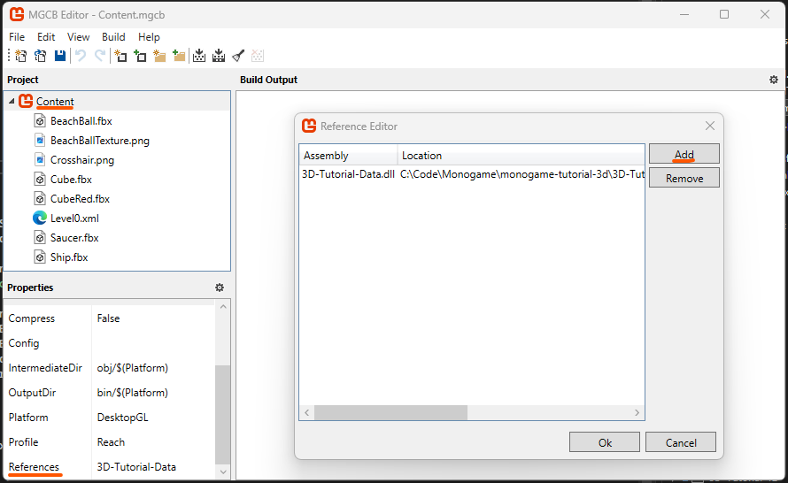
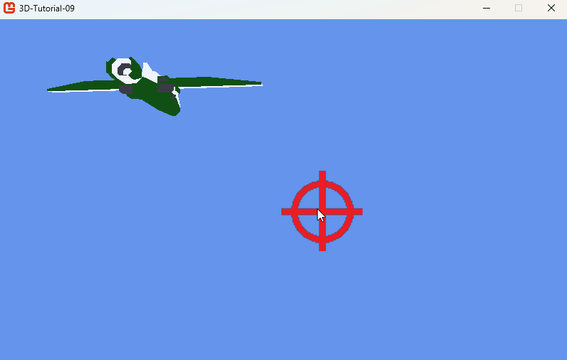

# Step 9: Enemy waves

We now want to organize a chroregraphy of enemies. We will make them enter at a specific time, shoot at us then get out of the screen. We will organize a level as a succession of enemy waves. We will also allow to spawn power-ups in the waves.

In this step, we will use the MonoGame data system to store the data of the waves. We will create a xml file that will be automatically interpreted as wave data thanks to the *MGCB*.

## Wave data library

### Create a library project

In order to store the wave data, we need to create a project that *MGCB* will reference and use to interpret the xml file. We will create a new project in the solution. Right click on the solution and select `Add > New Project...`. Select `MonoGame Game Library` and name it (in my case I chose `3D-Tutorial-Data`). You can remove the *.cs* files from the project. This will create a new project in the solution. We will use this project to store the wave data.

### The wave data class

In the library, create a new class called `WaveData.cs`. This class will be used to store the data of the waves. The class will look like this:

```csharp
namespace Tutorial_Data
{
  public class WaveData
  {
    public int id;
    public float time;
    public int elementNumber;

    public string element0Type;
    public string element0EnterSide;
    public string element0ExitSide;
    public float element0X;
    public float element0Y;
    public float element0Z;
    public float element0Duration;

    public string element1Type;
    public string element1EnterSide;
    public string element1ExitSide;
    public float element1X;
    public float element1Y;
    public float element1Z;
    public float element1Duration;

    public string element2Type;
    public string element2EnterSide;
    public string element2ExitSide;
    public float element2X;
    public float element2Y;
    public float element2Z;
    public float element2Duration;

    public string element3Type;
    public string element3EnterSide;
    public string element3ExitSide;
    public float element3X;
    public float element3Y;
    public float element3Z;
    public float element3Duration;

    public string element4Type;
    public string element4EnterSide;
    public string element4ExitSide;
    public float element4X;
    public float element4Y;
    public float element4Z;
    public float element4Duration;
  }
}
```

Notice this class is in a namespace called `Tutorial_Data`.

As you can see, the wave data countains an id (a simple int that will grow with each wave), a time (the time at which the wave will appear), and the number of elements in the wave. An element can be either an enemy or a power up, and we want a maximum of 5 element per wave. Each element has a type (a string that will be used to identify if it is an enemy or a power-up), an enter side (a string that will be used to identify the side from which the enemy will enter), an exit side (a string that will be used to identify the side from which the enemy will exit), a position (x, y, z) and a duration (the duration of the enemy's main phase).

Note that with the same data file, we could describe other types of enemies, or give additionnal properties to power-ups. In this lesson, we will stay simple so you can understand the concepts, but feel free to extend it!

Once you have created the class, compile the project by right-clicking on the project and selecting `Build`. This will create a dll file in the `bin/Debug` folder of the project. We will use this dll file to load the wave data in the main project.

### Reference the dll file in MGCB

Now we need to reference the dll file in MGCB. Open the MGCB file from your main project - do not use the MGCB file from the library project. Click on `Content` on the top left `Project explorer`. In the `Properties` panel, go all the way down and click on `Reference`. In the `Reference` explorer, click on `Add`. Browse to the `bin/Debug` folder of the library project and select the dll file. This will add a reference to the dll file in MGCB.



> [!NOTE]
>
> For MonoGame 3.8.2 or below the library project must be compiled with .NET 6.0 and not with .NET 8.0. To ensure that, right click on the data library, select `Properties`, and in the `Application` tab, select `.NET 6.0` in the `Target framework` dropdown. Then recompile the project. You will notice a `net6.0` folder in the `bin/Debug` folder of the library project in addition to the `net8.0` folder. This is the folder that MGCB will use to load the dll file.

### Reference the data library in the main project

In order to use the data library in the main project, we need to reference it in the main project. Right-click on the main project and select `Add > Project Reference...`. In the Reference Manager, check the library project. Click `OK`. This will add a reference to the library project in the main project. You can now use the `Tutorial_Data.WaveData` class in the main project.

### Create the xml file

We now need to create and populate the xml file that will be used to store the wave data. In the main project's Content folder, create a new xml file (Right click on the Content folder and select `Add > New Item...` and select xml file). Name it `Level0.xml`. The file should look like this:

```xml
<?xml version="1.0" encoding="utf-8" ?>
<XnaContent>
  <Asset Type="Tutorial_Data.WaveData[]">
    <Item>
      <id>0</id>
      <time>0</time>
      <elementNumber>3</elementNumber>

      <element0Type>enemy</element0Type>
      <element0EnterSide>Left</element0EnterSide>
      <element0ExitSide>Right</element0ExitSide>
      <element0X>-200</element0X>
      <element0Y>0</element0Y>
      <element0Z>-750</element0Z>
      <element0Duration>5.0</element0Duration>

      <element1Type>enemy</element1Type>
      <element1EnterSide>Left</element1EnterSide>
      <element1ExitSide>Right</element1ExitSide>
      <element1X>200</element1X>
      <element1Y>0</element1Y>
      <element1Z>-750</element1Z>
      <element1Duration>5.0</element1Duration>

      <element2Type>enemy</element2Type>
      <element2EnterSide>Left</element2EnterSide>
      <element2ExitSide>Right</element2ExitSide>
      <element2X>0</element2X>
      <element2Y>0</element2Y>
      <element2Z>-750</element2Z>
      <element2Duration>5.0</element2Duration>

      <element3Type>none</element3Type>
      <element3EnterSide>Left</element3EnterSide>
      <element3ExitSide>Right</element3ExitSide>
      <element3X>0</element3X>
      <element3Y>0</element3Y>
      <element3Z>0</element3Z>
      <element3Duration>5.0</element3Duration>

      <element4Type>none</element4Type>
      <element4EnterSide>Left</element4EnterSide>
      <element4ExitSide>Right</element4ExitSide>
      <element4X>0</element4X>
      <element4Y>0</element4Y>
      <element4Z>0</element4Z>
      <element4Duration>5.0</element4Duration>
    </Item>

    <Item>
      <id>1</id>
      <time>12</time>
      <elementNumber>1</elementNumber>

      <element0Type>powerup</element0Type>
      <element0EnterSide>Left</element0EnterSide>
      <element0ExitSide>Right</element0ExitSide>
      <element0X>0</element0X>
      <element0Y>0</element0Y>
      <element0Z>-500</element0Z>
      <element0Duration>5.0</element0Duration>

      <element1Type>none</element1Type>
      <element1EnterSide>Left</element1EnterSide>
      <element1ExitSide>Right</element1ExitSide>
      <element1X>200</element1X>
      <element1Y>0</element1Y>
      <element1Z>-750</element1Z>
      <element1Duration>5.0</element1Duration>

      <element2Type>none</element2Type>
      <element2EnterSide>Left</element2EnterSide>
      <element2ExitSide>Right</element2ExitSide>
      <element2X>0</element2X>
      <element2Y>0</element2Y>
      <element2Z>-750</element2Z>
      <element2Duration>5.0</element2Duration>

      <element3Type>none</element3Type>
      <element3EnterSide>Left</element3EnterSide>
      <element3ExitSide>Right</element3ExitSide>
      <element3X>0</element3X>
      <element3Y>0</element3Y>
      <element3Z>0</element3Z>
      <element3Duration>5.0</element3Duration>

      <element4Type>none</element4Type>
      <element4EnterSide>Left</element4EnterSide>
      <element4ExitSide>Right</element4ExitSide>
      <element4X>0</element4X>
      <element4Y>0</element4Y>
      <element4Z>0</element4Z>
      <element4Duration>5.0</element4Duration>
    </Item>

    <Item>
      <id>2</id>
      <time>15</time>
      <elementNumber>3</elementNumber>

      <element0Type>enemy</element0Type>
      <element0EnterSide>Bottom</element0EnterSide>
      <element0ExitSide>Bottom</element0ExitSide>
      <element0X>-200</element0X>
      <element0Y>0</element0Y>
      <element0Z>-750</element0Z>
      <element0Duration>5.0</element0Duration>

      <element1Type>enemy</element1Type>
      <element1EnterSide>Bottom</element1EnterSide>
      <element1ExitSide>Bottom</element1ExitSide>
      <element1X>200</element1X>
      <element1Y>0</element1Y>
      <element1Z>-750</element1Z>
      <element1Duration>5.0</element1Duration>

      <element2Type>enemy</element2Type>
      <element2EnterSide>Bottom</element2EnterSide>
      <element2ExitSide>Bottom</element2ExitSide>
      <element2X>0</element2X>
      <element2Y>0</element2Y>
      <element2Z>-750</element2Z>
      <element2Duration>5.0</element2Duration>

      <element3Type>none</element3Type>
      <element3EnterSide>Bottom</element3EnterSide>
      <element3ExitSide>Bottom</element3ExitSide>
      <element3X>0</element3X>
      <element3Y>0</element3Y>
      <element3Z>0</element3Z>
      <element3Duration>5.0</element3Duration>

      <element4Type>none</element4Type>
      <element4EnterSide>Bottom</element4EnterSide>
      <element4ExitSide>Bottom</element4ExitSide>
      <element4X>0</element4X>
      <element4Y>0</element4Y>
      <element4Z>0</element4Z>
      <element4Duration>5.0</element4Duration>
    </Item>
  </Asset>
</XnaContent>
```

The `none` type is used to indicate that there is no element at this position. The `enemy` type is used to indicate that the element is an enemy, and the `powerup` type is used to indicate that the element is a power-up.

As you can see, we specify the data class in the `Asset` tag. This is the class that *MGCB* will use to interpret the xml file. The `Item` tag contains the data of a wave. We can have as many `Item` tags as we want, and MGCB will interpret them as an array of `WaveData` objects. Our test level will countain one first wave with 3 enemies, a second wave with a power-up, and a third wave with 3 enemies coming and exiting from a different direction. First wave will start at second 0, the power up will appear at second 12 and the second enemy wave at time 15.

Now open *MGCB*, add an existing file and select the xml file we just created. Build the content data and everything should be fine. You can check the output window to see if there are any errors.

> [!NOTE]
>
> If you want more information about custom MonoGame data on xml format, you will find it here: https://docs.MonoGame.net/articles/getting_to_know/howto/content_pipeline/HowTo_Add_XML.html

## Loading and using the wave data

### The Wave class

We will create a new class called `Wave.cs` in the main project. This class will be used to load data, with the help of constructors, and use the wave data thanks to a `Launch` function. Each Wave will have a list of `WaveElement` objects - which can be for now an enemy or a power-up. The `WaveElement` class will be used to store the data of each element in the wave. The `Wave` class will look like this:

```csharp
public class Wave
{
  public float time;
  public int id;
  public int elementNumber;
  public List<WaveElement> elements = new List<WaveElement>();

  public Wave(float time, int id, int enemyNumber)
  {
    this.time = time;
    this.id = id;
    this.elementNumber = enemyNumber;
  }

  public void Launch(Game1 game)
  {
    foreach (WaveElement element in elements)
    {
      switch (element.type)
      {
        case "enemy":
          game.AddEnemy(element.position, element.screenSideEnter, element.screenSideExit, element.mainPhaseDuration, "Saucer");
          break;
        case "powerup":
          game.AddPowerUp(element.position);
          break;
      }
    }
  }
}

public class WaveElement
{
  public string type;
  public ScreenSide screenSideEnter;
  public ScreenSide screenSideExit;
  public Vector3 position;
  public float mainPhaseDuration;

  public WaveElement(string type, string screenSideEnter, string screenSideExit, float x, float y, float z, float mainPhaseDuration)
  {
    this.type = type;
    this.screenSideEnter = (ScreenSide)Enum.Parse(typeof(ScreenSide), screenSideEnter);
    this.screenSideExit = (ScreenSide)Enum.Parse(typeof(ScreenSide), screenSideExit);
    this.position = new Vector3(x, y, z);
    this.mainPhaseDuration = mainPhaseDuration;
  }
}
```

> [!NOTE]
>
> If you want more information about how to load custom xml data, you will find it here: https://docs.monogame.net/articles/getting_to_know/howto/content_pipeline/HowTo_Load_XML.html

### Updating the enemy class

Because we will now build enemies when a wave is launched, we need to update the `Enemy` class. We will update its constructor:

```csharp
  public Enemy(Vector3 position, Game1 game, ScreenSide enterSide, ScreenSide exitSide, float mainPhaseDuration) : base()
  {
    this.game = game;
    this.mainPhaseDuration = mainPhaseDuration;
    targetPosition = position;
    screenSideEnter = enterSide;
    screenSideExit = exitSide;
    scale = new Vector3(10f, 10f, 10f);
    ChangePhase(Phase.Enter);
  }
```

### Adding an enemy or a power-up from the Game1 class

As you just saw, we need to add a function to the `Game1` class that will allow us to add an enemy or a power-up. We will create two functions: `AddEnemy` and `AddPowerUp`. The `AddEnemy` function will take the position, the screen side from which the enemy will enter and exit, the duration of the main phase and the name of the 3D model we want to load. The `AddPowerUp` function will take the position of the power-up.

```csharp
public class Game1 : Game
{
  ...
  public void AddEnemy(Vector3 position, ScreenSide enterSide, ScreenSide exitSide, float mainPhaseDuration, string modelName)
  {
    Enemy enemy = new Enemy(position, this, enterSide, exitSide, mainPhaseDuration);
    enemy.Load(Content, modelName);
    enemies.Add(enemy);
  }

  public void AddPowerUp(Vector3 position)
  {
    PowerUp powerUp = new PowerUp(position, 100f);
    powerUp.Load(Content, "BeachBall");
    powerUps.Add(powerUp);
  }
}
```

### Loading the waves in the Game1 class

We will now load the wave data in the `Game1` class. First, we will need new member variables:

```csharp
public class Game1 : Game
{
  ...
  private Tutorial_Data.WaveData[] levelData;
  private List<Wave> waves = new List<Wave>();
  private int currentWave = 0;
  private float waveTimer = 0.0f;
  ...
}
```

The level data will countain the raw data from the xml file. The waves list will countain the waves that we will create from the level data. The current wave will be used to know which wave we are currently in, and the wave timer will be used to know when to launch the next wave.

We will need a `LoadWaves` function that will take the `levelData` as a parameter and build the list of `Waves`:

```csharp
public class Game1 : Game
{
  ...
  List<Wave> LoadWaves(Tutorial_Data.WaveData[] levelData)
  {
    List<Wave> waves = new List<Wave>();
    foreach (Tutorial_Data.WaveData waveData in levelData)
    {
      Wave wave = new Wave(waveData.time, waveData.id, waveData.elementNumber);
      for (int i = 0; i < waveData.elementNumber; i++)
      {
        switch(i)
        {
          case 0:
            if (waveData.element0Type.Equals("none")) continue;
            wave.elements.Add(new WaveElement(waveData.element0Type, waveData.element0EnterSide, waveData.element0ExitSide,
                waveData.element0X, waveData.element0Y, waveData.element0Z, waveData.element0Duration));
            break;
          case 1:
            if (waveData.element1Type.Equals("none")) continue;
            wave.elements.Add(new WaveElement(waveData.element1Type, waveData.element1EnterSide, waveData.element1ExitSide,
                waveData.element1X, waveData.element1Y, waveData.element1Z, waveData.element1Duration));
            break;
          case 2:
            if (waveData.element2Type.Equals("none")) continue;
            wave.elements.Add(new WaveElement(waveData.element2Type, waveData.element2EnterSide, waveData.element2ExitSide,
                waveData.element2X, waveData.element2Y, waveData.element2Z, waveData.element2Duration));
            break;
          case 3:
            if (waveData.element3Type.Equals("none")) continue;
            wave.elements.Add(new WaveElement(waveData.element3Type, waveData.element3EnterSide, waveData.element3ExitSide,
                waveData.element3X, waveData.element3Y, waveData.element3Z, waveData.element3Duration));
            break;
          case 4:
            if (waveData.element4Type.Equals("none")) continue;
            wave.elements.Add(new WaveElement(waveData.element4Type, waveData.element4EnterSide, waveData.element4ExitSide,
                waveData.element4X, waveData.element4Y, waveData.element4Z, waveData.element4Duration));
            break;
        }
      }
      waves.Add(wave);
    }
    return waves;
  }
}
```

This class reads from the level data and build the `Wave` objects and its `WaveElement` list. The function will be called in the `LoadContent` function:

```csharp
  protected override void LoadContent()
  {
      _spriteBatch = new SpriteBatch(GraphicsDevice);

      playerAim = new PlayerAim();
      playerAim.Load(Content, GraphicsDevice);

      player = new Player(playerAim, this);
      player.Load(Content, "Ship");

      levelData = Content.Load<Tutorial_Data.WaveData[]>("Level0");
      waves = LoadWaves(levelData);
  }
```

### Calling the waves

We will finally modify our `Update` function to call the waves. We will add a new function called `UpdateWaves` that will be called in the `Update` function:

```csharp
  ...
  protected override void Update(GameTime gameTime)
  {
      if (GamePad.GetState(PlayerIndex.One).Buttons.Back == ButtonState.Pressed || Keyboard.GetState().IsKeyDown(Keys.Escape))
          Exit();

      double dt = gameTime.ElapsedGameTime.TotalSeconds;
      playerAim.Update(dt);
      player.Update(dt);

      UpdateProjectiles(dt);
      UpdateEnemies(dt);
      UpdatePowerUps(dt);
      UpdateWaves(dt);

      base.Update(gameTime);
  }

  ...
  private void UpdateWaves(double dt)
  {
    waveTimer += (float)dt;
    if (currentWave < waves.Count && waveTimer >= waves[currentWave].time)
    {
      waves[currentWave].Launch(this);
      currentWave++;
    }
  }
```

The `UpdateWaves` function will check if the current wave is ready to be launched. If it is, it will call the `Launch` function of the `Wave` class. The `currentWave` variable will be incremented to the next wave. The `waveTimer` variable will be used to know when to launch the next wave.



## Conclusion

In this step, we have created a new project to store the wave data. We have created a new class to load and use the wave data. We have modified the `Enemy` class to allow it to be created from the wave data. We have also modified the `Game1` class to load and use the wave data.

The MonoGame content pipeline is a powerful tool that allows us to load and use custom data in our game. We have seen how to use it to load xml files and use them directly in our game. This is actually the simplest way to load data in MonoGame. There are two types of classes called `ContentImporter` and `ContentProcessor` that would allow to import more complex data. Nevertheless, this would go too far for this basic 3D tutorial. You can check the MonoGame documentation for more information on this.

Now that our gameplay is ready, we will dedicate the three next steps to improve the graphics of our game, starting with particles in the next lesson.
