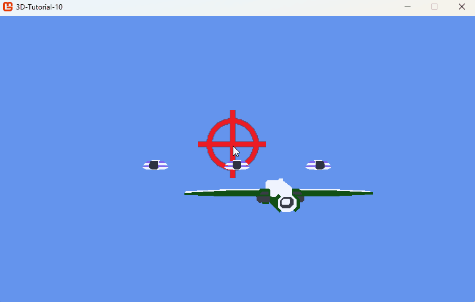

# Step 10: Particles

## Objectives

Now the rules of our game are set up, we will improve the feeling and the appearance of interactions. We will first focus on one crucial tool in the belt of 3D developers: particles.

We will create a custom particle management system and use it to signal when either the enemies or the player are hit. Also we will create an impressive particle explosion when an enemy ship is destroyed.

## The particle

A particle is usually a simple 2D sprite or simple 3D model that is drawn repeatedly by the GPU, so it does not consume too many resources. In our case, we will take advantage of our trusty `Quad` class to display a single particle. Additionally, a particle is positioned and drawn in the game, so it will be an `Entity`.

Particles usually move, and can have several parameters. In our case, we will decide the particle has a movement velocity, a lifetime (duration after which it disappears), an age which will track the life duration, a color at start and another at the end of its lifespan. The color will progressively shift between the two colors thanks to a linear interpolation (also called lerp). We will create a property to check if the lifetime is over and to manage velocity.

> [!NOTE]
>
> **Linear interpolation** is a common technique in gameplay and computer graphics to progressively shift a value between two other values. It is often used for colors, positions, scales, rotations, etc. It is often implemented in a `Lerp` function that takes three parameters: the start value, the end value, and a proportion (between 0 and 1) that indicates how far we are between the two values.
>
> For rotations, there is a similar technique called **spherical linear interpolation** (or *slerp*), that takes into account the circular nature of rotations.

Create a `Particle.cs` file:

```csharp
internal class Particle : Entity
{
    private Quad quad;
    GraphicsDevice device;

    Vector3 velocity = Vector3.Zero;
    float lifeTime;
    float age = 0;
    Color startColor;
    Color endColor;

    public bool IsDead
    {
        get { return age >= lifeTime; }
    }

    public Vector3 Velocity
    {
        get { return velocity; }
        set { velocity = value; }
    }

    public Particle(GraphicsDevice device, Vector3 position, float scale, float lifeTime, Color startColor, Color endColor) : base()
    {
        this.device = device;

        BasicEffect effect = new BasicEffect(device);
        effect.VertexColorEnabled = false;
        effect.TextureEnabled = true;
        effect.Texture = new Texture2D(device, 1, 1);
        effect.Texture.SetData(new Color[] { Color.White });
        quad = new Quad(Vector3.Zero, -Vector3.Forward, Vector3.Up, scale, scale, effect);

        this.position = position;
        this.lifeTime = lifeTime;
        this.startColor = startColor;
        this.endColor = endColor;
    }

    public override void Update(double dt)
    {
        float dtf = (float)dt;
        age += dtf;
        velocity *= 0.98f;
        velocity.Y -= 10f * dtf;
        position += velocity * dtf;
        float lerpAmount = age / lifeTime;
        Color color = Color.Lerp(startColor, endColor, lerpAmount);
        quad.Effect.DiffuseColor = color.ToVector3();
        base.Update(dt);
    }

    public override void Draw(Matrix view, Matrix projection)
    {
        quad.Draw(device, world, view, projection);
    }
}
```

The constructor will set up all member variables. Just notice that we create a `BasicEffect` for our particle's quad that will have a one-pixel white texture: because the particle has only one color, we do not need to load an image file to create it. The color will shift between the starting and the ending color thanks to a `BasicEffect` member variable called `DiffuseColor`.

The `Update` function accomplishes three things:

- It changes the particle's age.
- It applies some modification on the velocity: first we multiply it by a number inferior to `1f` in order to progressively slow it, then we apply a sort of gravity to make the particle accelerate downward. This will improve the feeling of our particle explosions.
- It computes a proportion of the elapsed lifetime (a number between 0 and 1), then it uses this number to *linearly interpolate* between the start color and the end color. When `lerpAmount` is 0 the color is the start color, when it is 1 it is the end color. Between those two moments, it has a proportionate mix of the two colors. This color is finally used to replace the `BasicEffect` diffuse color, so the texture color will be multiplied by this color. Because the texture color is white (1f, 1f, 1f), the final result is the diffuse color itself.

The `Draw` function just draws the `Quad`.

Note that to call `quad.Effect`, we need to update the `Quad.cs` class to add a public property:

```csharp
public BasicEffect Effect
{
    get { return effect; }
}
```

As a reminder, here is the documentation for `BasicEffect`:

[BasicEffect class](https://docs.monogame.net/api/Microsoft.Xna.Framework.Graphics.BasicEffect.html)

[Tutorial to create a BasicEffect](https://docs.monogame.net/articles/getting_to_know/howto/graphics/HowTo_Create_a_BasicEffect.html)

## The particle system

A particle alone is not that impressive. We need a class to manage all particles for a single special effect and be responsible for updating and drawing the particles. This class won't be an entity though, because it will not exist in the game per se: only the particles will exist.

We will have the possibility to set a particle system active or not, to play and stop its particle emission.

Create a `ParticleSystem` file:

```csharp
internal class ParticleSystem
{
    private GraphicsDevice device;
    private bool active = true;
    private const int MAX_PARTICLES = 100;
    private List<Particle> particles = [];
    Random random = new Random();

    public bool Active
    {
        get { return active; }
    }

    public ParticleSystem(GraphicsDevice device, Vector3 position, float scale, float lifetime, float speed, Color startColor, Color endColor)
    {
        this.device = device;
        particles.Capacity = MAX_PARTICLES;
        for (int i = 0; i < MAX_PARTICLES; i++)
        {
            Particle p = new Particle(device, position, scale, lifetime, startColor, endColor);
            p.Velocity = RandomVector3(-speed, speed);
            particles.Add(p);
        }
    }

    public void Update(double dt)
    {
        if (!active)
        {
            return;
        }
        if (particles.Count == 0)
        {
            active = false;
            return;
        }


        foreach (Particle p in particles)
        {
            p.Update(dt);
        }

        particles.RemoveAll(p => p.IsDead);
    }

    public void Draw(Matrix view, Matrix projection)
    {
        if (!active)
        {
            return;
        }
        foreach (Particle p in particles)
        {
            p.Draw(view, projection);
        }
    }

    private Vector3 RandomVector3(float v1, float v2) => new(RandomFloat(v1, v2), RandomFloat(v1, v2), RandomFloat(v1, v2));

    float RandomFloat(float v1, float v2) => (float)(v1 + (v2 - v1) * random.NextDouble());
}
```

The class handles a list of particles. The constructor populates it and passes all properties to the particles, for a maximum number of `MAX_PARTICLES`.

> [!NOTE]
>
> We have set the velocity of particles to a random value. This implies that the general shape of our particle system will be a sphere, for all particles will go in all directions at once.

In the `Update` function we update the particles, and handle particle removal when they are dead. When all particles are dead, the particle system is no longer active.

The `Draw` function draws all particles, except if the particle system is inactive.

## Using the particle system in the game

### Managing particle systems

In the `Game1` class, we will manage a list of particle systems. Each particle system will be spawned when we need it: when the player is hit, when the enemy is hit and when an enemy is destroyed. We will update all particle systems and remove them when they become inactive.

```csharp
public class Game1 : Game
{
    ...
    private List<ParticleSystem> particleSystems = new List<ParticleSystem>();

    ...
    protected override void Update(GameTime gameTime)
    {
        ...
        UpdateParticleSystems(dt);

        base.Update(gameTime);
    }

    ...
    private void UpdateParticleSystems(double dt)
    {
        for (int i = particleSystems.Count - 1; i >= 0; i--)
        {
            particleSystems[i].Update(dt);
            if (!particleSystems[i].Active)
            {
                particleSystems.RemoveAt(i);
            }
        }
    }
    ...
}
```

### Spawning particle systems

There are two places where we want to spawn particle systems:

- In `UpdateProjectiles` when either the player or an enemy is hit
- In `UpdateEnemies` when an enemy is destroyed

```csharp
    ...
    private void UpdateProjectiles(double dt)
    {
        for (int i = projectiles.Count - 1; i >= 0; i--)
        {
            projectiles[i].Update(dt);
            // Remove projectiles that are out of bounds
            if (projectiles[i].Position.Z < -10000 || projectiles[i].Position.Z > 1000)
            {
                projectiles.RemoveAt(i);
                continue;
            }
            // Collision with player
            if (projectiles[i].BoundingBox.Intersects(player.BoundingBox)
                && !projectiles[i].FromPlayer)
            {
                particleSystems.Add(new ParticleSystem(_graphics.GraphicsDevice, player.Position, 5f, 0.5f, 200f, Color.Orange, Color.Red));
                player.RemoveHp();
                projectiles.RemoveAt(i);
                continue;
            }
            // Collision with enemies
            foreach (Enemy enemy in enemies)
            {
                if (enemy.BoundingBox.Intersects(projectiles[i].BoundingBox)
                    && projectiles[i].FromPlayer)
                {
                    particleSystems.Add(new ParticleSystem(_graphics.GraphicsDevice, enemy.Position, 5f, 0.5f, 200f, Color.LightGreen, Color.Green));
                    enemy.RemoveHp();
                    projectiles.RemoveAt(i);
                    break;
                }
            }
        }
    }

    private void UpdateEnemies(double dt)
    {
        for (int i = enemies.Count - 1; i >= 0; i--)
        {
            enemies[i].Update(dt);
            // Remove dead enemies
            if (enemies[i].IsDead)
            {
                particleSystems.Add(new ParticleSystem(_graphics.GraphicsDevice, enemies[i].Position, 10f, 1.5f, 500f, Color.Orange, new Color(100, 0, 0)));
                enemies.RemoveAt(i);
            }
        }
    }
    ...
```

We choose different colors, speeds, sizes and durations depending on the situation. That's it! We have impressive explosions.

|  |
| :-----------------------------------------------------------------------------------------------: |
| **Figure 10-1: Final screenshot, particles!** |

## Conclusion

In this straightforward step, we implemented particles and particle systems, and used them for the main interactions of our game. Do not hesitate to add particle systems elsewhere: the more particles, the better!

In the next chapter, we will continue spotlighting interactions with the addition of sounds.
