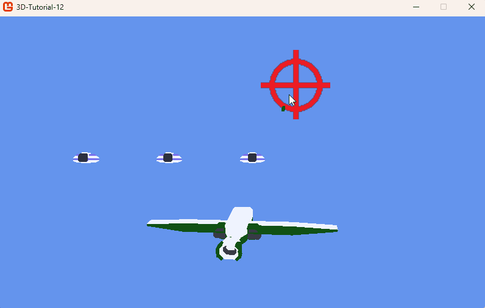

# Step 12: Entities color flash

## Objective

In this step, we will add a color flash effect to the player and enemies when they are hit. This effect will help the player to understand when they are hit, when an enemy is hit or when they catch a power-up. An effective communication of interaction information is always important to improve the game feeling.

This step will allow us to go further with the use of the `BasicEffect` class. We will see how we can structure our code to allow the use of different effects on entites sharing the same model.

## Making entities flash

### Color flash management

First, we need to manage color modification on our player and enemies. Because this special effect could actually happen for any 3d model in the game, we will setup everything in the `Entity` class.

The general idea for our flash effect is to set the `BasicEffect` emissive color to a certain value, and then allows it to go back to normal (transparent) over a certain duration. This will automaically add a color to the model then make it progressively disappear. We will need to store the flash color and the flash duration, as well as the current color and the flash timer.

> [!NOTE]
>
> Emissive and diffuse color are color that will automatically modify the model's texture color thanks to the `BasicEffect`.
>
> Emissive color is supposed to be a color that is emitted by the 3D object, and as such modify the texture color in an *additive* way. That is to say that the emissive color's components are added to the already existing color of the texture.
>
> Diffuse color is supposed to be the color of the object itself. It is usually multiplied with the texture's color in order to mix the texture's and the diffuse's color. It is called *diffuse* because it represents a statistical approximation of a lighting on an homogeneous surface. The light particules are supposed to bounce in a random direction, which diffuses them, and thus gives an uniform color.

It's time to implement our flash. Modify `Entity.cs` as follows:

```csharp
internal class Entity
{
  ...
  protected float flashTimer = 0.0f;
  protected float flashDuration = 0.5f;
  protected Color currentFlashColor = Color.Transparent;
  protected Color flashColor = Color.Red;

  ...
  public virtual void Update(double dt)
  {
      UpdateFlash(dt);
      world = Matrix.CreateScale(scale) * Matrix.CreateFromQuaternion(orientation) * Matrix.CreateTranslation(position);
  }

  ...
  protected void UpdateFlash(double dt)
  {
    if (flashTimer > 0.0f)
    {
      currentFlashColor = Color.Lerp(Color.Transparent, flashColor, flashTimer/flashDuration);
      flashTimer -= (float)dt;
      if (flashTimer <= 0.0f)
      {
        currentFlashColor = Color.Transparent;
      }
    }
  }

  public void Flash(Color color, float duration)
  {
    flashColor = color;
    flashTimer = duration;
    flashDuration = duration;
  }
}
```

We create an `UpdateFlash` method that will be called in the `Update` method. This method will update the `currentFlashColor` variable based on the proportion between `flashTimer` and flash duration - similarly to what we did in step 10 for particle colors. If the flash timer goes under 0, we set the `currentFlashColor` back to transparent.

The `Flash` public method will be used to set the flash color and duration. It basically resets the flash effect to start it again. This function will be called when the player or an enemy is hit, or when the player catches a power-up.

### Calling the Flash method

Calling our `Flash` method is easy. We will call it in the `Player` when a power-up is caught, and in the `Game1.UpdateProjectiles` method when the player or an enemy is hit.

For the `Player.cs`

```csharp
  public void PowerUp()
  {
    projectileNumber++;
    Flash(new Color(0, 255, 0), 2.0f);
  }
```

And in `Game1.cs`:

```csharp
  private void UpdateProjectiles(double dt)
  {
    for (int i = projectiles.Count - 1; i >= 0; i--)
    {
      projectiles[i].Update(dt);
      // Remove projectiles that are out of bounds
      if (projectiles[i].Position.Z < -10000 || projectiles[i].Position.Z > 1000)
      {
        projectiles.RemoveAt(i);
        continue;
      }
      // Collision with player
      if (projectiles[i].BoundingBox.Intersects(player.BoundingBox)
          && !projectiles[i].FromPlayer)
      {
        particleSystems.Add(new ParticleSystem(_graphics.GraphicsDevice, player.Position, 5f, 0.5f, 200f, Color.Orange, Color.Red));
        player.RemoveHp();
        projectiles.RemoveAt(i);
        smallExplosionSound.Play();
        player.Flash(Color.Red, 0.5f);
        continue;
      }
      // Collision with enemies
      foreach (Enemy enemy in enemies)
      {
        if (enemy.BoundingBox.Intersects(projectiles[i].BoundingBox)
            && projectiles[i].FromPlayer)
        {
          Vector3 enemyPosition = enemy.Position; // Keep enemy position if the enemy is dead
          particleSystems.Add(new ParticleSystem(_graphics.GraphicsDevice, enemyPosition, 5f, 0.5f, 200f, Color.LightGreen, Color.Green));
          enemy.RemoveHp();
          if (enemy.IsDead)
          {
            particleSystems.Add(new ParticleSystem(_graphics.GraphicsDevice, enemyPosition, 10f, 1.5f, 500f, Color.Orange, new Color(100, 0, 0)));
            explosionSound.Play();
          }
          else
          {
            enemy.Flash(Color.Red, 0.5f);
            smallExplosionEnemySound.Play();
          }
          projectiles.RemoveAt(i);
          break;
        }
      }
    }
  }
```

## Drawing the flash

Calling Flash this way is not enough. We need to change the `BasicEffect.emissiveColor` value to make it appear.

This modification cannot happen anywhere: for GPU optimization reasons, the `BasicEffect` shader is shared across all the models that will be drawn with it. That's why we must modify this emissive color just before drawing a specific entity. If we would modify the emissive color in the `Update` method, it would be modified for all the models that are using this effect, so for instance all enemies would turn red.

In order to achieve this individual modification, we will override the `Entity.Draw` function in `Player.cs` and `Enemy.cs`:

```csharp
  public override void Draw(Matrix view, Matrix projection)
  {
    foreach (ModelMesh mesh in model.Meshes)
    {
      foreach (BasicEffect effect in mesh.Effects)
      {
        effect.EmissiveColor = currentFlashColor.ToVector3();
      }
    }
    base.Draw(view, projection);
  }
```

The code is the same for both classes. The diffuse color is stored as a `Vector3`, so we convert the `Color` to a `Vector3` using the `ToVector3` method.

Now, when an enemy is hit, is will turn red for a short period of time.

> [!TIP]
>
> Should we use emissive or diffuse color for flash?
>
> In this lesson, I decided to use emissive color because of the way my *Ship* and *Saucer* models are textured. For an other models with other texture, like the *BeachBall*, it might be better to use diffuse color.
>
> Note that for diffuse color, the neutral color is not `Color.Transparent` (0, 0, 0, 0) as with emissive, but `Color.White` (1, 1, 1, 1). This is because we multiply the texture color components with the diffuse color components value instead of adding them.

## An additional note about shaders

The `BasicEffect` is actually an abstraction the MonoGame team created around an important graphics programming topic called *Shaders*. `BasicEffect` *is* a set of shaders, applied to the drawing of basic 3D elements. The more general `Effect` class allows to create custom effects - that is custom shaders.

I decided that shaders will be outside the scope of this first 3D tutorial, for, usually, starting to think in 3D is already enough for an aspiring game programmer. Nevertheless, if you are interested, you can read [Introduction to this concept in the 2D game tutorial](https://docs.monogame.net/articles/tutorials/building_2d_games/24_shaders/) as well as the [MonoGame's documentation about Custom Effects](https://docs.monogame.net/articles/getting_started/content_pipeline/custom_effects.html).

## Conclusion

In this step, we added a color flash effect to the player and enemies when they are hit. This effect is achieved by modifying the `BasicEffect` emissive color in the `Draw` method of the entity. We also added a `Flash` method to manage the flash effect and a `UpdateFlash` method to update the current flash color over time. All this allowed us to learn more about the `BasicEffect` class.



Overall, our game's feedback starts to be really good. We have sounds, particles and colors to communicate the game state to the player. The game is starting to feel like a real game! In the next step we will improve the graphical aspect by using a neat trick to create a dynamic level background.
