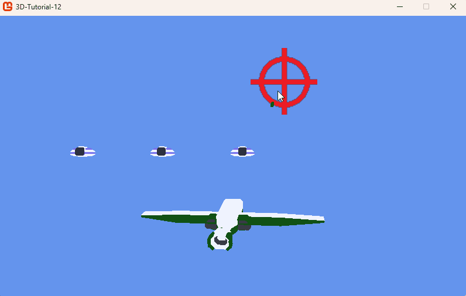

# Step 12: Entities color flash

## Objective

In this step, we will add a color flash effect to the player and enemies when they are hit. This effect will help the player understand when they are hit, when an enemy is hit, or when they catch a power-up. Effective communication of interaction information is always important to improve the game feeling.

This step will allow us to go further with the use of the `BasicEffect` class. We will see how we can structure our code to allow the use of different effects on entities sharing the same model.

## Making entities flash

### Color flash management

First, we need to manage color modification on our player and enemies. Because this special effect could happen for any 3D model in the game, we will set everything up in the `Entity` class.

The general idea for our flash effect is to set the `BasicEffect` emissive color to a certain value, and then let it go back to normal (transparent) over a specified duration. This will automatically add a color to the model and then make it progressively disappear. We will need to store the flash color and the flash duration, as well as the current color and the flash timer.

> [!NOTE]
>
> Emissive and diffuse colors are colors that will automatically modify the model's texture color via `BasicEffect`.
>
> **Emissive color** is a color that is emitted by the 3D object, and as such modifies the texture color in an additive way.
>
> **Diffuse color** is the color of the object itself. It is usually multiplied with the texture's color in order to mix the texture's and the diffuse color. The neutral diffuse color is `Color.White` (1,1,1,1), whereas the neutral emissive color is `Color.Transparent` (0,0,0,0).

It's time to implement our flash. Modify `Entity.cs` as follows:

```csharp
internal class Entity
{
  ...
  protected float flashTimer = 0.0f;
  protected float flashDuration = 0.5f;
  protected Color currentFlashColor = Color.Transparent;
  protected Color flashColor = Color.Red;

  ...
  public virtual void Update(double dt)
  {
      UpdateFlash(dt);
      world = Matrix.CreateScale(scale) * Matrix.CreateFromQuaternion(orientation) * Matrix.CreateTranslation(position);
  }

  ...
  protected void UpdateFlash(double dt)
  {
    if (flashTimer > 0.0f)
    {
      currentFlashColor = Color.Lerp(Color.Transparent, flashColor, flashTimer/flashDuration);
      flashTimer -= (float)dt;
      if (flashTimer <= 0.0f)
      {
        currentFlashColor = Color.Transparent;
      }
    }
  }

  public void Flash(Color color, float duration)
  {
    flashColor = color;
    flashTimer = duration;
    flashDuration = duration;
  }
}
```

We create an `UpdateFlash` method that will be called in the `Update` method. This method will update the `currentFlashColor` based on the proportion between `flashTimer` and the flash duration — similarly to what we did in step 10 for particle colors. If the flash timer goes under 0, we set `currentFlashColor` back to transparent.

The `Flash` public method will be used to set the flash color and duration. It basically resets the flash effect to start it again. This function will be called when the player or an enemy is hit, or when the player catches a power-up.

### Calling the Flash method

Calling our `Flash` method is straightforward. We will call it in the `Player` when a power-up is caught, and in the `Game1.UpdateProjectiles` method when the player or an enemy is hit.

For the `Player.cs`:

```csharp
  public void PowerUp()
  {
    projectileNumber++;
    Flash(new Color(0, 255, 0), 2.0f);
  }
```

And in `Game1.cs`:

```csharp
  private void UpdateProjectiles(double dt)
  {
    for (int i = projectiles.Count - 1; i >= 0; i--)
    {
      projectiles[i].Update(dt);
      // Remove projectiles that are out of bounds
      if (projectiles[i].Position.Z < -10000 || projectiles[i].Position.Z > 1000)
      {
        projectiles.RemoveAt(i);
        continue;
      }
      // Collision with player
      if (projectiles[i].BoundingBox.Intersects(player.BoundingBox)
          && !projectiles[i].FromPlayer)
      {
        particleSystems.Add(new ParticleSystem(_graphics.GraphicsDevice, player.Position, 5f, 0.5f, 200f, Color.Orange, Color.Red));
        player.RemoveHp();
        projectiles.RemoveAt(i);
        smallExplosionSound.Play();
        player.Flash(Color.Red, 0.5f);
        continue;
      }
      // Collision with enemies
      foreach (Enemy enemy in enemies)
      {
        if (enemy.BoundingBox.Intersects(projectiles[i].BoundingBox)
            && projectiles[i].FromPlayer)
        {
          Vector3 enemyPosition = enemy.Position; // Keep enemy position if the enemy is dead
          particleSystems.Add(new ParticleSystem(_graphics.GraphicsDevice, enemyPosition, 5f, 0.5f, 200f, Color.LightGreen, Color.Green));
          enemy.RemoveHp();
          if (enemy.IsDead)
          {
            particleSystems.Add(new ParticleSystem(_graphics.GraphicsDevice, enemyPosition, 10f, 1.5f, 500f, Color.Orange, new Color(100, 0, 0)));
            explosionSound.Play();
          }
          else
          {
            enemy.Flash(Color.Red, 0.5f);
            smallExplosionEnemySound.Play();
          }
          projectiles.RemoveAt(i);
          break;
        }
      }
    }
  }
```

## Drawing the flash

Calling `Flash` is not enough. We need to change the `BasicEffect.EmissiveColor` value to make it visible.

This modification must happen during drawing: the `BasicEffect` shader is shared across meshes, so we must set emissive color immediately before drawing the specific entity. Otherwise all models using that effect would be affected.

Override the `Entity.Draw` function in `Player.cs` and `Enemy.cs`:

```csharp
  public override void Draw(Matrix view, Matrix projection)
  {
    foreach (ModelMesh mesh in model.Meshes)
    {
      foreach (BasicEffect effect in mesh.Effects)
      {
        effect.EmissiveColor = currentFlashColor.ToVector3();
      }
    }
    base.Draw(view, projection);
  }
```

The code is the same for both classes. The color is converted from `Color` to `Vector3` with `ToVector3`.

Now, when the player or an enemy is hit, they will flash red for half a second.

> [!TIP]
>
> Should we use emissive or diffuse color for flash?
>
> I chose emissive here because of the way my Ship and Saucer models are textured. For other models (for example the BeachBall), diffuse may be a better choice. Note that diffuse neutral is `Color.White`, while emissive neutral is `Color.Transparent`.

## An additional note about shaders

`BasicEffect` is a convenient abstraction around shaders. The more general `Effect` class allows custom shaders.

I decided that shaders will be outside the scope of this first 3D tutorial, for, usually, starting to think in 3D is already enough for an aspiring game programmer. Nevertheless, if you are interested, you can read [Introduction to this concept in the 2D game tutorial](https://docs.monogame.net/articles/tutorials/building_2d_games/24_shaders/) as well as the [MonoGame's documentation about Custom Effects](https://docs.monogame.net/articles/getting_started/content_pipeline/custom_effects.html).

## Conclusion

In this step, we added a color flash effect to the player and enemies when they are hit. This effect is achieved by modifying the `BasicEffect` emissive color in the `Draw` method of the entity. We also added a `Flash` method to manage the flash effect and a `UpdateFlash` method to update the current flash color over time. All this allowed us to learn more about the `BasicEffect` class.

|   |
| :-----------------------------------------------------------------------------------------------: |
|                  **Figure 12-1: Flashes on enemies and player**                  |

Overall, our game's feedback starts to be really good. We have sounds, particles and colors to communicate the game state to the player. The game is starting to feel like a real game! In the next step we will improve the graphical aspect by using a neat trick to create a dynamic level background.
