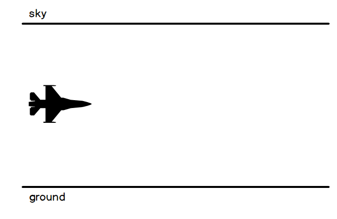
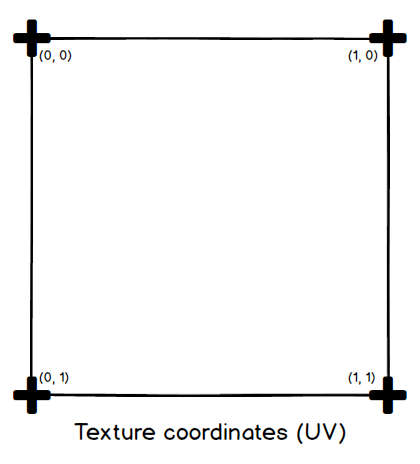

# Step 13: Shifting texture for ground and sky

## Objective

Let's make the game's graphics better. For now our background fills too empty. Let's pretend our game takes place in a virtual numerical environment, like in Tron, and we are supposed to destroy bugs or attackers. We will add a shifting texture for the ground and the sky that will represent this numerical environment, and we will also add a fog effect to make the game more immersive.

## Shifting texture for ground and sky

### Some theory

As stated above, our background will be composed of two textures, placed in the way that one will represent the ground, and the other the sky.



Textures are 2D images that are mapped onto 3D objects to give them a more realistic appearance. In our case, the texture is mapped on a simple quad. If you check the code we used to setup `Quad.cs`:

```csharp
  private void FillVertices()
  {
    Vector2 textureUpperLeft = new Vector2(0.0f, 0.0f);
    Vector2 textureUpperRight = new Vector2(1.0f, 0.0f);
    Vector2 textureLowerLeft = new Vector2(0.0f, 1.0f);
    Vector2 textureLowerRight = new Vector2(1.0f, 1.0f);

    for (int i = 0; i < this.vertices.Length; i++)
    {
      vertices[i].Normal = normal;
    }

    vertices[0].Position = lowerLeft;
    vertices[0].TextureCoordinate = textureLowerLeft;
    vertices[1].Position = upperLeft;
    vertices[1].TextureCoordinate = textureUpperLeft;
    vertices[2].Position = lowerRight;
    vertices[2].TextureCoordinate = textureLowerRight;
    vertices[3].Position = upperRight;
    vertices[3].TextureCoordinate = textureUpperRight;

    indices[0] = 0;
    indices[1] = 1;
    indices[2] = 2;
    indices[3] = 2;
    indices[4] = 1;
    indices[5] = 3;
  }
```

You see that the texture is mapped on the quad using the `TextureCoordinate` property of the vertices. The texture coordinates are in the range [0, 1], where (0, 0) is the upper left corner of the texture and (1, 1) is the lower right corner. In our case, we are saying thaht the upper left corner of the texture is mapped to the upper left corner of the quad, and the lower right corner of the texture is mapped to the lower right corner of the quad. This means that the texture will be stretched to fit the quad.



Now, this actually opens a possibility for us: we can modify the texture coordinates of the vertices to make the texture move. Indeed, if we modify the texture coordinates of the vertices, the texture will move on the quad. This is a common technique used in games to create a moving background or a shifting texture effect.

But how to use this effect to figure out the ground and sky? The idea is the ground quad will be mapped with a texture that moves down, and the sky quad will be mapped with a texture that moves up. If we position those quads horizontally below the player (for the ground) and above the player (for the sky), and make their textures shift toward us, we will have the illusion that our ship is rushing through space.

> [!NOTE] UVs
>
> Texture coordinates are often called *UVs*. That's because we often use xyz for 3D position coordinates, so we needed two additional letters for the texture coordinates. We took the closest. Thus U - horizontal texture coordinate - and V - vertical texture coordinate. Some engines or frameworks also use S and T.

### Updating the quad class

In order to make the texture coordinates change, we need to create a new variable and property:

```csharp
internal class Quad
{
  ...
  private Vector2 textureShiftSpeed = Vector2.Zero;

  public Vector2 TextureShiftSpeed
  {
    get { return textureShiftSpeed; }
    set { textureShiftSpeed = value; }
  }
  ...
}
```

This property will be used to set the speed of the texture shift. The `textureShiftSpeed` variable is a `Vector2` that will be used to store the speed of the texture shift in the X and Y directions.

Now we just have to update the `Draw` method of the `Quad` class to use this variable:

```csharp
  ...
  public void Draw(GraphicsDevice device, Matrix world, Matrix view, Matrix projection)
  {
    effect.World = world;
    effect.View = view;
    effect.Projection = projection;
    foreach (EffectPass pass in effect.CurrentTechnique.Passes)
    {
      pass.Apply();
      device.DrawUserIndexedPrimitives<VertexPositionNormalTexture>(
        PrimitiveType.TriangleList, vertices, 0, 4, indices, 0, 2
      );
    }

    if (textureShiftSpeed == Vector2.Zero) return;
    for (int i = 0; i < vertices.Length; i++)
    {
      vertices[i].TextureCoordinate += textureShiftSpeed;
    }
  }
  ...
```

We update the texture coordinates with the `textureShiftSpeed`. This will offset the texture each frame.

> [!NOTE] Wrapping texture
>
> Because texture are by default setup in `Wrapping` mode, the increase of the texture coordinate will actually make the texture pixels (*texels*) wrap around the 0-1 values. To put it simply, texel at coordinate (1.5, 0.5) will actually represented by texel (0.5, 0.5).

### The shifting texture entity

Because we want to setup two quads, one for the ground and one for the sky, we will create a new class called `ShiftingTexture.cs` that will inherit from `Entity` and hold a `Quad`. This way, it will be easier to create both the ground and the sky.

```csharp
internal class ShiftingTexture : Entity
{
  private Quad quad;
  private GraphicsDevice device;
  private Vector2 size;
  private Vector2 shiftSpeed;

  public ShiftingTexture(Vector3 position, Quaternion orientation, Vector2 size, Vector2 shiftSpeed) : base()
  {
    this.position = position;
    this.orientation = orientation;
    this.size = size;
    this.shiftSpeed = shiftSpeed;
  }

  public void Load(ContentManager content, GraphicsDevice device, string textureName)
  {
    this.device = device;
    BasicEffect effect = new BasicEffect(device);
    effect.FogEnabled = true;
    effect.FogStart = 1000;
    effect.FogEnd = 2000;
    effect.FogColor = new Color(30, 0, 50).ToVector3();
    effect.VertexColorEnabled = false;
    effect.TextureEnabled = true;
    effect.Texture = content.Load<Texture2D>(textureName);

    quad = new Quad(Vector3.Zero, -Vector3.Forward, Vector3.Up, size.X, size.Y, effect);
  }

  public override void Update(double dt)
  {
    quad.TextureShiftSpeed = shiftSpeed * (float)dt;
    base.Update(dt);
  }

  public override void Draw(Matrix view, Matrix projection)
  {
    quad.Draw(device, world, view, projection);
  }
}
```

This class will hold a `Quad` and will be responsible for updating the texture shift speed. The `Load` method will load the texture and set the effect. The `Update` method will update the texture shift speed based on the time elapsed since the last frame. The `Draw` method will call the `Draw` method of the `Quad` class.

In the `Load` method, we set a new effect: the fog effect. The fog effect is a common technique used in games to create a sense of depth and distance. The `FogStart` and `FogEnd` properties define the distance at which the fog starts and is total, and the `FogColor` property defines the color of the fog.

### Some more Entity properties

In order to position, rotate and scale our ground and sky quads, we need to add some properties to the `Entity.cs` class. We will add the following properties:

```csharp
internal class Entity
{
  ...
  public Vector3 Position
  {
    get { return position; }
    set { position = value; }
  }

  public Quaternion Orientation
  {
    get { return orientation; }
    set { orientation = value; }
  }

  public Vector3 Scale {
    get { return scale; }
    set { scale = value; }
  }
  ...
}
```

## Inserting the ground and sky quads

First, check you have imported the `Grid` texture the MGCB.

### Instanciating ground and sky

In the `Game1.cs` class, we will create two instances of the `ShiftingTexture` class, one for the ground and one for the sky. We will also set their position, orientation and scale, update them and draw them.

> [!NOTE] Face culling
>
> We shall orientate the shifting speed in opposite directions, for the ground and the sky quads will be orientated upside down, along the x-axis. This is because *face culling*: a 3d model is not rendered if it is not facing the camera. This is a performance optimization that is used in most 3D engines.

```csharp
public class Game1 : Game
{
  ...
  private ShiftingTexture ground;
  private ShiftingTexture sky;

  ...
  protected override void LoadContent()
  {
    ...
    ground = new ShiftingTexture(new Vector3(0, -150, -1000),
        Quaternion.CreateFromAxisAngle(Vector3.Right, -MathF.PI / 2),
        new Vector2(3000f, 3000f),
        new Vector2(0, -0.2f));
    ground.Load(Content, GraphicsDevice, "Grid");

    sky = new ShiftingTexture(new Vector3(0, 150, -1000),
        Quaternion.CreateFromAxisAngle(Vector3.Right, MathF.PI / 2),
        new Vector2(3000f, 3000f),
        new Vector2(0, 0.2f));
    sky.Load(Content, GraphicsDevice, "Grid");
  }

  ...
  protected override void Update(GameTime gameTime)
  {
    if (GamePad.GetState(PlayerIndex.One).Buttons.Back == ButtonState.Pressed || Keyboard.GetState().IsKeyDown(Keys.Escape))
        Exit();

    double dt = gameTime.ElapsedGameTime.TotalSeconds;
    playerAim.Update(dt);
    player.Update(dt);

    UpdateProjectiles(dt);
    UpdateEnemies(dt);
    UpdatePowerUps(dt);
    UpdateWaves(dt);
    UpdateParticleSystems(dt);

    ground.Update(dt);
    sky.Update(dt);

    base.Update(gameTime);
  }

  ...
  protected override void Draw(GameTime gameTime)
  {
    Color bgColor = new Color(30, 0, 50);
    GraphicsDevice.Clear(bgColor);

    GraphicsDevice.BlendState = BlendState.Opaque;

    ground.Draw(view, projection);
    sky.Draw(view, projection);
    player.Draw(view, projection);

    foreach (Projectile projectile in projectiles)
    {
      projectile.Draw(view, projection);
    }

    foreach (Enemy enemy in enemies)
    {
      enemy.Draw(view, projection);
    }

    foreach (PowerUp powerUp in powerUps)
    {
      powerUp.Draw(view, projection);
    }

    GraphicsDevice.BlendState = BlendState.NonPremultiplied;
    playerAim.Draw(view, projection);
    foreach (ParticleSystem particles in particleSystems)
    {
      particles.Draw(view, projection);
    }

    base.Draw(gameTime);
  }
  ...
}
```

We changed the background color to a dark purple color to match the texture's colors, and we set the ground and sky quads to be very large (3000x3000 units). The fog effect finished to make the scene look good.

### Fog effect on projectiles

Currently, the fog effect is only applied to the ground and sky quads. We need to apply it to other entities, notably the projectiles. To do this, we will update the `Entity.cs` class rendering code:

```csharp
  ...
  public virtual void Draw(Matrix view, Matrix projection)
  {
    foreach (ModelMesh mesh in model.Meshes)
    {
      foreach (BasicEffect effect in mesh.Effects)
      {
          effect.World = world;
          effect.View = view;
          effect.Projection = projection;
          effect.FogEnabled = true;
          effect.FogStart = 1000;
          effect.FogEnd = 2000;
          effect.FogColor = new Color(30, 0, 50).ToVector3();
      }

      mesh.Draw();
    }
  }
  ...
```

We set the fog effect to be enabled, and we set the same values as for the ground and sky quads. This way, the projectiles will be affected by the fog effect.

## Conclusion

We have added a shifting texture for the ground and sky, and we have applied a fog effect entities. This makes the game look much better and more immersive.


Nevertheless, we have created a bug: the player's target aim can no longer be seen behind the sky and ground quads. In the next step we will modify our target system to rather use a kind of laser helper in order to aim.
