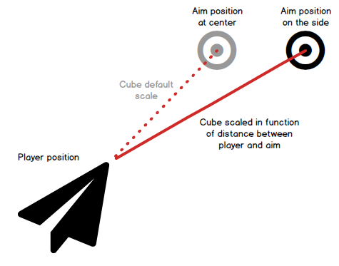

# Step 14: A laser aim

## Objective

In order to solve the bug introduced in the previous step, we will change our game's aiming system. We will get rid of the target quad and raher use a laser that will display to the player the trajectory of its projectiles.

## Deactivate the TargetAim

First, we need to deactivate the `PlayerAim.cs` rendering that is now useless. We will just comment out its call to the quad's draw function.

```csharp
  public override void Draw(Matrix view, Matrix projection)
  {
    //quad.Draw(device, world, view, projection);
  }
```

## Create a new laser aim on the player

The laser aim will just be a very thin and stretched cube that will be managed by the `Player.cs` class. Because it will be drawn, it will be an `Entity`. The `Player` class will manage its orientation and position.

### Loading the laser aim

First we need to add the laser aim entity to the `Player` class and load it. We will also create a `laserAimDefaultLength` variable to set the default length of the laser aim, which is the distance between the former player aim quad and the player's position.

```csharp
internal class Player : Entity
{
  ...
  private Entity laserAim;
  float laserAimDefaultLength = 0;

  ...
  public override void Load(ContentManager content, string modelName)
  {
      base.Load(content, modelName);
      position = new Vector3(0, 0.0f, -250.0f);
      shootSound = content.Load<SoundEffect>("Laser0");
      laserAim = new Entity();
      laserAim.Load(content, "Cube");
      laserAimDefaultLength = (playerAim.Position - position).Length();
  }
  ...
```

### Updating and repositioning the laser aim

We could have thought that the laser aim's cube just needed to be scaled once and orientated in the aiming direction, as the player's ship. Actually, if we do that, we will encounter some problems:

- The laser will not be position right when we orientate the ship toward the screen's sides.
- The laser will not be long enough in those cases.

In order to solve those problemes, we need to update the laser position and scale each frame.

The laserAim position should be set to the middle of the distance between the player and the aim: the default position of a cube is at its center, so this is the simplest way to position it.


We orientate the laser aim with the same quaternion as the player.

The laser aim should be scaled in the Z direction. Its default length is set to 2400f, but we multiply it by the ratio between the current direction length and the default distance, when the player is centered and neutrally oriented. This way, the laser aim will always appear to be the same length, no matter how the player is oriented.



We will implement that in the player's `HandleAiming` function:

```csharp
  ...
  private void HandleAiming()
  {
    Vector3 direction = playerAim.Position - position;
    orientation = Projectile.CreateQuaternionFromDirection(direction);
    ComputeLaserAimTransform(direction, orientation);
  }

  private void ComputeLaserAimTransform(Vector3 direction, Quaternion orientation)
  {
    laserAim.Position = (playerAim.Position - position) / 2f + position;
    laserAim.Orientation = orientation;
    laserAim.Scale = new Vector3(1f, 1f, 2400f * direction.Length() / laserAimDefaultLength);
  }
  ...
```

### Drawing the laser aim

Finally, we need to draw the laser aim in the `Player` class. We will do that in the `Draw` function, just after the player is drawn:

```csharp
  public override void Draw(Matrix view, Matrix projection)
  {
    foreach (ModelMesh mesh in model.Meshes)
    {
      foreach (BasicEffect effect in mesh.Effects)
      {
        effect.DiffuseColor = currentFlashColor.ToVector3();
      }
    }
    base.Draw(view, projection);
    laserAim.Draw(view, projection);
  }
```

## Conclusion

Now, the player has a laser aim that is always pointing to where they aim. It replaces our former target quad. The laser aim is a cube that is stretched in the Z direction, and its length is adjusted according to the player's orientation.


Our feedback and graphics improvement pass is finished! In the next two steps, we will focus on UI. First, add a message system to introduce some narration, then wrap up the game with a main menu and a game over screen.
