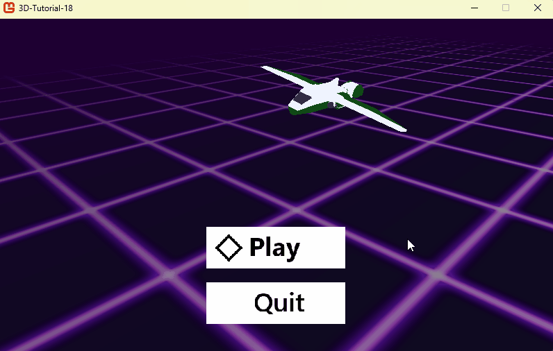

# The 3D game we will create

Hi! Welcome to this MonoGame 3D beginner tutorial. Our goal will be to create a fun and effective game that presents the basics of the MonoGame API for 3D games. To this end, we will develop the prototype of a *Star Fox 64*–style game.

*Star Fox 64* is a 3D shooter game, born at a time when 3D games were still figuring out their controls and gameplay shapes. It was renowned for its fun controls, its fast-paced rhythm and its barrel rolls! Its basic gameplay is simple enough to be implemented by a beginner in 3D programming, yet you will be able to polish it a lot if you want to make a complete game out of this tutorial. Though we won't implement the barrel roll feature, we will go through all the mathematical and technical elements you need to bootstrap your 3D gameplay, thanks to the MonoGame API.

To differ from Star Fox, we will set our game inside the internal core of a fantasy computer, where our pilot heroine will rush her miniaturized virtual spaceship to shoot and destroy nasty bugs! Our final result will look like this:



Before we start coding, let's review what you need to know.

## Knowledge requirements

> [!CAUTION]
> Before starting this 3D tutorial, you should be able to create a MonoGame 2D game. Thus, I will assume you have read Aristurtle's excellent [Building 2D Games](https://docs.monogame.net/articles/tutorials/building_2d_games/).

Specifically, some chapters are important to understand before diving into creating 3D games with MonoGame.

| Summary                 | Needed content                                                        | Link                                                                 |
| ----------------------- | --------------------------------------------------------------------- | -------------------------------------------------------------------- |
| What is MonoGame?       | A high-level view and a summary of MonoGame's history and features    | [2D games chapter 01](https://docs.monogame.net/articles/tutorials/building_2d_games/01_what_is_monogame/index.html)          |
| How to install MonoGame | Setting up and getting started with MonoGame, whichever your platform | [2D games chapter 02](https://docs.monogame.net/articles/tutorials/building_2d_games/02_getting_started/index.html?tabs=windows)  |
| The Game1 file          | Understanding the game loop in the Game1 class                        | [2D games chapter 03](https://docs.monogame.net/articles/tutorials/building_2d_games/03_the_game1_file/index.html)  |
| The Content pipeline    | How to load assets using the MGCB editor and the ContentManager class | [2D games chapter 05](https://docs.monogame.net/articles/tutorials/building_2d_games/05_content_pipeline/index.html?tabs=vscode)  |
| Working with textures   | Displaying textures in our game, useful for UI                        | [2D games chapter 06](https://docs.monogame.net/articles/tutorials/building_2d_games/06_working_with_textures/index.html)  |
| Handling input          | The way to use keyboard, mouse and controller in MonoGame             | [2D games chapter 10](https://docs.monogame.net/articles/tutorials/building_2d_games/10_handling_input/index.html)  |
| Input management        | How to actually use the previous lesson in a game                     | [2D games chapter 11](https://docs.monogame.net/articles/tutorials/building_2d_games/11_input_management/index.html)  |
| Sounds in MonoGame      | How to use sound effects and music in your game                       | [2D games chapter 14](https://docs.monogame.net/articles/tutorials/building_2d_games/14_soundeffects_and_music/index.html)  |
| Working with SpriteFonts| How to use fonts and text                                              | [2D games chapter 16](https://docs.monogame.net/articles/tutorials/building_2d_games/16_working_with_spritefonts/index.html)  |
| Scene management        | Creating different game scenes (menu, gameplay...)                     | [2D games chapter 17](https://docs.monogame.net/articles/tutorials/building_2d_games/17_scenes/index.html)  |
| Packaging your Game     | How to create a final executable for your game                         | [2D games chapter 25](https://docs.monogame.net/articles/tutorials/building_2d_games/25_packaging_game/index.html?tabs=windows)  |

You are not required to read all these chapters now: in each step of this tutorial, I will remind you of the relevant chapters to read before starting the coding.

By the way, you are expected to know the C# language, since MonoGame uses C#. If it is not the case, I recommend reading the [Learn C#](https://dotnet.microsoft.com/en-us/learn/csharp) tutorials from Microsoft.

The rest of the required knowledge to create a 3D game, and specifically 3D mathematics, will be presented in this tutorial.

Now, let's see how we will create our 3D Star Fox–inspired game.

## Our way to a 3D game

This tutorial is divided into 17 steps plus a conclusion. Each step tackles a gameplay feature and its MonoGame implementation. The steps are the following:

| Summary                        | Content                                                               | Link                                                             |
| -------------------------------| --------------------------------------------------------------------- | ---------------------------------------------------------------- |
| Step 1: Display a 3D ship       | Load and display the 3D model of a space ship, using the ContentManager | [Link to lesson 01](./01_display_a_3d_ship/index.md)             |
| Step 2: Moving the ship         | Using Vector3 and inputs to move the ship, with 3D velocity          | [Link to lesson 02](./02_move_the_player/index.md)               |
| Step 3: Aim and rotate          | Display a Quad and use rotations with Matrices and Quaternions       | [Link to lesson 03](./03_aim_and_rotate/index.md)                |
| Step 4: Shooting projectiles    | Spawn moving projectiles and use Inheritance for the game's entities | [Link to lesson 04](./04_shoot_projectiles/index.md)             |
| Step 5: Projectiles' collisions | Handling projectiles collisions on a basic Enemy class               | [Link to lesson 05](./05_projectile_collision/index.md)          |
| Step 6: A power up              | Colliding the player with a power up will improve its shooting power | [Link to lesson 06](./06_power_up/index.md)                      |
| Step 7: A moving enemy          | Make the enemy a State Machine to organize its entry and exit        | [Link to lesson 07](./07_a_moving_enemy/index.md)                |
| Step 8: A shooting enemy        | Extend the enemy's State machine to make it shoot at the player      | [Link to lesson 08](./08_a_shooting_enemy/index.md)              |
| Step 9: Waves of enemy          | Using a data library and XML parsing to setup timed waves of enemies | [Link to lesson 09](./09_enemy_waves/index.md)                   |
| Step 10: Particles              | Reuse our Quad class to spawn particles, thanks to a Particle system | [Link to lesson 10](./10_particles/index.md)                     |
| Step 11: Sounds and music       | Make our game more impactful by adding sounds and background music   | [Link to lesson 11](./11_sounds/index.md)                        |
| Step 12: Graphics polishing     | Use the BasicEffect further to make the game feel more reactive      | [Link to lesson 12](./12_entity_color_flash/index.md)            |
| Step 13: Moving floor           | Enhance the game's graphics with a moving floor to give a speed feeling | [Link to lesson 13](./13_shifting_ground/index.md)            |
| Step 14: Laser aim              | Replace the target quad with a laser aim visual                      | [Link to lesson 14](./14_laser_aim/index.md)                     |
| Step 15: Conversation and 2D UI | Add a 2D UI on top of our 3D game to enable storytelling             | [Link to lesson 15](./15_message_system/index.md)                |
| Step 16: Scene refactoring      | Add a scene system to manage title screen and game over              | [Link to lesson 16](./16_scene_refactoring/index.md)             |
| Step 17: Scenes and inputs      | Implement the other scenes and refactor input for better controls    | [Link to lesson 17](./17_scenes_and_inputs/index.md)             |
| Step 18: Finishing touches      | Last modifications and gameplay ideas to extend the game beyond      | [Link to lesson 18](./18_finishing-touches/index.md)             |

If you need a reference, you can find the complete code for this tutorial on the following Git repository: https://github.com/Gaetz/monogame-tutorial-3d

The solution is organized with one project per step. In each project, classes are duplicated so you can find the state of each class at that specific step.

## The game's assets

All assets for the game are provided in this [Resources](./Resources.zip) zipped folder. Make sure to unzip this folder somewhere on your computer before you start coding the project.

Authoring:

- Music composed by [Bertrand Toupet](https://soundcloud.com/merune)
- The Beach Ball 3D asset and textures are from [RB Whitaker model library](http://rbwhitaker.wikidot.com/model-library)
- 3D ships and sound effects were created by me using Asset Forge and bfxr

## About this documentation

### Conventions Used in This Documentation

The following conventions are used in this documentation:

#### Italics

*Italics* are used for emphasis and technical terms.

#### Highlights

`Highlights` are used for paths such as file paths, including filenames, extensions and other critical information in the application of steps in a tutorial. These are similar to inline code blocks and stand out more in Markdown.

#### Inline Code Blocks

`Inline code` blocks are used for methods, functions, and variable names when discussed within the body of a text paragraph.

#### Code Blocks

```cs
// Example Code Block
public void Foo() { }
```

Code blocks are used to show code examples with syntax highlighting.

### MonoGame

If you ever have questions about MonoGame or would like to talk with other developers to share ideas or just hang out with us, you can find us in the various MonoGame communities below

* [Discord](https://discord.gg/monogame)
* [GitHub Discussions Forum](https://github.com/MonoGame/MonoGame/discussions)
* [Community Forums (deprecated)](https://community.monogame.net/)
* [Reddit](https://www.reddit.com/r/monogame/)
* [Facebook](https://www.facebook.com/monogamecommunity)

## Note From Author

> MonoGame (and its predecessor XNA) was my first game framework, back in 2010 — except for the time I was coding in Basic on my high school TI-83 calculator. It suddenly opened the possibility to make the exact game I had in mind, instead of using tools that would take design decisions for me. With MonoGame, I made my first game engine.
>
> Since then, I still believe that making your own game is also making your own engine. It is not just a programmer's perspective — when I started making games, I would have described myself more as a designer and storyteller than as a programmer. Game making involves thousands of important micro and macro decisions, and the quality of your game ultimately depends on the awareness and quality of those decisions. Creating and understanding your game engine and tools ensures you have full control and awareness of what your code will produce as a game experience.
>
> MonoGame is a great tool to start creating your games and game engine. Deep technical problems, like file formats, asset and graphics pipelines, inputs, and memory management, are handled for you, so you can focus on your game and tools. Still, unlike Unity or Unreal, you have complete freedom about how you architect what you want to create, without having to carry gigabytes of non-essential features. You are free to explore creative directions without the bloat of commercial game engines.
> 
> I wrote this tutorial as a tribute to the people who kindled my ever-growing exploration of game-making techniques, and as a way to tell my younger self (15 years ago) that no, 3D games are not that complex — and that the mysterious BasicEffect shader is an incredibly powerful tool once you understand what it does. I hope you find it useful.
>
> \- Gaëtan Blaise-Cazalet (Gaetz) — May 2025

## Acknowledgements

To the people who made and maintained XNA and MonoGame.

To the people that write books, talks, code examples and blog articles, for the knowledge shared.

To my friends and loved ones, who watched me spend countless hours behind a computer screen without asking too many questions about my mental sanity.
